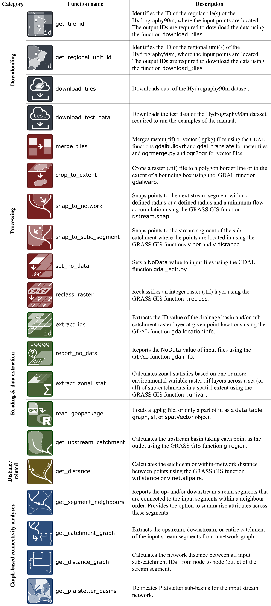

# hydrographr 

[](https://doi.org/10.5281/zenodo.7998072)
[](https://www.repostatus.org/#active)

`hydrographr` provides a collection of `R` function wrappers for GDAL and GRASS-GIS functions to efficiently work with [Hydrography90m](https://essd.copernicus.org/articles/14/4525/2022/essd-14-4525-2022.html) and spatial biodiversity data. The easy-to-use functions process large raster and vector data directly on disk in parallel, such that the memory of R does not get overloaded. This allows creating scalable data processing and analysis workflows in R, even though the data is not processed directly in R.

The package contains currently these functions: 


We invite users to test the package and to provide feedback. Please notify us of any possible issues, bugs and feature requests under the [issues tab](https://github.com/glowabio/hydrographr/issues) on the top of this page.


Installation
-----------
Please see the installation guide of the required tools at https://glowabio.github.io/hydrographr/articles/hydrographr.html. Afterwards, use the following lines to install the package in R:

```{r}
install.packages("remotes")
remotes::install_github("glowabio/hydrographr")
library(hydrographr)
```
The pdf manual of the `hydrographr` package can be downloaded [here](https://github.com/glowabio/hydrographr/tree/main/man/pdf/hydrographr_1.2.0.pdf).


Publication
-----------
You can find more details on the package and its applications in our recently published
[paper in _Methods in Ecology and Evolution_](https://besjournals.onlinelibrary.wiley.com/doi/10.1111/2041-210X.14226). 


Please cite the hydrographr package as:

Schürz, M., Grigoropoulou, A., Garcia Marquez, J.R., Tomiczek, T., Floury, M., Schürz, C., Amatulli, G., Grossart, H.-P., Domisch, S. (2023). hydrographr: an R package for scalable hydrographic data processing. _Methods in Ecology and Evolution_, [doi:10.1111/2041-210X.14226](https://doi.org/10.1111/2041-210X.14226).

Please also cite the Hydrography90m data:

Amatulli, G., Garcia Marquez, J.R., Sethi, T., Kiesel, J., Grigoropoulou, A., Üblacker, M., Shen, L., Domisch, S. (2022). Hydrography90m: A new high-resolution global hydrographic dataset. _Earth System Science Data_, 14, 4525–4550, [doi:10.5194/essd-14-4525-2022](https://doi.org/10.5194/essd-14-4525-2022).

If you're using the environmental data, please also cite the Environment90m data:

Garcia Marquez, J., Amatulli, G., Grigoropoulou, A., Schürz, M., Tomiczek, T., Buurman, M., Bremerich, V., Bego, K. and Domisch, S.: Global datasets of aggregated environmental variables at the sub-catchment scale for freshwater biodiversity modeling, in prep.
(Please contact the authors for more up-to-date citation info.)


We thank [NFDI4Biodiversity](https://www.nfdi4biodiversity.org/en/) and [NFDI4Earth](https://www.nfdi4earth.de/) for providing the funding that helped us getting the hydrographr package together!


