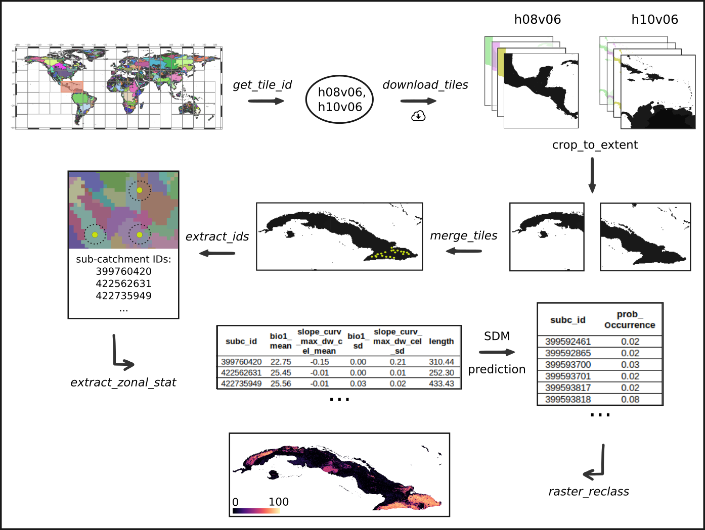
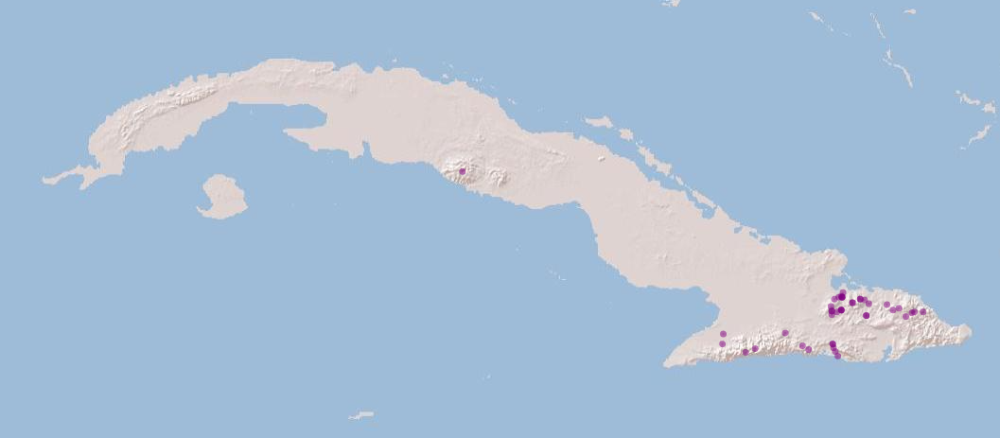
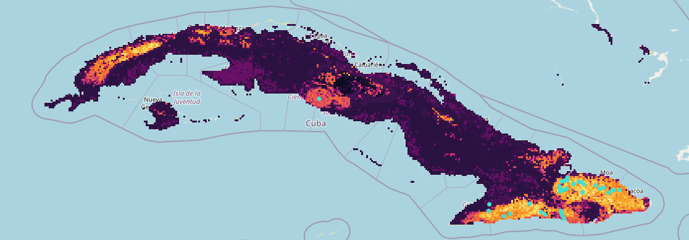

# Case study - Cuba

### Introduction

The following example showcases the functionality of the hydrographr
package along a species distribution modelling (SDM) workflow. We will
use an SDM to predict the suitable habitats of a dragonfly species in
Cuba. We will start by defining the regular tiles of the Hydrography90m
(Amatulli et al., 2022) where the occurrence points of the species are
located. Afterwards we will download the Hydrography90m and CHELSA
Bioclim (Karger & Zimmermann, 2019) layers of the predictor variables,
crop them and merge them, if necessary. Then, we will aggregate the
variable values within each sub-catchment of the study area, keeping as
predictors their mean and SD per sub-catchment. Using the random forest
(RF) algorithm, we will build a simple SDM and predict where the species
could potentially occur. Finally, we will reclassify the layer of all
the sub-catchments in the study area, creating a habitat suitability
map.



[*Hypolestes trinitatis*](https://www.gbif.org/species/1424240) is a
damselfly species endemic to Cuba. The species inhabits rivers and
streams located in forest areas at the main mountain ranges of eastern
and central Cuba. The presence of riparian forests as well as clean and
well oxygenated water seems to be important ecological conditions
required by *H. trinitatis*. Larvae can be found clinging to boulders
and cobbles in the river bed at fast-flowing water stream segments and
pre-reproductive adults of both sexes and sexually mature females remain
most of the time in the vegetation of the riparian forest where they
find shelter and prey.

Let’s get started!

Load required libraries

``` r

library(hydrographr)
library(data.table)
library(dplyr)
library(terra)
library(tools)
library(stringr)
library(ranger)
library(leaflet)
library(leafem)
```

Define working directory

``` r

# Define the "data_cuba" directory, where you have downloaded all the data,
# as the working directory
wdir <- "my/working/directory/data_cuba"
setwd(wdir)

# Create a new folder in the working directory to store all the data
dir.create("data")
```

### Species data

We will start by downloading a dataset including aquatic insect
occurrence records in Cuba from
<https://doi.org/10.18728/igb-fred-778.3> (Cambas & Salina, 2022).

``` r

download.file("https://fred.igb-berlin.de/data/file_download/1395",
              destfile = paste0(wdir, "/data/spdata_cuba.csv"), mode = "wb")
```

Import the dataset and select the occurrences of the species of
interest, sampled after the year 1980 (to match with the climate data)

``` r

spdata <- fread(paste0(wdir, "/data/spdata_cuba.csv"), sep = "\t", fill = TRUE) %>%
          filter(species == "Hypolestes_trinitatis") %>%
          filter(year > 1980)
```

Subset columns

``` r

spdata <- spdata %>%
  dplyr::select(c("occurrence_ID", "species", "longitude", "latitude", "year"))
```

``` r

spdata
```

| occurrence_ID | species               | longitude | latitude | year |
|--------------:|:----------------------|----------:|---------:|-----:|
|     107705340 | Hypolestes_trinitatis |    -75.73 |    20.01 | 2006 |
|     107705519 | Hypolestes_trinitatis |    -75.37 |    20.40 | 2003 |
|     107705533 | Hypolestes_trinitatis |    -75.78 |    20.50 | 1998 |
|     107705535 | Hypolestes_trinitatis |    -77.03 |    20.20 | 1998 |
|     107705546 | Hypolestes_trinitatis |    -74.81 |    20.44 | 2008 |
|     107705657 | Hypolestes_trinitatis |    -75.76 |    20.09 | 2012 |
|     107705727 | Hypolestes_trinitatis |    -80.06 |    21.96 | 2015 |
|     107705733 | Hypolestes_trinitatis |    -76.04 |    20.03 | 2011 |
|     107705744 | Hypolestes_trinitatis |    -74.71 |    20.44 | 2004 |
|     107705863 | Hypolestes_trinitatis |    -75.76 |    20.09 | 2004 |
|     107706093 | Hypolestes_trinitatis |    -76.77 |    20.00 | 1996 |
|     107706107 | Hypolestes_trinitatis |    -75.44 |    20.58 | 2001 |
|     107706146 | Hypolestes_trinitatis |    -75.34 |    20.53 | 2001 |
|     107706216 | Hypolestes_trinitatis |    -75.44 |    20.58 | 2001 |
|     107706217 | Hypolestes_trinitatis |    -75.53 |    20.54 | 2001 |
|     107706218 | Hypolestes_trinitatis |    -75.53 |    20.54 | 2001 |
|     107706240 | Hypolestes_trinitatis |    -76.31 |    20.21 | 2003 |
|     107706332 | Hypolestes_trinitatis |    -75.77 |    20.41 | 2001 |
|     107706355 | Hypolestes_trinitatis |    -75.66 |    20.61 | 2001 |
|     107706359 | Hypolestes_trinitatis |    -75.66 |    20.46 | 2001 |
|     107706363 | Hypolestes_trinitatis |    -75.74 |    20.58 | 2000 |
|     107706366 | Hypolestes_trinitatis |    -75.65 |    20.60 | 2001 |
|     107706369 | Hypolestes_trinitatis |    -75.64 |    20.65 | 2000 |
|     107706370 | Hypolestes_trinitatis |    -75.69 |    20.60 | 1999 |
|     107706375 | Hypolestes_trinitatis |    -75.71 |    20.44 | 2000 |
|     107706378 | Hypolestes_trinitatis |    -75.77 |    20.45 | 1999 |
|     107706384 | Hypolestes_trinitatis |    -75.65 |    20.60 | 2001 |
|     107706385 | Hypolestes_trinitatis |    -75.65 |    20.60 | 2001 |
|     107706386 | Hypolestes_trinitatis |    -75.66 |    20.46 | 2000 |
|     107706387 | Hypolestes_trinitatis |    -75.66 |    20.46 | 2001 |
|     107706388 | Hypolestes_trinitatis |    -75.77 |    20.45 | 1999 |
|     107706420 | Hypolestes_trinitatis |    -76.11 |    20.07 | 2005 |
|     107706436 | Hypolestes_trinitatis |    -74.84 |    20.43 | 1998 |
|     107706561 | Hypolestes_trinitatis |    -75.37 |    20.40 | 2004 |
|     107706589 | Hypolestes_trinitatis |    -77.04 |    20.09 | 1998 |
|     107706709 | Hypolestes_trinitatis |    -74.99 |    20.48 | 2003 |
|     107706715 | Hypolestes_trinitatis |    -75.39 |    20.57 | 2004 |
|     107706720 | Hypolestes_trinitatis |    -76.66 |    20.04 | 2004 |
|     107706807 | Hypolestes_trinitatis |    -75.06 |    20.46 | 2003 |
|     107706909 | Hypolestes_trinitatis |    -75.70 |    19.96 | 2001 |
|     107706916 | Hypolestes_trinitatis |    -75.75 |    20.05 | 1996 |
|     107706937 | Hypolestes_trinitatis |    -74.91 |    20.39 | 2003 |
|     107706938 | Hypolestes_trinitatis |    -75.13 |    20.52 | 2003 |

Let’s visualise the species occurrences on the map

``` r

# Convert species data to a spatial vector object to plot the points
spdata_vect <- vect(spdata, geom=c("longitude", "latitude"))
```

Let’s define the extent (bounding box) of the study area (xmin, ymin,
xmax, ymax)

``` r

bbox <- c(-84.9749110583, 19.8554808619, -74.1780248685, 23.1886107447)
```

``` r

m <- leaflet() %>%
  addProviderTiles('Esri.WorldShadedRelief') %>%
  setMaxBounds(bbox[1], bbox[2], bbox[3], bbox[4]) %>%
  addCircles(data = spdata_vect, color = "purple") # data = spdata

m
```



### Download files

In order to download layers of the Hydrography90m, we need to know the
IDs of the 20°x20° tiles in which they are located. We can obtain these
IDs using the function *get_tile_id()*. This function downloads and uses
the auxiliary raster file that contains all the regional units globally,
and thus requires an active internet connection.

``` r

tile_id <- get_tile_id(data = spdata, lon = "longitude", lat = "latitude")
```

``` r

tile_id
```

    ## [1] "h08v06" "h10v04" "h10v06"

Currently the function returns all the tiles of the regional unit where
the input points are located. However, some of them may be far from the
study area and hence not always needed in further steps. Please double
check which tile IDs are relevant for your purpose using the **Tile
map** found
[here](https://hydrography.org/hydrography90m/hydrography90m_layers/).

In our case, Cuba spreads across two tiles, which hold the IDs “h08v06”
and “h10v06”, so we will keep only these two.

``` r

tile_id <- tile_id[c(1,3)]
```

Let’s define the Hydrography90m variables that we would like to
download. We will use the variables
[slope_curv_max_dw_cel](https://hydrography.org/hydrography90m/hydrography90m_layers#stream-slope-layers)
(maximum curvature between the highest upstream, focal and downstream
cell) and
[spi](https://geo.igb-berlin.de/maps/new?layer=geonode:hydrography90m_v1_spi_cog&view=True)
(Stream Power Index) and [stream
length](https://hydrography.org/hydrography90m/hydrography90m_layers/#stream-order-layers)
as predictors in our model.

Additionally, we will download the
[sub_catchment](https://geo.igb-berlin.de/maps/new?layer=geonode:hydrography90m_v1_sub_catchment_cog&view=True)
layer, which is the necessary base-layer for the workflow.

A list of all available Hydrography90m variables, as well as details and
visualisations are available
[here](https://hydrography.org/hydrography90m/hydrography90m_layers/).

``` r

# Variables in raster format
vars_tif <- c("sub_catchment", "slope_curv_max_dw_cel", "spi")
# Variables in vector format. This layerholds the information on stream length
vars_gpkg <- c("order_vect_point")
```

``` r

# Download the .tif tiles of the desired variables
download_tiles(variable = vars_tif, tile_id = tile_id, file_format = "tif",
              download_dir = "data")

# Download the .gpkg tiles of the desired variables
download_tiles(variable = vars_gpkg, tile_id = tile_id, file_format = "gpkg",
              download_dir = "data")
```

Then download the CHELSA present and future Bioclim variables

For a quick outlook on the bioclimatic variables you can have a look
[here](https://chelsa-climate.org/bioclim/).

``` r

# Create download directory
dir.create(paste0(wdir, "/data/chelsa_bioclim"))
```

``` r

# Extend timeout to 1000s to allow uninterrupted downloading
options(timeout = 1000)

# Download
# Present, 1981-2010
download.file("https://os.zhdk.cloud.switch.ch/envicloud/chelsa/chelsa_V2/GLOBAL/climatologies/1981-2010/bio/CHELSA_bio12_1981-2010_V.2.1.tif",
destfile = "data/chelsa_bioclim/bio12_1981-2010.tif", mode = "wb")
download.file("https://os.zhdk.cloud.switch.ch/envicloud/chelsa/chelsa_V2/GLOBAL/climatologies/1981-2010/bio/CHELSA_bio15_1981-2010_V.2.1.tif",
destfile = "data/chelsa_bioclim/bio15_1981-2010.tif", mode = "wb")
download.file("https://os.zhdk.cloud.switch.ch/envicloud/chelsa/chelsa_V2/GLOBAL/climatologies/1981-2010/bio/CHELSA_bio1_1981-2010_V.2.1.tif",
destfile = "data/chelsa_bioclim/bio1_1981-2010.tif", mode = "wb")
# Future, 2041-2070
download.file("https://os.zhdk.cloud.switch.ch/envicloud/chelsa/chelsa_V2/GLOBAL/climatologies/2041-2070/IPSL-CM6A-LR/ssp370/bio/CHELSA_bio12_2041-2070_ipsl-cm6a-lr_ssp370_V.2.1.tif",
destfile = "data/chelsa_bioclim/bio12_IPSL-CM6A-LR_ssp370_2041-2070.tif", mode = "wb")
download.file("https://os.zhdk.cloud.switch.ch/envicloud/chelsa/chelsa_V2/GLOBAL/climatologies/2041-2070/IPSL-CM6A-LR/ssp370/bio/CHELSA_bio15_2041-2070_ipsl-cm6a-lr_ssp370_V.2.1.tif",
destfile = "data/chelsa_bioclim/bio15_IPSL-CM6A-LR_ssp370_2041-2070.tif", mode = "wb")
download.file("https://os.zhdk.cloud.switch.ch/envicloud/chelsa/chelsa_V2/GLOBAL/climatologies/2041-2070/IPSL-CM6A-LR/ssp370/bio/CHELSA_bio1_2041-2070_ipsl-cm6a-lr_ssp370_V.2.1.tif",
destfile = "data/chelsa_bioclim/bio1_IPSL-CM6A-LR_ssp370_2041-2070.tif", mode = "wb")
```


### Cropping

After having downloaded all the layers, we need to crop them to the
extent of our study area. This is straightforward in the case of the
global CHELSA layers:

We define the directory containing the layers to be cropped

``` r

dirs_chelsa <- paste0(wdir, "/data/chelsa_bioclim")
```

… and the final output directory

``` r

# Define output directory for merged files
layer_dir <- paste0(wdir, "/data/final_layers")
# Create the directory
dir.create(layer_dir)
```

We then crop the files using the function *crop_to_extent()* in a loop

``` r

files_chelsa <- list.files(dirs_chelsa, pattern = ".tif", full.names = TRUE)

for(ifile in files_chelsa) {
    crop_to_extent(
      raster_layer = ifile,
      bounding_box = bbox,
      out_dir = layer_dir,
      file_name = basename(ifile),
      read = FALSE,
      quiet = TRUE)
}
```

However, the hydrographic variable *slope_curv_max_dw_cel* (the maximum
curvature between the highest upstream, the focal, and the downstream
cell) is split across two tiles. We highly recommend to first crop the
tiles to the extent of the study area to limit their size, and
afterwards merge them into one file.

Again, we will first define the input directories, but this time we will
store the cropped files in the same directory as the input files, as
there is an extra step before reaching to the final output.

``` r

dirs_h90m <- list.dirs(paste0(wdir, "/data"),
                       recursive = TRUE, full.names = TRUE)

dirs_h90m <- dirs_h90m[grep("tiles20d", dirs_h90m)]
```

``` r

for(idir in dirs_h90m) {
  # only choose rasters
  tiles <- list.files(idir, pattern = ".tif$", full.names = TRUE)
  for(itile in tiles) {
      crop_to_extent(
        raster_layer = itile,
        bounding_box = bbox,
        out_dir = idir,
        file_name = paste0(str_remove(basename(itile), ".tif"), "_crop.tif"),
        read = FALSE,
        quiet = TRUE)
  }
}
```

### Merging

The cropped tiles of the variable now need to be merged together.

``` r

# This can be done sequentially:
idir <- dirs_h90m[1]
merge_tiles(tile_dir = idir,
            tile_names = list.files(idir, full.names = FALSE,
                                    pattern = "_crop.tif"),
            out_dir = layer_dir,
            file_name = "spi.tif",
            read = FALSE)

idir <- dirs_h90m[3]
merge_tiles(tile_dir = idir,
            tile_names = list.files(idir, full.names = FALSE,
                                    pattern = "_crop.tif"),
            out_dir = layer_dir,
            file_name = "slope_curv_max_dw_cel.tif",
            read = FALSE)

idir <- dirs_h90m[4]
merge_tiles(tile_dir = idir,
            tile_names = list.files(idir, full.names = FALSE,
                                    pattern = "_crop.tif"),
            out_dir = layer_dir,
            file_name = "sub_catchment.tif",
            read = FALSE)


# ...or in a loop
for(idir in dirs_h90m[c(1,3,4)]) {
  # Get input file extension
  file_extension <- file_ext(list.files(idir, full.names = FALSE)[1])

  # Assign file extension to output files
  ivar_name <- paste0(
    str_remove(basename(idir), "_tiles20d"), ".", file_extension
  )

  # Run the function
  merge_tiles(tile_dir = idir,
              tile_names = list.files(idir, full.names = FALSE,
                                      pattern = "_crop.tif"),
              out_dir = layer_dir,
              file_name = ivar_name,
              read = FALSE, 
              bigtiff = TRUE)
}
```

### Extraction of sub-catchment IDs

Extract the IDs of the sub-catchments where the points are located. This
step is crucial, as many of the functions that we will later use require
a vector of sub-catchment IDs as input. Note that the function
*extract_ids()* can be used to extract the values at specific points of
any raster file provided to the argument *subc_layer*. It can be safely
used to query very large raster files, as these are not loaded into R.

``` r

spdata_ids <- extract_ids(data = spdata, lon = "longitude", lat = "latitude",
                          id = "occurrence_ID", quiet = FALSE,
                          subc_layer = paste0(layer_dir, "/sub_catchment.tif"))
```

| longitude | latitude | occurrence_ID | subcatchment_id |
|----------:|---------:|--------------:|----------------:|
|    -75.73 |    20.01 |     107705340 |       422886180 |
|    -75.37 |    20.40 |     107705519 |       422816272 |
|    -75.78 |    20.50 |     107705533 |       422801107 |
|    -77.03 |    20.20 |     107705535 |       422851157 |
|    -74.81 |    20.44 |     107705546 |       422809465 |
|    -75.76 |    20.09 |     107705657 |       422872031 |

The species data have now their corresponding sub-catchment ids {.table}

### Aggregation of environmental layers

We will calculate the zonal statistics of the Hydrography90m and the
CHELSA Bioclim variables for all the sub-catchments of the study area.
Caution, don’t increase the number of cores to more than 3 as this can
cause memory problems. However, this highly depends to the number of
sub-catchments as well. We recommend to test the function with different
parameters to find out what works best for your case.

``` r

# Define input var_layers for the extract_zonal_stat() function
var_layers <- list.files(layer_dir)[-9]
# var_layers <- list.files(layer_dir)[c(3,5,7)]
var_layers
```

``` r

## [1] "bio1_1981-2010.tif"                     
## [2] "bio1_IPSL-CM6A-LR_ssp370_2041-2070.tif"
## [3] "bio12_1981-2010.tif"                    
## [4] "bio12_IPSL-CM6A-LR_ssp370_2041-2070.tif"
## [5] "bio15_1981-2010.tif"                    
## [6] "bio15_IPSL-CM6A-LR_ssp370_2041-2070.tif"
## [7] "slope_curv_max_dw_cel.tif"              
## [8] "spi.tif"
```

A good practice before aggregating the variables is to check their
NoData values:

``` r

report_no_data(data_dir = layer_dir, var_layer = var_layers)
```

``` r

##                                    Raster   NoData
## 1                     bio15_1981-2010.tif        0
## 2                      bio1_1981-2010.tif        0
## 3  bio1_IPSL-CM6A-LR_ssp370_2041-2070.tif        0
## 4                     bio12_1981-2010.tif        0
## 5 bio12_IPSL-CM6A-LR_ssp370_2041-2070.tif        0
## 6 bio15_IPSL-CM6A-LR_ssp370_2041-2070.tif        0
## 7               slope_curv_max_dw_cel.tif -9999999
## 8                                 spi.tif -9999999
```

``` r

# Run the function that returns the zonal statistics
stats_table_zon <- extract_zonal_stat(
                    data_dir = layer_dir,
                    subc_layer = paste0(layer_dir, "/sub_catchment.tif"),
                    subc_id = "all",
                    var_layer = var_layers,
                    out_dir = paste0(wdir, "/data"),
                    file_name = "zonal_stats.csv",
                    n_cores = 2)
```

The function also reports the NoData values that are used in the
calculation of the zonal statistics of each variable.

``` r

# Read the previously created file
stats_table_zon <- fread(paste0(wdir, "/data/zonal_stats.csv"))
```

Let’s inspect the resulting table

| subc_id | bio1_1981.2010_data_cells | bio1_1981.2010_nodata_cells | bio1_1981.2010_min | bio1_1981.2010_max | bio1_1981.2010_range | bio1_1981.2010_mean | bio1_1981.2010_mean_abs | bio1_1981.2010_sd | bio1_1981.2010_var | bio1_1981.2010_cv | bio1_1981.2010_sum | bio1_1981.2010_sum_abs | bio1_IPSL.CM6A.LR_ssp370_2041.2070_data_cells | bio1_IPSL.CM6A.LR_ssp370_2041.2070_nodata_cells | bio1_IPSL.CM6A.LR_ssp370_2041.2070_min | bio1_IPSL.CM6A.LR_ssp370_2041.2070_max | bio1_IPSL.CM6A.LR_ssp370_2041.2070_range | bio1_IPSL.CM6A.LR_ssp370_2041.2070_mean | bio1_IPSL.CM6A.LR_ssp370_2041.2070_mean_abs | bio1_IPSL.CM6A.LR_ssp370_2041.2070_sd | bio1_IPSL.CM6A.LR_ssp370_2041.2070_var | bio1_IPSL.CM6A.LR_ssp370_2041.2070_cv | bio1_IPSL.CM6A.LR_ssp370_2041.2070_sum | bio1_IPSL.CM6A.LR_ssp370_2041.2070_sum_abs | bio12_1981.2010_data_cells | bio12_1981.2010_nodata_cells | bio12_1981.2010_min | bio12_1981.2010_max | bio12_1981.2010_range | bio12_1981.2010_mean | bio12_1981.2010_mean_abs | bio12_1981.2010_sd | bio12_1981.2010_var | bio12_1981.2010_cv | bio12_1981.2010_sum | bio12_1981.2010_sum_abs | bio12_IPSL.CM6A.LR_ssp370_2041.2070_data_cells | bio12_IPSL.CM6A.LR_ssp370_2041.2070_nodata_cells | bio12_IPSL.CM6A.LR_ssp370_2041.2070_min | bio12_IPSL.CM6A.LR_ssp370_2041.2070_max | bio12_IPSL.CM6A.LR_ssp370_2041.2070_range | bio12_IPSL.CM6A.LR_ssp370_2041.2070_mean | bio12_IPSL.CM6A.LR_ssp370_2041.2070_mean_abs | bio12_IPSL.CM6A.LR_ssp370_2041.2070_sd | bio12_IPSL.CM6A.LR_ssp370_2041.2070_var | bio12_IPSL.CM6A.LR_ssp370_2041.2070_cv | bio12_IPSL.CM6A.LR_ssp370_2041.2070_sum | bio12_IPSL.CM6A.LR_ssp370_2041.2070_sum_abs | bio15_1981.2010_data_cells | bio15_1981.2010_nodata_cells | bio15_1981.2010_min | bio15_1981.2010_max | bio15_1981.2010_range | bio15_1981.2010_mean | bio15_1981.2010_mean_abs | bio15_1981.2010_sd | bio15_1981.2010_var | bio15_1981.2010_cv | bio15_1981.2010_sum | bio15_1981.2010_sum_abs | bio15_IPSL.CM6A.LR_ssp370_2041.2070_data_cells | bio15_IPSL.CM6A.LR_ssp370_2041.2070_nodata_cells | bio15_IPSL.CM6A.LR_ssp370_2041.2070_min | bio15_IPSL.CM6A.LR_ssp370_2041.2070_max | bio15_IPSL.CM6A.LR_ssp370_2041.2070_range | bio15_IPSL.CM6A.LR_ssp370_2041.2070_mean | bio15_IPSL.CM6A.LR_ssp370_2041.2070_mean_abs | bio15_IPSL.CM6A.LR_ssp370_2041.2070_sd | bio15_IPSL.CM6A.LR_ssp370_2041.2070_var | bio15_IPSL.CM6A.LR_ssp370_2041.2070_cv | bio15_IPSL.CM6A.LR_ssp370_2041.2070_sum | bio15_IPSL.CM6A.LR_ssp370_2041.2070_sum_abs | slope_curv_max_dw_cel_data_cells | slope_curv_max_dw_cel_nodata_cells | slope_curv_max_dw_cel_min | slope_curv_max_dw_cel_max | slope_curv_max_dw_cel_range | slope_curv_max_dw_cel_mean | slope_curv_max_dw_cel_mean_abs | slope_curv_max_dw_cel_sd | slope_curv_max_dw_cel_var | slope_curv_max_dw_cel_cv | slope_curv_max_dw_cel_sum | slope_curv_max_dw_cel_sum_abs | spi_data_cells | spi_nodata_cells | spi_min | spi_max | spi_range | spi_mean | spi_mean_abs | spi_sd | spi_var | spi_cv | spi_sum | spi_sum_abs |
|---:|---:|---:|---:|---:|---:|---:|---:|---:|---:|---:|---:|---:|---:|---:|---:|---:|---:|---:|---:|---:|---:|---:|---:|---:|---:|---:|---:|---:|---:|---:|---:|---:|---:|---:|---:|---:|---:|---:|---:|---:|---:|---:|---:|---:|---:|---:|---:|---:|---:|---:|---:|---:|---:|---:|---:|---:|---:|---:|---:|---:|---:|---:|---:|---:|---:|---:|---:|---:|---:|---:|---:|---:|---:|---:|---:|---:|---:|---:|---:|---:|---:|---:|---:|---:|---:|---:|---:|---:|---:|---:|---:|---:|---:|---:|---:|---:|
| 399592461 | 355 | 0 | 2986 | 2986 | 0 | 2986 | 2986 | 0 | 0 | 0 | 1060030 | 1060030 | 355 | 0 | 3005 | 3005 | 0 | 3005 | 3005 | 0 | 0 | 0 | 1066775 | 1066775 | 355 | 0 | 11031 | 11084 | 53 | 11050.04 | 11050.04 | 17.799709 | 316.82964 | 0.1610828 | 3922763 | 3922763 | 355 | 0 | 10532 | 10575 | 43 | 10546.23 | 10546.23 | 13.81320 | 190.80449 | 0.1309776 | 3743913 | 3743913 | 355 | 0 | 414 | 416 | 2 | 414.7380 | 414.7380 | 0.9650755 | 0.9313708 | 0.2326952 | 147232 | 147232 | 355 | 0 | 373 | 375 | 2 | 374.0225 | 374.0225 | 0.6230767 | 0.3882246 | 0.1665880 | 132778 | 132778 | 354 | 1 | -54884 | 30865 | 85749 | -2472.034 | 5752.051 | 12038.554 | 144926775 | -486.9898 | -875100 | 2036226 | 354 | 1 | 0 | 44 | 44 | 6.655367 | 6.655367 | 9.411190 | 88.570494 | 141.40752 | 2356 | 2356 |
| 399592865 | 82 | 0 | 2986 | 2986 | 0 | 2986 | 2986 | 0 | 0 | 0 | 244852 | 244852 | 82 | 0 | 3005 | 3005 | 0 | 3005 | 3005 | 0 | 0 | 0 | 246410 | 246410 | 82 | 0 | 11042 | 11084 | 42 | 11049.17 | 11049.17 | 9.880758 | 97.62939 | 0.0894253 | 906032 | 906032 | 82 | 0 | 10540 | 10575 | 35 | 10545.72 | 10545.72 | 8.19023 | 67.07986 | 0.0776640 | 864749 | 864749 | 82 | 0 | 414 | 416 | 2 | 414.1220 | 414.1220 | 0.4785711 | 0.2290303 | 0.1155629 | 33958 | 33958 | 82 | 0 | 373 | 374 | 1 | 373.0610 | 373.0610 | 0.2392856 | 0.0572576 | 0.0641411 | 30591 | 30591 | 81 | 1 | -40084 | 18444 | 58528 | -3907.630 | 7527.259 | 12947.641 | 167641415 | -331.3426 | -316518 | 609708 | 81 | 1 | 0 | 70 | 70 | 8.925926 | 8.925926 | 13.105251 | 171.747600 | 146.82231 | 723 | 723 |
| 399593700 | 148 | 0 | 2986 | 2986 | 0 | 2986 | 2986 | 0 | 0 | 0 | 441928 | 441928 | 148 | 0 | 3005 | 3005 | 0 | 3005 | 3005 | 0 | 0 | 0 | 444740 | 444740 | 148 | 0 | 11008 | 11054 | 46 | 11019.70 | 11019.70 | 14.048015 | 197.34674 | 0.1274810 | 1630915 | 1630915 | 148 | 0 | 10510 | 10548 | 38 | 10520.42 | 10520.42 | 11.55306 | 133.47316 | 0.1098156 | 1557022 | 1557022 | 148 | 0 | 414 | 416 | 2 | 414.5811 | 414.5811 | 0.8055006 | 0.6488313 | 0.1942927 | 61358 | 61358 | 148 | 0 | 375 | 376 | 1 | 375.1757 | 375.1757 | 0.3805440 | 0.1448137 | 0.1014309 | 55526 | 55526 | 148 | 0 | -28093 | 14059 | 42152 | -1160.236 | 3082.331 | 7115.013 | 50623405 | -613.2381 | -171715 | 456185 | 148 | 0 | 0 | 12 | 12 | 2.439189 | 2.439189 | 2.916000 | 8.503059 | 119.54794 | 361 | 361 |
| 399593701 | 7 | 0 | 2986 | 2986 | 0 | 2986 | 2986 | 0 | 0 | 0 | 20902 | 20902 | 7 | 0 | 3005 | 3005 | 0 | 3005 | 3005 | 0 | 0 | 0 | 21035 | 21035 | 7 | 0 | 10987 | 10987 | 0 | 10987.00 | 10987.00 | 0.000000 | 0.00000 | 0.0000000 | 76909 | 76909 | 7 | 0 | 10490 | 10490 | 0 | 10490.00 | 10490.00 | 0.00000 | 0.00000 | 0.0000000 | 73430 | 73430 | 7 | 0 | 415 | 415 | 0 | 415.0000 | 415.0000 | 0.0000000 | 0.0000000 | 0.0000000 | 2905 | 2905 | 7 | 0 | 376 | 376 | 0 | 376.0000 | 376.0000 | 0.0000000 | 0.0000000 | 0.0000000 | 2632 | 2632 | 7 | 0 | -8035 | 5997 | 14032 | -2046.286 | 3874.571 | 4235.546 | 17939850 | -206.9870 | -14324 | 27122 | 7 | 0 | 0 | 10 | 10 | 2.142857 | 2.142857 | 3.481731 | 12.122449 | 162.48077 | 15 | 15 |
| 399593817 | 162 | 0 | 2986 | 2986 | 0 | 2986 | 2986 | 0 | 0 | 0 | 483732 | 483732 | 162 | 0 | 3005 | 3005 | 0 | 3005 | 3005 | 0 | 0 | 0 | 486810 | 486810 | 162 | 0 | 10993 | 11042 | 49 | 11009.02 | 11009.02 | 14.746614 | 217.46262 | 0.1339503 | 1783461 | 1783461 | 162 | 0 | 10496 | 10537 | 41 | 10509.90 | 10509.90 | 12.24907 | 150.03963 | 0.1165479 | 1702604 | 1702604 | 162 | 0 | 414 | 416 | 2 | 414.7654 | 414.7654 | 0.7161558 | 0.5128791 | 0.1726653 | 67192 | 67192 | 162 | 0 | 375 | 376 | 1 | 375.2160 | 375.2160 | 0.4115484 | 0.1693720 | 0.1096830 | 60785 | 60785 | 162 | 0 | -38488 | 19276 | 57764 | -2234.920 | 5134.846 | 9093.644 | 82694353 | -406.8890 | -362057 | 831845 | 162 | 0 | 0 | 19 | 19 | 2.660494 | 2.660494 | 3.961487 | 15.693378 | 148.90043 | 431 | 431 |
| 399593818 | 5 | 0 | 2986 | 2986 | 0 | 2986 | 2986 | 0 | 0 | 0 | 14930 | 14930 | 5 | 0 | 3005 | 3005 | 0 | 3005 | 3005 | 0 | 0 | 0 | 15025 | 15025 | 5 | 0 | 10975 | 10987 | 12 | 10977.40 | 10977.40 | 4.800000 | 23.04000 | 0.0437262 | 54887 | 54887 | 5 | 0 | 10479 | 10490 | 11 | 10481.20 | 10481.20 | 4.40000 | 19.36000 | 0.0419799 | 52406 | 52406 | 5 | 0 | 415 | 415 | 0 | 415.0000 | 415.0000 | 0.0000000 | 0.0000000 | 0.0000000 | 2075 | 2075 | 5 | 0 | 376 | 377 | 1 | 376.8000 | 376.8000 | 0.4000000 | 0.1600000 | 0.1061571 | 1884 | 1884 | 5 | 0 | 0 | 10582 | 10582 | 2116.400 | 2116.400 | 4232.800 | 17916596 | 200.0000 | 10582 | 10582 | 5 | 0 | 1 | 2 | 1 | 1.200000 | 1.200000 | 0.400000 | 0.160000 | 33.33333 | 6 | 6 |

``` r

colnames(stats_table_zon)
```

    ##  [1] "subc_id"                                         
    ##  [2] "bio1_1981.2010_data_cells"                       
    ##  [3] "bio1_1981.2010_nodata_cells"                     
    ##  [4] "bio1_1981.2010_min"                              
    ##  [5] "bio1_1981.2010_max"                              
    ##  [6] "bio1_1981.2010_range"                            
    ##  [7] "bio1_1981.2010_mean"                             
    ##  [8] "bio1_1981.2010_mean_abs"                         
    ##  [9] "bio1_1981.2010_sd"                               
    ## [10] "bio1_1981.2010_var"                              
    ## [11] "bio1_1981.2010_cv"                               
    ## [12] "bio1_1981.2010_sum"                              
    ## [13] "bio1_1981.2010_sum_abs"                          
    ## [14] "bio1_IPSL.CM6A.LR_ssp370_2041.2070_data_cells"   
    ## [15] "bio1_IPSL.CM6A.LR_ssp370_2041.2070_nodata_cells" 
    ## [16] "bio1_IPSL.CM6A.LR_ssp370_2041.2070_min"          
    ## [17] "bio1_IPSL.CM6A.LR_ssp370_2041.2070_max"          
    ## [18] "bio1_IPSL.CM6A.LR_ssp370_2041.2070_range"        
    ## [19] "bio1_IPSL.CM6A.LR_ssp370_2041.2070_mean"         
    ## [20] "bio1_IPSL.CM6A.LR_ssp370_2041.2070_mean_abs"     
    ## [21] "bio1_IPSL.CM6A.LR_ssp370_2041.2070_sd"           
    ## [22] "bio1_IPSL.CM6A.LR_ssp370_2041.2070_var"          
    ## [23] "bio1_IPSL.CM6A.LR_ssp370_2041.2070_cv"           
    ## [24] "bio1_IPSL.CM6A.LR_ssp370_2041.2070_sum"          
    ## [25] "bio1_IPSL.CM6A.LR_ssp370_2041.2070_sum_abs"      
    ## [26] "bio12_1981.2010_data_cells"                      
    ## [27] "bio12_1981.2010_nodata_cells"                    
    ## [28] "bio12_1981.2010_min"                             
    ## [29] "bio12_1981.2010_max"                             
    ## [30] "bio12_1981.2010_range"                           
    ## [31] "bio12_1981.2010_mean"                            
    ## [32] "bio12_1981.2010_mean_abs"                        
    ## [33] "bio12_1981.2010_sd"                              
    ## [34] "bio12_1981.2010_var"                             
    ## [35] "bio12_1981.2010_cv"                              
    ## [36] "bio12_1981.2010_sum"                             
    ## [37] "bio12_1981.2010_sum_abs"                         
    ## [38] "bio12_IPSL.CM6A.LR_ssp370_2041.2070_data_cells"  
    ## [39] "bio12_IPSL.CM6A.LR_ssp370_2041.2070_nodata_cells"
    ## [40] "bio12_IPSL.CM6A.LR_ssp370_2041.2070_min"         
    ## [41] "bio12_IPSL.CM6A.LR_ssp370_2041.2070_max"         
    ## [42] "bio12_IPSL.CM6A.LR_ssp370_2041.2070_range"       
    ## [43] "bio12_IPSL.CM6A.LR_ssp370_2041.2070_mean"        
    ## [44] "bio12_IPSL.CM6A.LR_ssp370_2041.2070_mean_abs"    
    ## [45] "bio12_IPSL.CM6A.LR_ssp370_2041.2070_sd"          
    ## [46] "bio12_IPSL.CM6A.LR_ssp370_2041.2070_var"         
    ## [47] "bio12_IPSL.CM6A.LR_ssp370_2041.2070_cv"          
    ## [48] "bio12_IPSL.CM6A.LR_ssp370_2041.2070_sum"         
    ## [49] "bio12_IPSL.CM6A.LR_ssp370_2041.2070_sum_abs"     
    ## [50] "bio15_1981.2010_data_cells"                      
    ## [51] "bio15_1981.2010_nodata_cells"                    
    ## [52] "bio15_1981.2010_min"                             
    ## [53] "bio15_1981.2010_max"                             
    ## [54] "bio15_1981.2010_range"                           
    ## [55] "bio15_1981.2010_mean"                            
    ## [56] "bio15_1981.2010_mean_abs"                        
    ## [57] "bio15_1981.2010_sd"                              
    ## [58] "bio15_1981.2010_var"                             
    ## [59] "bio15_1981.2010_cv"                              
    ## [60] "bio15_1981.2010_sum"                             
    ## [61] "bio15_1981.2010_sum_abs"                         
    ## [62] "bio15_IPSL.CM6A.LR_ssp370_2041.2070_data_cells"  
    ## [63] "bio15_IPSL.CM6A.LR_ssp370_2041.2070_nodata_cells"
    ## [64] "bio15_IPSL.CM6A.LR_ssp370_2041.2070_min"         
    ## [65] "bio15_IPSL.CM6A.LR_ssp370_2041.2070_max"         
    ## [66] "bio15_IPSL.CM6A.LR_ssp370_2041.2070_range"       
    ## [67] "bio15_IPSL.CM6A.LR_ssp370_2041.2070_mean"        
    ## [68] "bio15_IPSL.CM6A.LR_ssp370_2041.2070_mean_abs"    
    ## [69] "bio15_IPSL.CM6A.LR_ssp370_2041.2070_sd"          
    ## [70] "bio15_IPSL.CM6A.LR_ssp370_2041.2070_var"         
    ## [71] "bio15_IPSL.CM6A.LR_ssp370_2041.2070_cv"          
    ## [72] "bio15_IPSL.CM6A.LR_ssp370_2041.2070_sum"         
    ## [73] "bio15_IPSL.CM6A.LR_ssp370_2041.2070_sum_abs"     
    ## [74] "slope_curv_max_dw_cel_data_cells"                
    ## [75] "slope_curv_max_dw_cel_nodata_cells"              
    ## [76] "slope_curv_max_dw_cel_min"                       
    ## [77] "slope_curv_max_dw_cel_max"                       
    ## [78] "slope_curv_max_dw_cel_range"                     
    ## [79] "slope_curv_max_dw_cel_mean"                      
    ## [80] "slope_curv_max_dw_cel_mean_abs"                  
    ## [81] "slope_curv_max_dw_cel_sd"                        
    ## [82] "slope_curv_max_dw_cel_var"                       
    ## [83] "slope_curv_max_dw_cel_cv"                        
    ## [84] "slope_curv_max_dw_cel_sum"                       
    ## [85] "slope_curv_max_dw_cel_sum_abs"                   
    ## [86] "spi_data_cells"                                  
    ## [87] "spi_nodata_cells"                                
    ## [88] "spi_min"                                         
    ## [89] "spi_max"                                         
    ## [90] "spi_range"                                       
    ## [91] "spi_mean"                                        
    ## [92] "spi_mean_abs"                                    
    ## [93] "spi_sd"                                          
    ## [94] "spi_var"                                         
    ## [95] "spi_cv"                                          
    ## [96] "spi_sum"                                         
    ## [97] "spi_sum_abs"

We will keep only the mean and sd of each variable of the stats_table,
to use them as predictors in the species distribution model

``` r

stats_table_zon <- stats_table_zon %>%
  dplyr::select(contains("subc") |  ends_with("_mean") | ends_with("_sd")) %>%
  rename('subcatchment_id' = 'subc_id')
```

### Reading vector files

Read in the .gpkg databases of the two tiles, filtering only the
sub-catchments of the study area. Their IDs can be retrieved from the
stats_table

``` r

stats_gpkg_h08v06 <- read_geopackage(
  "data/r.stream.order/order_vect_tiles20d/order_vect_point_h08v06.gpkg",
  subc_id = stats_table_zon$subcatchment_id) %>%
  rename('subcatchment_id' = 'stream')

stats_gpkg_h10v06 <- read_geopackage(
  "data/r.stream.order/order_vect_tiles20d/order_vect_point_h10v06.gpkg",
  subc_id = stats_table_zon$subcatchment_id) %>%
  rename('subcatchment_id' = 'stream')
```

Then we join the two .gpkg databases and select the columns
“subcatchment_id” and “length”. We will use the length of the stream as
an indicator of the sub-catchment size

``` r

stats_gpkg <- rbind(stats_gpkg_h08v06, stats_gpkg_h10v06) %>%
  dplyr::select(c("subcatchment_id", "length"))

# Clear up memory
rm(stats_gpkg_h08v06, stats_gpkg_h10v06); gc()
```

    ##            used  (Mb) gc trigger  (Mb) max used  (Mb)
    ## Ncells  4790838 255.9    9457868 505.2  5991480 320.0
    ## Vcells 27337544 208.6   87692828 669.1 87692828 669.1

### Prepare data for modelling

Join the stats_table with the .gpkg database

``` r

stats_table <- left_join(stats_table_zon, stats_gpkg, by = "subcatchment_id")
```

The values in the original raster files were scaled, so we need to
re-scale them before the modelling

We define the following functions:

``` r

slope_scale <- function(x, na.rm = F) (x * 0.000001)
clim_scale <- function(x, na.rm = F) (x * 0.1)
offset <- function(x, na.rm = F) (x - 273.15)
```

… and apply them to rescale the values

``` r

stats_table <- stats_table  %>%
  mutate(across(contains("slope_curv_max_dw_cel"), slope_scale)) %>%
  mutate(across(starts_with("bio"), clim_scale))  %>%
  mutate(across(matches("bio1_.*_mean"), offset))
```

``` r

head(stats_table)
```

| subcatchment_id | bio1_1981.2010_mean | bio1_IPSL.CM6A.LR_ssp370_2041.2070_mean | bio12_1981.2010_mean | bio12_IPSL.CM6A.LR_ssp370_2041.2070_mean | bio15_1981.2010_mean | bio15_IPSL.CM6A.LR_ssp370_2041.2070_mean | slope_curv_max_dw_cel_mean | spi_mean | bio1_1981.2010_sd | bio1_IPSL.CM6A.LR_ssp370_2041.2070_sd | bio12_1981.2010_sd | bio12_IPSL.CM6A.LR_ssp370_2041.2070_sd | bio15_1981.2010_sd | bio15_IPSL.CM6A.LR_ssp370_2041.2070_sd | slope_curv_max_dw_cel_sd | spi_sd | length |
|---:|---:|---:|---:|---:|---:|---:|---:|---:|---:|---:|---:|---:|---:|---:|---:|---:|---:|
| 399592461 | 25.45 | 27.35 | 1105.004 | 1054.623 | 41.47380 | 37.40225 | -0.0024720 | 6.655367 | 0 | 0 | 1.7799709 | 1.381320 | 0.0965076 | 0.0623077 | 0.0120386 | 9.411190 | 3827.3302 |
| 399592865 | 25.45 | 27.35 | 1104.917 | 1054.572 | 41.41220 | 37.30610 | -0.0039076 | 8.925926 | 0 | 0 | 0.9880758 | 0.819023 | 0.0478571 | 0.0239286 | 0.0129476 | 13.105251 | 2911.9507 |
| 399593700 | 25.45 | 27.35 | 1101.970 | 1052.042 | 41.45811 | 37.51757 | -0.0011602 | 2.439189 | 0 | 0 | 1.4048016 | 1.155306 | 0.0805501 | 0.0380544 | 0.0071150 | 2.916000 | 1903.8027 |
| 399593701 | 25.45 | 27.35 | 1098.700 | 1049.000 | 41.50000 | 37.60000 | -0.0020463 | 2.142857 | 0 | 0 | 0.0000000 | 0.000000 | 0.0000000 | 0.0000000 | 0.0042355 | 3.481731 | 1057.3782 |
| 399593817 | 25.45 | 27.35 | 1100.902 | 1050.990 | 41.47654 | 37.52160 | -0.0022349 | 2.660494 | 0 | 0 | 1.4746614 | 1.224907 | 0.0716156 | 0.0411548 | 0.0090936 | 3.961487 | 2343.3823 |
| 399593818 | 25.45 | 27.35 | 1097.740 | 1048.120 | 41.50000 | 37.68000 | 0.0021164 | 1.200000 | 0 | 0 | 0.4800000 | 0.440000 | 0.0000000 | 0.0400000 | 0.0042328 | 0.400000 | 812.9898 |

``` r

head(stats_table[is.na(stats_table$slope_curv_max_dw_cel_mean),])
```

| subcatchment_id | bio1_1981.2010_mean | bio1_IPSL.CM6A.LR_ssp370_2041.2070_mean | bio12_1981.2010_mean | bio12_IPSL.CM6A.LR_ssp370_2041.2070_mean | bio15_1981.2010_mean | bio15_IPSL.CM6A.LR_ssp370_2041.2070_mean | slope_curv_max_dw_cel_mean | spi_mean | bio1_1981.2010_sd | bio1_IPSL.CM6A.LR_ssp370_2041.2070_sd | bio12_1981.2010_sd | bio12_IPSL.CM6A.LR_ssp370_2041.2070_sd | bio15_1981.2010_sd | bio15_IPSL.CM6A.LR_ssp370_2041.2070_sd | slope_curv_max_dw_cel_sd | spi_sd | length |
|---:|---:|---:|---:|---:|---:|---:|---:|---:|---:|---:|---:|---:|---:|---:|---:|---:|---:|
| 399596764 | 25.45 | 27.35 | 1110.4 | 1054.3 | 41.8 | 36.6 | NA | NA | 0 | 0 | 0 | 0 | 0 | 0 | NA | NA | 0 |
| 399597046 | 25.55 | 27.55 | 1362.3 | 1261.1 | 49.3 | 42.9 | NA | NA | 0 | 0 | 0 | 0 | 0 | 0 | NA | NA | 0 |
| 399604194 | 25.35 | 27.35 | 1117.2 | 1059.8 | 42.9 | 38.9 | NA | NA | 0 | 0 | 0 | 0 | 0 | 0 | NA | NA | 0 |
| 399607973 | 25.35 | 27.25 | 1130.5 | 1074.5 | 43.2 | 38.6 | NA | NA | 0 | 0 | 0 | 0 | 0 | 0 | NA | NA | 0 |
| 399611470 | 25.35 | 27.25 | 1149.3 | 1086.0 | 44.5 | 39.0 | NA | NA | 0 | 0 | 0 | 0 | 0 | 0 | NA | NA | 0 |
| 399614825 | 25.45 | 27.45 | 1305.2 | 1207.6 | 50.2 | 43.9 | NA | NA | 0 | 0 | 0 | 0 | 0 | 0 | NA | NA | 0 |

``` r

head(stats_table[is.na(stats_table$spi_mean),])
```

| subcatchment_id | bio1_1981.2010_mean | bio1_IPSL.CM6A.LR_ssp370_2041.2070_mean | bio12_1981.2010_mean | bio12_IPSL.CM6A.LR_ssp370_2041.2070_mean | bio15_1981.2010_mean | bio15_IPSL.CM6A.LR_ssp370_2041.2070_mean | slope_curv_max_dw_cel_mean | spi_mean | bio1_1981.2010_sd | bio1_IPSL.CM6A.LR_ssp370_2041.2070_sd | bio12_1981.2010_sd | bio12_IPSL.CM6A.LR_ssp370_2041.2070_sd | bio15_1981.2010_sd | bio15_IPSL.CM6A.LR_ssp370_2041.2070_sd | slope_curv_max_dw_cel_sd | spi_sd | length |
|---:|---:|---:|---:|---:|---:|---:|---:|---:|---:|---:|---:|---:|---:|---:|---:|---:|---:|
| 399596764 | 25.45 | 27.35 | 1110.4 | 1054.3 | 41.8 | 36.6 | NA | NA | 0 | 0 | 0 | 0 | 0 | 0 | NA | NA | 0 |
| 399597046 | 25.55 | 27.55 | 1362.3 | 1261.1 | 49.3 | 42.9 | NA | NA | 0 | 0 | 0 | 0 | 0 | 0 | NA | NA | 0 |
| 399604194 | 25.35 | 27.35 | 1117.2 | 1059.8 | 42.9 | 38.9 | NA | NA | 0 | 0 | 0 | 0 | 0 | 0 | NA | NA | 0 |
| 399607973 | 25.35 | 27.25 | 1130.5 | 1074.5 | 43.2 | 38.6 | NA | NA | 0 | 0 | 0 | 0 | 0 | 0 | NA | NA | 0 |
| 399611470 | 25.35 | 27.25 | 1149.3 | 1086.0 | 44.5 | 39.0 | NA | NA | 0 | 0 | 0 | 0 | 0 | 0 | NA | NA | 0 |
| 399614825 | 25.45 | 27.45 | 1305.2 | 1207.6 | 50.2 | 43.9 | NA | NA | 0 | 0 | 0 | 0 | 0 | 0 | NA | NA | 0 |

If we check the IDs of the sub-catchments that have null values for both
variables, we observe that they are identical:

``` r

stats_table[is.na(stats_table$spi_mean),]$subcatchment_id == stats_table[is.na(stats_table$slope_curv_max_dw_cel_mean),]$subcatchment_id
```

    ##  [1] TRUE TRUE TRUE TRUE TRUE TRUE TRUE TRUE TRUE TRUE TRUE TRUE TRUE TRUE TRUE
    ## [16] TRUE TRUE TRUE TRUE TRUE TRUE TRUE TRUE TRUE TRUE TRUE TRUE TRUE TRUE TRUE
    ## [31] TRUE TRUE TRUE TRUE TRUE TRUE TRUE TRUE TRUE TRUE TRUE

This happens because the variables are not defined for a few
single-pixel sub-catchments, which are outlets. We will remove these
sub-catchments, as the model will not be able to handle the no data
values.

``` r

stats_table <- stats_table[!is.na(stats_table$slope_curv_max_dw_cel_mean),]
```

We split the dataset into two datasets, according to present and future
Bioclim variables. The first will be used in the training of the model
and the second in the prediction of future suitable habitats

``` r

stats_table_present <- stats_table %>%
  dplyr::select(!contains("IPSL")) %>%
  rename(bio1_mean = bio1_1981.2010_mean,
         bio1_sd = bio1_1981.2010_sd,
         bio12_mean = bio12_1981.2010_mean,
         bio12_sd = bio12_1981.2010_sd,
         bio15_mean = bio15_1981.2010_mean,
         bio15_sd = bio15_1981.2010_sd)

stats_table_future <- stats_table %>%
  dplyr::select(!contains("1981")) %>%
  rename(bio1_mean = bio1_IPSL.CM6A.LR_ssp370_2041.2070_mean,
         bio1_sd = bio1_IPSL.CM6A.LR_ssp370_2041.2070_sd,
         bio12_mean = bio12_IPSL.CM6A.LR_ssp370_2041.2070_mean,
         bio12_sd = bio12_IPSL.CM6A.LR_ssp370_2041.2070_sd,
         bio15_mean = bio15_IPSL.CM6A.LR_ssp370_2041.2070_mean,
         bio15_sd = bio15_IPSL.CM6A.LR_ssp370_2041.2070_sd)

# Clear up memory
# rm(stats_table) ; gc()
```

The classification model needs at least two classes, in this case
presences and absences. We will sample 10,000 random sub-catchments that
will be used as pseudoabsences in the model. The filtering that takes
place before the sampling assures that we will avoid sampling
sub-catchments with known presences of the species

``` r

pseudoabs <- stats_table_present %>%
  filter(!subcatchment_id %in% spdata_ids$subcatchment_id) %>%
  sample_n(10000)
```

``` r

head(pseudoabs)
```

| subcatchment_id | bio1_mean | bio12_mean | bio15_mean | slope_curv_max_dw_cel_mean | spi_mean | bio1_sd | bio12_sd | bio15_sd | slope_curv_max_dw_cel_sd | spi_sd | length |
|---:|---:|---:|---:|---:|---:|---:|---:|---:|---:|---:|---:|
| 422593789 | 25.35 | 1439.238 | 57.04615 | -0.0045514 | 42.0000000 | 0 | 0.3247211 | 0.1082404 | 0.0063108 | 75.9878533 | 378.7080 |
| 422643790 | 26.15 | 1189.122 | 46.48889 | -0.0019627 | 0.3333333 | 0 | 0.3206860 | 0.0458123 | 0.0030693 | 0.6666667 | 345.0156 |
| 422583648 | 25.85 | 1263.540 | 42.20667 | -0.0021193 | 5.2000000 | 0 | 0.5986652 | 0.0249444 | 0.0069391 | 6.1881607 | 338.5232 |
| 399926491 | 25.25 | 1323.100 | 63.80000 | -0.0021693 | 0.4444444 | 0 | 0.0000000 | 0.0000000 | 0.0039234 | 0.4969040 | 126.0302 |
| 422750102 | 25.25 | 1361.300 | 49.70000 | -0.1213734 | 3.8888889 | 0 | 0.0000000 | 0.0000000 | 0.1430169 | 4.1484788 | 126.6293 |
| 422614041 | 25.75 | 1346.771 | 68.00000 | -0.0153614 | 0.5714286 | 0 | 0.6648615 | 0.0000000 | 0.0175656 | 0.7284314 | 126.2846 |

We join the species occurrences with the present environmental variables
table

``` r

presence <- left_join(spdata_ids, stats_table_present, by = "subcatchment_id")
```

We then join the predictors of the presences and those of the
pseudoabsences, to obtain the modelling data table

``` r

data_model <- data.table::rbindlist(list(presence, pseudoabs), fill = TRUE)
```

Define a binary column of presence-absence (0-1) and set it to factor

``` r

data_model$occurrence <- ifelse(!is.na(data_model$occurrence_ID), 1, 0)
data_model$occurrence <- as.factor(data_model$occurrence)
```

``` r

head(data_model)
```

| longitude | latitude | occurrence_ID | subcatchment_id | bio1_mean | bio12_mean | bio15_mean | slope_curv_max_dw_cel_mean | spi_mean | bio1_sd | bio12_sd | bio15_sd | slope_curv_max_dw_cel_sd | spi_sd | length | occurrence |
|---:|---:|---:|---:|---:|---:|---:|---:|---:|---:|---:|---:|---:|---:|---:|:---|
| -75.73 | 20.01 | 107705340 | 422886180 | 25.73519 | 1250.785 | 52.50000 | -0.0324294 | 59.8148148 | 0.0755410 | 4.513577 | 0.0000000 | 0.0783162 | 123.190018 | 388.5433 | 1 |
| -75.37 | 20.40 | 107705519 | 422816272 | 24.53667 | 1866.747 | 47.82667 | -0.0349241 | 7.2666667 | 0.0339935 | 0.883830 | 0.0679869 | 0.0576330 | 6.677990 | 434.9116 | 1 |
| -75.78 | 20.50 | 107705533 | 422801107 | 22.37000 | 1819.280 | 52.28000 | -0.0280889 | 1.8666667 | 0.0400000 | 2.560000 | 0.0400000 | 0.0361340 | 1.746107 | 300.6135 | 1 |
| -77.03 | 20.20 | 107705535 | 422851157 | 26.35000 | 1401.500 | 58.50000 | -0.0020064 | 0.3571429 | 0.0000000 | 0.000000 | 0.0000000 | 0.0026065 | 0.610286 | 311.3841 | 1 |
| -74.81 | 20.44 | 107705546 | 422809465 | 24.39706 | 2527.112 | 27.59706 | -0.0927082 | 132.1470588 | 0.0882353 | 25.733450 | 0.1524029 | 0.1779599 | 307.500371 | 514.4451 | 1 |
| -75.76 | 20.09 | 107705657 | 422872031 | 24.95000 | 1441.100 | 53.60000 | -0.1552392 | 53.7500000 | 0.0000000 | 0.000000 | 0.0000000 | 0.1703503 | 88.485521 | 126.9131 | 1 |

In this step, there are two alternatives: Either we split the data into
train and test sets:

``` r

set.seed(17)
```

``` r

#obtain stratified training sample
train_idx <- sample(nrow(data_model), 2/3 * nrow(data_model))
data_train <- data_model[train_idx, ]
data_test <- data_model[-train_idx, ]
```

…or we use the whole dataset as the training set, since RF performs
intrinsic evaluation in every tree

``` r

data_train <- data_model
```

### A simple SDM using Random Forest

We will use the ranger random forest (RF) algorithm (Wright & Ziegler,
2017) to build a species distribution model. Random forest can handle
huge quantities of data and is therefore scalable to larger datasets. As
our dataset is highly imbalanced towards the pseudo-absence data, we
will apply the down-sampling method for presence-only data in the
modelling process (Valavi et al., 2021). Down-sampling works by
balancing the training data, which contain significantly more absence
that presence points. Following this approach, the classification-RF
model will use the same number of pseudo-absences as presence points in
each classification tree, by sampling with replacement (bootstrapping)
from the full pseudo-absence set (Valavi et al., 2021).

Let’s define the sample size of each classification tree as a proportion
of the whole training set, based on the number of presences.

``` r

# number of presence records:
pres_num <- as.numeric(table(data_train$occurrence)["1"])
sample_size <- c("0" = pres_num / nrow(data_train),
                 "1" = pres_num / nrow(data_train))
sample_size
```

    ##           0           1 
    ## 0.004281589 0.004281589

Run and inspect the model.

``` r

model <- ranger(data_train$occurrence ~ .,
                 data = data_train[, 6:14],
                 num.trees = 1000,
                 mtry= 6,
                 replace = T,
                 sample.fraction = sample_size,
                 oob.error = T,
                 keep.inbag = T,
                 num.threads = 4,
                 importance ='impurity',
                 probability = T)

model
```

    ## Ranger result
    ## 
    ## Call:
    ##  ranger(data_train$occurrence ~ ., data = data_train[, 6:14],      num.trees = 1000, mtry = 6, replace = T, sample.fraction = sample_size,      oob.error = T, keep.inbag = T, num.threads = 4, importance = "impurity",      probability = T) 
    ## 
    ## Type:                             Probability estimation 
    ## Number of trees:                  1000 
    ## Sample size:                      10043 
    ## Number of independent variables:  9 
    ## Mtry:                             6 
    ## Target node size:                 10 
    ## Variable importance mode:         impurity 
    ## Splitrule:                        gini 
    ## OOB prediction error (Brier s.):  0.09087151

The model can be evaluated based on the OOB prediction error. This
metric lies on the fact that the data points that are not used in
training a tree can be used to test the tree. The errors on the OOB
samples are called the **out-of-bag errors**.

### Model prediction

We will predict to the table of all the sub-catchments across Cuba,
including the future Bioclim variables.

``` r

pred <- predict(model, data = stats_table_future[,!1])
```

We can now reclassify the sub-catchment raster based on the predicted
probabilities of occurrence, to visualise the potential suitable
habitats of the species. For this purpose we will use the
‘reclass_raster’ function. The function requires a table with the
reclassification rules (i.e., subc_id = predicted_occurrence), the
values of which need to be integers.

First, let’s join the probabilities of presence in each sub-catchment
with the corresponding sub-catchment IDs, to create a table with
reclassification rules

``` r

prediction <- data.table(subcatchment_id = stats_table_future$subcatchment_id,
                         pred_occur = as.numeric(pred$predictions[,2]))
```

``` r

head(prediction)
```

    ##    subcatchment_id pred_occur
    ##              <int>      <num>
    ## 1:       399592461 0.02508095
    ## 2:       399592865 0.02323095
    ## 3:       399593700 0.03909881
    ## 4:       399593701 0.03078929
    ## 5:       399593817 0.02586667
    ## 6:       399593818 0.08412738

and multiply the probability values by 100, to convert them to integers

``` r

prediction$pred_occur <- as.integer(round(prediction$pred_occur, 2) * 100)
```

We can now reclassify the sub-catchment raster

``` r

reclass_raster(
  data = prediction,
  rast_val = "subcatchment_id",
  new_val = "pred_occur",
  raster_layer = paste0(layer_dir, "/sub_catchment.tif"),
  recl_layer = paste0(wdir, "/prediction.tif"),
  read = FALSE)
```

Let’s plot the future habitat suitability map, and add the presence
points

``` r

# Define colour palette
num_pal <- colorNumeric(
  viridisLite::inferno(256)
  , domain = prediction$pred_occur
  , na.color = "transparent"
)

p <- leaflet() %>% addTiles() %>%
  setMaxBounds(bbox[1], bbox[2], bbox[3], bbox[4]) %>%
    leafem::addGeotiff(
  file = paste0(wdir, "/prediction.tif"), opacity = 1,
   colorOptions = colorOptions(
                  palette = hcl.colors(256, palette = "inferno"),
                  na.color = "transparent"
                  ) # read external raster file without loading it to R
  ) %>%
  leaflet::addCircles(data = spdata_vect, color = "turquoise", stroke = TRUE, # data = spdata
                      weight = 5, opacity = 1) %>% # add points
  addLegend(pal = num_pal,
           values = prediction$pred_occur,
           labels = palette(),
           title = "Future habitat suitability map</br>for Hypolestes trinitatis",
           position = "bottomleft", opacity = 1, labFormat = labelFormat(suffix = "%"))  # add a legend

p
```



If we zoom in to the habitat suitability map, we can observe the
sub-catchments that could offer a suitable habitat to the species in a
more detailed view.


### References

Amatulli, Giuseppe, Jaime Garcia Marquez, Tushar Sethi, et al. 2022.
“Hydrography90m: A New High-Resolution Global Hydrographic Dataset.”
*Earth System Science Data* 14 (10): 4525–50.

Appelhans, Tim. 2022. *Leafem: Leaflet Extensions for Mapview*.
<https://CRAN.R-project.org/package=leafem>.

Appelhans, Tim, Florian Detsch, Christoph Reudenbach, and Stefan
Woellauer. 2022. *Mapview: Interactive Viewing of Spatial Data in r*.
<https://github.com/r-spatial/mapview>.

Cheng, Joe, Barret Schloerke, Bhaskar Karambelkar, and Yihui Xie. 2023.
*Leaflet: Create Interactive Web Maps with the JavaScript Leaflet
Library*. <https://rstudio.github.io/leaflet/>.

Dowle, Matt, and Arun Srinivasan. 2022. *Data.table: Extension of
‘Data.frame‘*. <https://CRAN.R-project.org/package=data.table>.

Hijmans, Robert J. 2023. *Terra: Spatial Data Analysis*.
<https://rspatial.org/terra/>.

Karger, Dirk Nikolaus, and Niklaus E Zimmermann. 2019. “Climatologies at
High Resolution for the Earth Land Surface Areas CHELSA V1. 2: Technical
Specification.” *Swiss Federal Research Institute WSL, Switzerland*.

R Core Team. 2022. *R: A Language and Environment for Statistical
Computing*. R Foundation for Statistical Computing.
<https://www.R-project.org/>.

Schürz, Marlene, Afroditi Grigoropoulou, Jaime Garcia Marquez, et al.
2023. *Hydrographr: Scalable Hydrographic Data Processing in r*.
<https://glowabio.github.io/hydrographr/>.

Torres-Cambas, Yusdiel, Martiño Cabana-Otero, M Olalla Lorenzo-Carballa,
and Adolfo Cordero-Rivera. 2016. “Conservation Status and Protection of
Three Antillean Endemic Damselflies.” *Journal of Insect Conservation*
20: 277–84.

Torres-Cambas, Yusdiel, and Juan Carlos Salazar Salina. 2022.
*Ephemeroptera, Trichoptera and Odonata of Cuba*.
[Https://doi.org/10.18728/igb-fred-778.3](https://doi.org/10.18728/igb-fred-778.3).
<https://doi.org/10.18728/igb-fred-778.3>.

Vaidyanathan, Ramnath, Yihui Xie, JJ Allaire, Joe Cheng, Carson Sievert,
and Kenton Russell. 2023. *Htmlwidgets: HTML Widgets for r*.
<https://github.com/ramnathv/htmlwidgets>.

Valavi, Roozbeh, Jane Elith, José J Lahoz-Monfort, and Gurutzeta
Guillera-Arroita. 2021. “Modelling Species Presence-Only Data with
Random Forests.” *Ecography* 44 (12): 1731–42.

Wickham, Hadley. 2022. *Stringr: Simple, Consistent Wrappers for Common
String Operations*. <https://CRAN.R-project.org/package=stringr>.

Wickham, Hadley, Romain François, Lionel Henry, and Kirill Müller. 2022.
*Dplyr: A Grammar of Data Manipulation*.
<https://CRAN.R-project.org/package=dplyr>.

Wright, Marvin N., Stefan Wager, and Philipp Probst. 2022. *Ranger: A
Fast Implementation of Random Forests*.
<https://github.com/imbs-hl/ranger>.

Wright, Marvin N., and Andreas Ziegler. 2017. “ranger: A Fast
Implementation of Random Forests for High Dimensional Data in C++ and
R.” *Journal of Statistical Software* 77 (1): 1–17.
<https://doi.org/10.18637/jss.v077.i01>.

Xie, Yihui. 2014. “Knitr: A Comprehensive Tool for Reproducible Research
in R.” In *Implementing Reproducible Computational Research*, edited by
Victoria Stodden, Friedrich Leisch, and Roger D. Peng. Chapman;
Hall/CRC.

Xie, Yihui. 2015. *Dynamic Documents with R and Knitr*. 2nd ed. Chapman;
Hall/CRC. <https://yihui.org/knitr/>.

Xie, Yihui. 2023. *Knitr: A General-Purpose Package for Dynamic Report
Generation in r*. <https://yihui.org/knitr/>.

Zhu, Hao. 2021. *kableExtra: Construct Complex Table with Kable and Pipe
Syntax*. <https://CRAN.R-project.org/package=kableExtra>.
