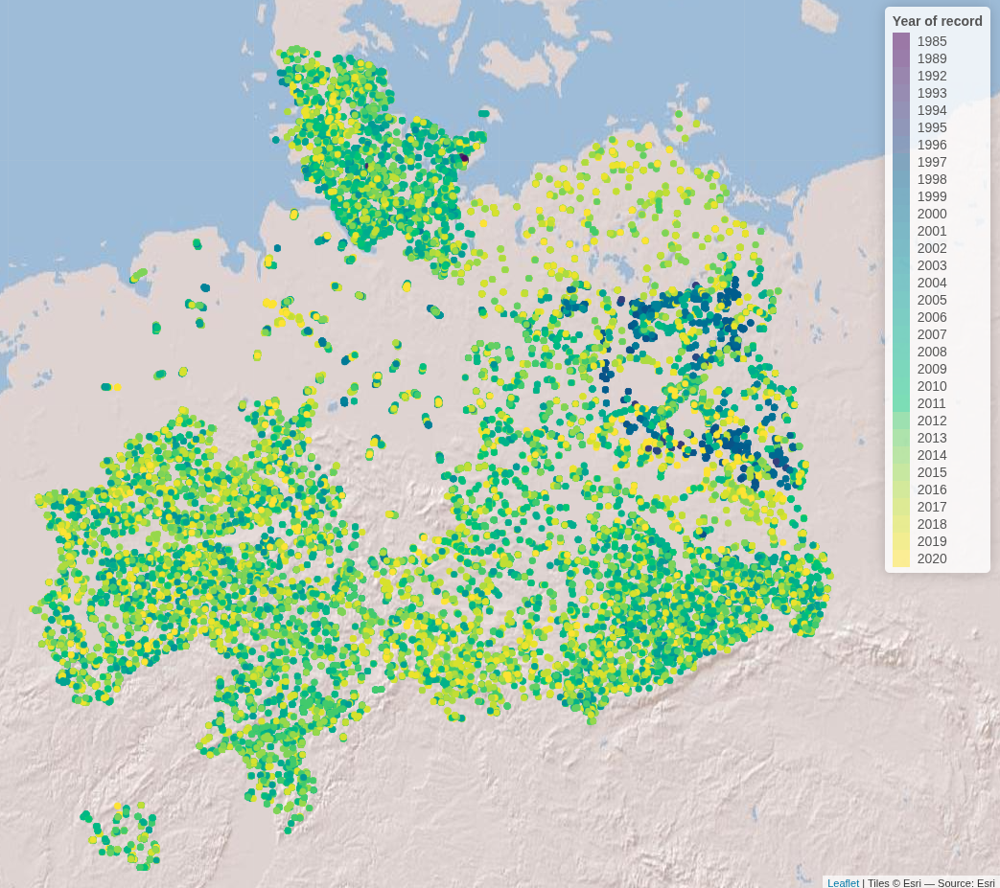
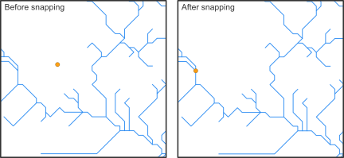
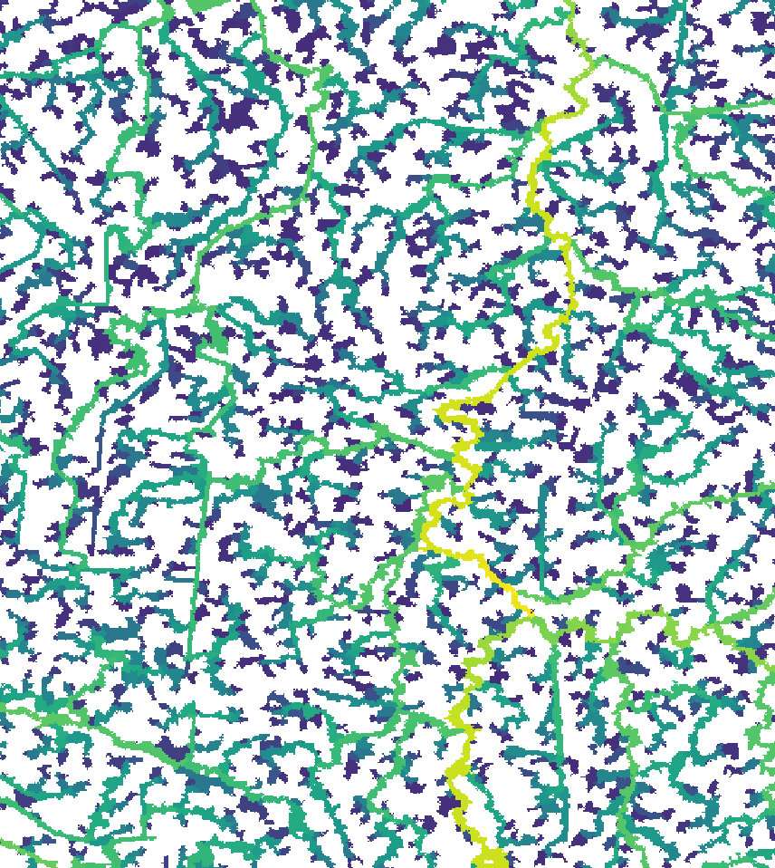
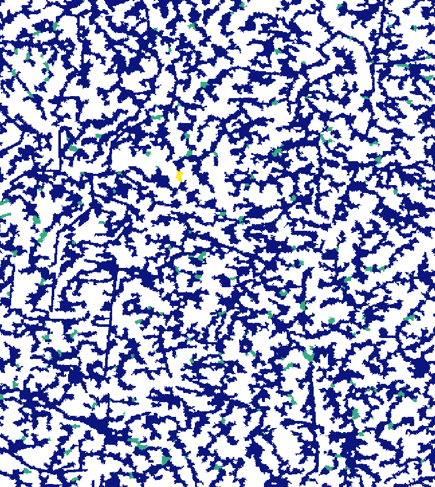
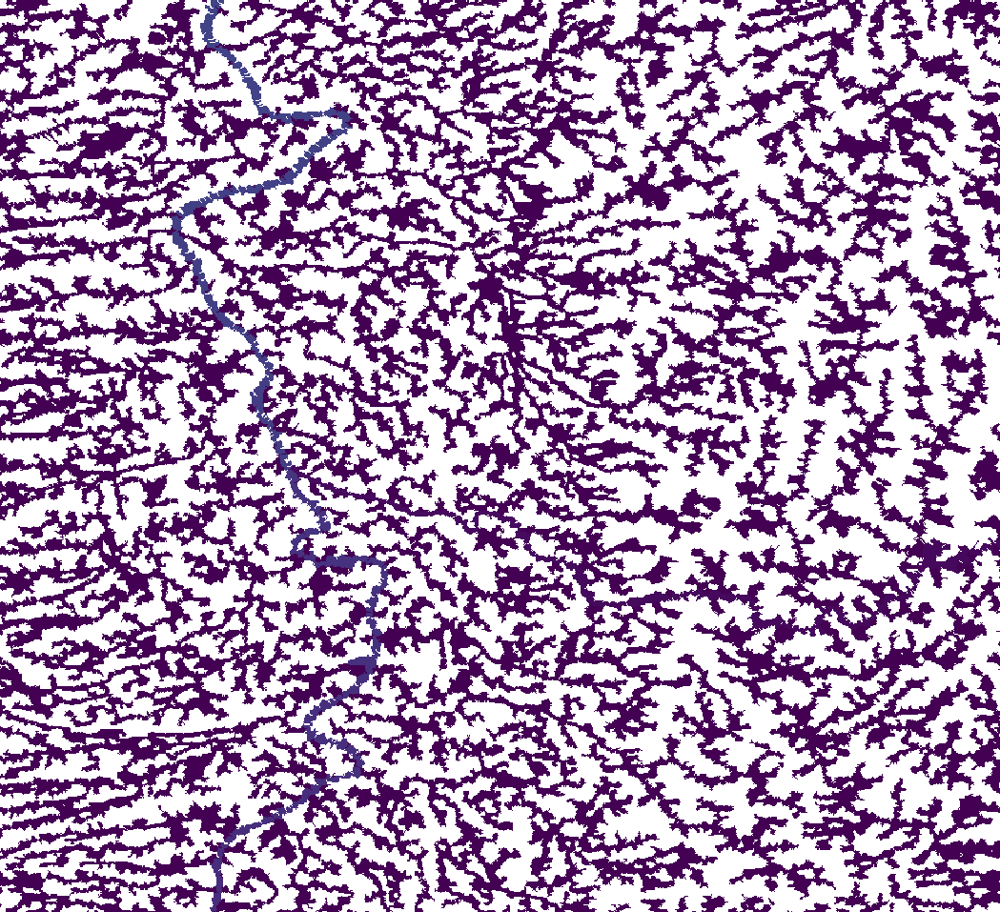
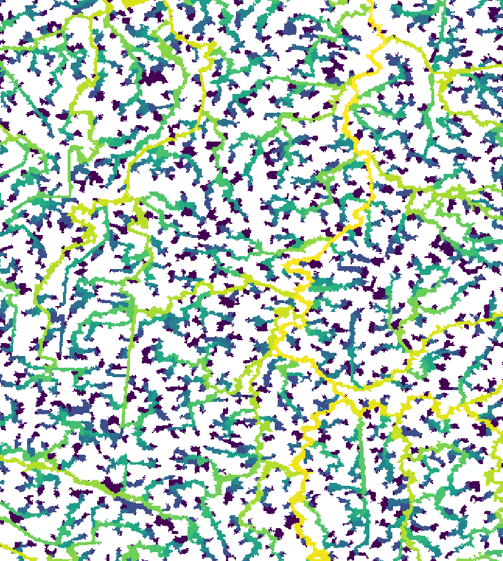

# Case study - Germany

### Introduction

Load required libraries

``` r

library(hydrographr)
library(rgbif)
library(data.table)
library(dplyr)
library(terra)
library(tools)
library(stringr)
library(leaflet)
library(leafem)
library(sf)
library(tidyr)
```

Define working directory

``` r

# Define the "data_germany" directory, where you have downloaded all the data,
# as the working directory
wdir <- "my/working/directory/data_germany"
setwd(wdir)

# Create a new folder in the working directory to store all the data
dir.create("data")
```

### Species data

We first download the occurrence data with coordinates from GBIF

``` r

# Once: Download species occurrence data based on the key of the dataset
# and write out to working directory
spdata_all <- occ_download_get(key="0004551-231002084531237",
                               overwrite = TRUE) %>%
  occ_download_import

fwrite(spdata_all, paste0(wdir, "/data/fish_germany_gbif.csv"),
       row.names = F, quote = F, sep = "\t")
```

``` r

# Import and clean the data
spdata <- fread(paste0(wdir, "/data/fish_germany_gbif.csv"), sep = "\t") %>%
  select(gbifID, decimalLongitude, decimalLatitude, species, year) %>%
  rename("longitude" = "decimalLongitude",
         "latitude" = "decimalLatitude")
```

``` r

head(spdata)
```

|     gbifID | longitude | latitude | species       | year |
|-----------:|----------:|---------:|:--------------|-----:|
| 4058501303 |   13.2284 |  52.5709 | Abramis brama | 2007 |
| 4058501307 |   13.1564 |  52.4147 | Abramis brama | 2007 |
| 4058460309 |   13.1861 |  52.4576 | Abramis brama | 2007 |
| 4058501314 |   13.1093 |  52.4079 | Abramis brama | 2008 |
| 4058501316 |   13.5746 |  52.5091 | Abramis brama | 2008 |
| 4058460317 |   13.1177 |  52.4017 | Abramis brama | 2008 |

Let’s visualise the species occurrences on the map

Let’s define the extent (bounding box) of the study area (xmin, ymin,
xmax, ymax)

``` r

# Define the extent
bbox <- c(min(spdata$longitude), min(spdata$latitude),
          max(spdata$longitude), max(spdata$latitude))
```

``` r

# Define color palette for the different years of record
factpal <- colorFactor(hcl.colors(unique(spdata$year)), spdata$year)

# Create leaflet plot
spdata_plot <- leaflet(spdata) %>%
  addProviderTiles('Esri.WorldShadedRelief') %>%
  setMaxBounds(bbox[1], bbox[2], bbox[3], bbox[4]) %>%
  addCircles(lng = ~longitude, lat = ~ latitude, 
             color =  ~factpal(as.factor(year)),
             opacity = 1) %>%
  addLegend(pal = factpal, values = ~as.factor(year),
            title = "Year of record")
spdata_plot
```



### Abiotic variables data

#### 1. Hydrography90m

In order to download layers of the Hydrography90m, we need to know the
IDs of the 20°x20° tiles in which they are located. We can obtain these
IDs using the function *get_tile_id()*. This function downloads and uses
the auxiliary raster file that contains all the regional units globally,
and thus requires an active internet connection.

``` r

tile_id <- get_tile_id(data = spdata,
                       lon = "longitude", lat = "latitude")

# Get reg unit id to crop all the regular tile layers so that 
# we have uninterrupted basins
reg_unit_id <- get_regional_unit_id(data = spdata,
                                    lon = "longitude", lat = "latitude")
```

``` r

tile_id
```

    ## [1] "h16v02" "h18v00" "h18v02"

Currently the function returns all the tiles of the regional unit where
the input points are located. However, some of them may be far from the
study area and hence not always needed in further steps. Please double
check which tile IDs are relevant for your purpose using the **Tile
map** found
[here](https://hydrography.org/hydrography90m/hydrography90m_layers/).

In our case, Germany spreads in just one tile, with the ID “h18v02”, so
we will keep only this one.

``` r

tile_id <- "h18v02"
```

Then we define the names of the raster and vector layers we want to
download.

``` r

# Define the raster layers
vars_tif <- c("basin", "sub_catchment", "segment", "accumulation", "direction",
              "outlet_dist_dw_basin", "outlet_dist_dw_scatch",
              "channel_dist_up_seg", "order_strahler")
# Define the vector layers
# The "basin" layer contains the polygons of the drainage basins while the
# "order_vect_segment" layer is the stream network vector file
vars_gpkg <- c("basin", "order_vect_segment")
```

``` r

# Extend timeout to 1000s to allow uninterrupted downloading
options(timeout = 1000)
# Download the .tif tiles of the desired variables
download_tiles(variable = vars_tif, tile_id = tile_id, file_format = "tif",
               download_dir = "data")

# Download the .gpkg tiles of the desired variables
download_tiles(variable = vars_gpkg, tile_id = tile_id, file_format = "gpkg",
               download_dir = "data")

# Download the raster mask of the regional unit
download_tiles(variable = "regional_unit",
               file_format = "tif",
               reg_unit_id = reg_unit_id,
               download_dir = "data")
```

#### 2. Elevation - MERIT-HYDRO

To download the elevation files of MERIT-HYDRO, we visit
<https://hydro.iis.u-tokyo.ac.jp/~yamadai/MERIT_Hydro/> to define the
tiles that need to be downloaded. We download the zipped tiles into a
new directory called ***elv***, unzip the downloaded .tar file and keep
only the tiles that we need

``` r

elv_dir <- paste0(wdir, "/data/elv") 
dir.create(elv_dir)
```

#### 3. Climate - CHELSA Bioclim

Finally, we will download three CHELSA present Bioclim variables. For a
quick outlook on the bioclimatic variables you can have a look
[here](https://chelsa-climate.org/bioclim/).

``` r

# Create download directory
dir.create(paste0(wdir, "/data/chelsa_bioclim"))
```

``` r

# Extend timeout to 1000s to allow uninterrupted downloading
options(timeout = 1000)

# Download
# Present, 1981-2010
download.file("https://os.zhdk.cloud.switch.ch/chelsav2/GLOBAL/climatologies/1981-2010/bio/CHELSA_bio12_1981-2010_V.2.1.tif ",
destfile = "data/chelsa_bioclim/bio12_1981-2010.tif", mode = "wb")
download.file("https://os.zhdk.cloud.switch.ch/chelsav2/GLOBAL/climatologies/1981-2010/bio/CHELSA_bio15_1981-2010_V.2.1.tif ",
destfile = "data/chelsa_bioclim/bio15_1981-2010.tif", mode = "wb")
download.file("https://os.zhdk.cloud.switch.ch/chelsav2/GLOBAL/climatologies/1981-2010/bio/CHELSA_bio1_1981-2010_V.2.1.tif ",
destfile = "data/chelsa_bioclim/bio1_1981-2010.tif", mode = "wb")
```

### Cropping the raster files

After having downloaded all the layers, we need to crop them to the
extent of our study area extended by 500 km, so that our basins are not
split in half.

``` r

# Define and create a directory for the study area
study_area_dir <-  paste0(wdir, "/data/study_area")
if(!dir.exists(study_area_dir)) dir.create(study_area_dir)


# Get the full paths of the raster tiles
raster_tiles_watershed <- list.files(paste0(wdir, "/data/r.watershed"),
                                     pattern = ".tif", full.names = TRUE, 
                                     recursive = TRUE)
raster_tiles_dist <- list.files(paste0(wdir, "/data/r.stream.distance"),
                                pattern = ".tif", full.names = TRUE, 
                                recursive = TRUE)
raster_tiles_chan <- list.files(paste0(wdir, "/data/r.stream.channel"),
                                pattern = ".tif", full.names = TRUE, 
                                recursive = TRUE)
raster_tiles_ord <- list.files(paste0(wdir, "/data/r.stream.order"),
                               pattern = ".tif", full.names = TRUE, 
                               recursive = TRUE)

raster_tiles <- c(raster_tiles_watershed, raster_tiles_dist, 
                  raster_tiles_chan, raster_tiles_ord)
```

Let’s define the extent (bounding box) of the study area (xmin, ymin,
xmax, ymax)

``` r

bb <- c(0.256, 20, 45, 55.4325)
```

We then crop the raster tiles to the extent using the function
*crop_to_extent()* in a loop

``` r

for(itile in raster_tiles) {

  crop_to_extent(raster_layer = itile,
                 bounding_box = bb,
                 out_dir = study_area_dir,
                 file_name =  paste0(str_remove(basename(itile), ".tif"),
                                     "_crop.tif"),
                 quiet = FALSE,
                 compression = "high",
                 bigtiff = TRUE,
                 read = FALSE)
}
```

### Filtering the sub-catchment and basin .gpkg files

In case you don’t work on a server, we suggest you to download the
output files of this chunk from the following links and then copy them
in the folder *`study_area_dir`*:

- [order_vect_segment_h18v02_crop.gpkg](https://drive.google.com/file/d/14jh2zG7eqlS-KQZlZufLcZfPdEhRncd8/view?usp=drive_link)

- [basin_h18v02_crop.gpkg](https://drive.google.com/file/d/1l9l7k3s9YIVkjhSoRqLVb8L2rGStSvz0/view?usp=drive_link)

``` r

# !! Only run this chunk on a machine with more than 16 GB RAM, 
# as the input files are really big !!

# Load the cropped stream and basin raster layer of the study area.
# The stream raster can be used interchangeably with the sub_catchment raster, 
# because the stream IDs are the same as the sub-catchment IDs. 
# Here we use the stream raster because it's smaller in size. 

stream_layer <- rast(paste0(study_area_dir, "/segment_h18v02_crop.tif"))
basin_layer <- rast(paste0(study_area_dir, "/basin_h18v02_crop.tif"))

# Get all sub-catchment and basin IDs of the study area
subc_ids <- terra::unique(stream_layer)
basin_ids <- terra::unique(basin_layer)

# Get the full path of the stream order segment GeoPackage tile
order_tile <- list.files(wdir, pattern = "order.+_h[v0-8]+.gpkg$",
                         full.names = TRUE, recursive = TRUE)
basin_gpkg_tile <- list.files(wdir, pattern = "bas.+_h[v0-8]+.gpkg$",
                              full.names = TRUE, recursive = TRUE)

# Filter the sub-catchment IDs from the GeoPackage of the order_vector_segment
# tiles (sub-catchment ID = stream ID)
# Save the stream segments of the study area
filtered_stream <- read_geopackage(order_tile,
                                   import_as = "sf",
                                   subc_id = subc_ids$segment_h18v02_crop,
                                   name = "stream")

sf::write_sf(filtered_stream, paste(study_area_dir,
                              paste0(str_remove(basename(order_tile), ".gpkg"),
                                     "_crop.gpkg"), sep="/"))

filtered_bas <- read_geopackage(basin_gpkg_tile,
                                import_as = "sf",
                                subc_id = basin_ids$basin_h18v02_crop,
                                name = "ID")

sf::write_sf(filtered_bas, paste(study_area_dir,
                                 paste0(str_remove(basename(basin_gpkg_tile), ".gpkg"),
                                        "_crop.gpkg"), sep="/"))
```

### Merging the elevation tiles

``` r

# These are the elevation tiles that include our study area
elv_tiles <- c("n45e000_elv.tif", "n50e010_elv.tif", "n60e000_elv.tif",
                "n45e005_elv.tif", "n50e015_elv.tif", "n60e005_elv.tif",
                "n45e010_elv.tif", "n55e000_elv.tif", "n60e010_elv.tif",
                "n45e015_elv.tif", "n55e005_elv.tif", "n60e015_elv.tif",
                "n50e000_elv.tif", "n55e010_elv.tif", "n50e005_elv.tif",
                "n55e015_elv.tif")

merge_tiles(tile_dir = elv_dir, 
            tile_names = elv_tiles,
            out_dir = study_area_dir, 
            file_name = "elv_study_area.tif",
            compression = "high",
            bigtiff = TRUE,
            quiet = FALSE)


# crop to our extent
crop_to_extent(raster_layer = paste0(study_area_dir, "/elv_study_area.tif"),
               bounding_box = bb,
               out_dir = study_area_dir,
               file_name =  "elv_study_area_crop.tif",
               quiet = FALSE,
               compression = "high", 
               bigtiff = TRUE, 
               read = FALSE)
```

Finally, we will crop the CHELSA Bioclim layers.

We define the directory containing the layers to be cropped and we list
their file names

``` r

dir_chelsa <- paste0(wdir, "/data/chelsa_bioclim")
files_chelsa <- list.files(dir_chelsa, pattern = ".tif", full.names = TRUE)
```

``` r

for(ifile in files_chelsa) {
    crop_to_extent(
      raster_layer = ifile,
      bounding_box = bb,
      out_dir = study_area_dir,
      file_name = basename(ifile),
      read = FALSE,
      quiet = TRUE)
}
```

### Extracting sub-catchment IDs

Extract the IDs of the sub-catchments where the points are located. This
step is crucial, as many of the functions that we will later use require
a vector of sub-catchment IDs as input. Note that the function
*extract_ids()* can be used to extract the values at specific points of
any raster file provided to the argument *subc_layer*. It can be safely
used to query very large raster files, as these are not loaded into R.

``` r

spdata_ids <- extract_ids(data = spdata,
                          id = "gbifID",
                          lon = "longitude", 
                          lat = "latitude",
                          basin_layer = paste0(study_area_dir, 
                                               "/basin_h18v02_crop.tif"),
                          subc_layer = paste0(study_area_dir, 
                                              "/sub_catchment_h18v02_crop.tif"))
```

| longitude | latitude |     gbifID | subcatchment_id | basin_id |
|----------:|---------:|-----------:|----------------:|---------:|
|   13.2284 |  52.5709 | 4058501303 |       507197109 |  1294020 |
|   13.1564 |  52.4147 | 4058501307 |       507313477 |  1294020 |
|   13.1861 |  52.4576 | 4058460309 |       507278293 |  1294020 |
|   13.1093 |  52.4079 | 4058501314 |       507316793 |  1294020 |
|   13.5746 |  52.5091 | 4058501316 |       507243022 |  1294020 |
|   13.1177 |  52.4017 | 4058460317 |       507321279 |  1294020 |

The species data have now their corresponding sub-catchment ids {.table}

### Snapping points to the network

Before we can calculate the distance along the stream network between
species occurrences, we need to snap the coordinates of the sites to the
stream network. Recorded coordinates of point locations usually do not
exactly overlap with the digital stream network and, therefore, need to
be slightly corrected.

The hydrographr package offers two different snapping functions,
`snap_to_network` and `snap_to_subc_segment`. The first function uses a
defined distance radius and a flow accumulation threshold, while the
second function snaps the point to the stream segment of the
sub-catchment the point was originally located in.

For this case study we will use the function `snap_to_network` to be
able to define a certain flow accumulation threshold and ensure that the
fish occurrences will not be snapped to a headwater stream (first order
stream) if there is also a higher order stream next to it.



``` r

# Define full paths of raster layers
stream_rast <- paste0(study_area_dir, "/segment_h18v02_crop.tif")
flow_rast <- paste0(study_area_dir, "/accumulation_h18v02_crop.tif")
```

``` r

# We need to shorten the gbifIDs because they are too long for GRASS-GIS
# We will delete the first 2 characters ("40") from all IDs
spdata_ids$gbifID_tmp <- str_replace(spdata_ids$gbifID, "40", "")
```

The function is implemented in a for-loop that starts searching for
streams with a very high flow accumulation of 400,000 km² in a very
short distance and then slowly decreases the flow accumulation to 100
km². If there are still sites left which were not snapped to a stream
segment, the distance will increase from 10 up to 30 cells.

``` r

# Define thresholds for the flow accumulation of the stream segment, where
# the point location should be snapped to
accu_threshold <- c(400000, 300000, 100000, 50000, 10000, 5000, 1000, 500, 100) 
# Define the distance radius
dist_radius <- c(10, 20, 30)

# Create a temporary data.table
point_locations_tmp <- spdata_ids

# Note: The for loop takes about 9 minutes
first <- TRUE
for (idist in dist_radius) {
    
   # If the distance increases to 20 cells only a flow accumulation of 100 km²
   # will be used
   if (idist == 20) {
    # Set accu_threshold to 100
    accu_threshold <- c(100)
   }
  

  for (iaccu in accu_threshold) {
    # Snap point locations to the stream network
    point_locations_snapped_tmp <- snap_to_network(data = point_locations_tmp,
                                    id = "gbifID",
                                    lon = "longitude", lat = "latitude",
                                    stream_layer = stream_rast,
                                    accu_layer = flow_rast,
                                    method = "accumulation",
                                    distance = idist,
                                    accumulation = iaccu,
                                    quiet = FALSE)

    
    # Keep point location with NAs for the next loop
    point_locations_tmp <- point_locations_snapped_tmp %>% 
      filter(is.na(subc_id_snap_accu))
  
  if (first == TRUE) {
    # Keep the point locations with the new coordinates and remove rows with NA
    point_locations_snapped <- point_locations_snapped_tmp %>% 
    filter(!is.na(subc_id_snap_accu))
    first <- FALSE
  } else {
    # Bind the new data.frame to the data.frame of the loop before
    # and remove the NA
    point_locations_snapped <- point_locations_snapped %>% 
      bind_rows(point_locations_snapped_tmp) %>% 
      filter(!is.na(subc_id_snap_accu))
    
  }
  
  }
    
}
```

We can write out the result of the snapping

``` r

fwrite(point_locations_snapped, paste0(wdir, "/data/spdata_snapped.csv"), sep = ",", 
                      row.names = FALSE, quote = FALSE)
```

``` r

head(point_locations_snapped)
```

|   gbifID | longitude | latitude | lon_snap_accu | lat_snap_accu | subc_id_snap_accu |
|---------:|----------:|---------:|--------------:|--------------:|------------------:|
| 58452301 |   10.1725 |  53.8729 |     10.172083 |      53.87292 |         506457237 |
| 58452302 |   10.2972 |  53.6788 |     10.297083 |      53.67875 |         506528521 |
| 58452303 |    9.4411 |  54.0136 |      9.441250 |      54.01375 |         506407992 |
| 58452304 |    9.5619 |  54.0996 |      9.562083 |      54.09958 |         506383004 |
| 58452305 |   10.6518 |  53.6034 |     10.652083 |      53.60375 |         506562036 |
| 58452306 |    9.9609 |  53.8553 |      9.961250 |      53.85542 |         506463635 |

The species data have been attributed new coordinates and in some cases
a new sub-catchment id (“subc_id_snap_accu”) {.table}

### Calculating distances between points

We will calculate the distance between all point locations. The
following chunks are computationally heavy, so we suggest to run them on
a server.

``` r

# Load as graph
stream_graph <- read_geopackage(
  gpkg = paste0(study_area_dir, "/order_vect_segment_h18v02_crop.gpkg"),
  import_as = "graph")

# Get the network distance (in meters) between all input pairs.
# We provide the subcatchment ids of the snapped points to the argument "subc_id"
subc_distances <- get_distance_graph(stream_graph,
                            subc_id = point_locations_snapped$subc_id_snap_accu,
                            variable = "length",
                            distance_m = TRUE)
```

``` r

head(subc_distances)
```

|      from |        to |  distance |
|----------:|----------:|----------:|
| 506457237 | 506528521 | 167973.69 |
| 506457237 | 506407992 |  92908.34 |
| 506528521 | 506407992 | 111478.74 |
| 506457237 | 506383004 | 161571.37 |
| 506528521 | 506383004 | 136308.05 |
| 506407992 | 506383004 | 105076.42 |

### Obtaining network centrality indices

We will now calculate centrality indices using the directed stream
network graph and the function `get_centrality` We want to consider only
the upstream connected segments, so we set `mode = "in".`

The following chunks are computationally heavy, so we suggest to run
them on a server.

``` r

centrality <- get_centrality(stream_graph, index = "all", mode = "in")
```

We can reclassify the stream segment and sub-catchment raster layers
based on the centrality value of each stream, using the function
`reclass_raster`. Essentially, we will create two new raster files, in
which each stream pixel will have a centrality value, instead of the
unique ID of the stream or sub-catchment.

``` r

# This data.frame includes some NAs in some of the columns, because some centrality metrics by default cannot be defined for some the subcatchments. We have to discard subcatchments with NAs before reclassifying.
centrality <- drop_na(centrality)

# Then we convert the values in the centrality data.frame into integers
centrality <- centrality %>% mutate_if(is.numeric, as.integer)

reclass_raster(data = centrality, 
                            rast_val = "subc_id", 
                            new_val = "betweeness", 
                            raster_layer = paste0(study_area_dir, "/segment_h18v02_crop.tif"), 
                            recl_layer = paste0(study_area_dir,"/segment_h18v02_betweeness_all.tif"), 
                            read = F)

reclass_raster(data = centrality, 
               rast_val = "subc_id", 
               new_val = "degree", 
               raster_layer = paste0(study_area_dir, "/sub_catchment_h18v02_crop.tif"),
               recl_layer = paste0(study_area_dir,"/sub_catchment_h18v02_degree_all.tif"), 
               read = F)

reclass_raster(data = centrality, 
               rast_val = "subc_id", 
               new_val = "betweeness", 
               raster_layer = paste0(study_area_dir, "/sub_catchment_h18v02_crop.tif"),
               recl_layer = paste0(study_area_dir,"/sub_catchment_h18v02_betweeness_all.tif"), 
               read = F)

reclass_raster(data = centrality, rast_val = "subc_id", 
               new_val = "farness", 
               raster_layer = paste0(study_area_dir, "/sub_catchment_h18v02_crop.tif"),
               recl_layer = paste0(study_area_dir,"/sub_catchment_h18v02_farness_all.tif"), 
               read = F)

reclass_raster(data = centrality, 
               rast_val = "subc_id", 
               new_val = "eccentricity", 
               raster_layer = paste0(study_area_dir, "/sub_catchment_h18v02_crop.tif"),
               recl_layer = paste0(study_area_dir,"/sub_catchment_h18v02_eccentricity_all.tif"), 
               read = F)
```

Here’s what the new segment and sub-catchment layers look like on QGIS.
Yellow sub-catchments have the highest values, whereas dark blue have
the lowest values for the different metrics.

The node **betweenness** is (roughly) defined by the number of geodesics
(shortest paths) going through a node:



The **degree** of a node is the number of its adjacent edges:



**Farness** centrality is the sum of the length of the shortest paths
between the node and all other nodes. It is the reciprocal of closeness
(Altermatt, 2013):



The **eccentricity** of a node is its shortest path distance from the
farthest other node in the graph (West,
1996):

We can add the centrality metrics’ values to the table of our points,
using the sub-catchment id:

``` r

point_locations_snapped <- left_join(point_locations_snapped, centrality, 
                          by = c('subc_id_snap_accu'= 'subc_id'))
head(point_locations_snapped)
```

|   subc_id | degree | closeness | farness | betweeness | eccentricity |
|----------:|-------:|----------:|--------:|-----------:|-------------:|
| 506226492 |      2 |   4.8e-06 |  210084 |     175492 |          163 |
| 506226723 |      2 |   3.8e-06 |  263544 |     125205 |          185 |
| 506226977 |      2 |   1.4e-06 |  716085 |     167992 |          214 |
| 506227065 |      2 |   3.6e-06 |  279270 |     114210 |          191 |
| 506227782 |      2 |   6.1e-06 |  164017 |     201756 |          144 |
| 506227869 |      2 |   7.5e-06 |  133336 |     168399 |          137 |

Bonus! If we want to include the centrality indices to the stream
network .gpkg, we can import the .gpkg and merge it with the centrality
table

``` r

# Load stream network .gpkg as vector
stream_vect <- read_geopackage(paste0(study_area_dir, "/order_vect_segment_h18v02_crop.gpkg"),
                               import_as = "SpatVect")

# Merge the centrality table with the vector
stream_vect <- terra::merge(stream_vect, spdata_centr, 
                        by.x = c('stream'), by.y="subc_id")

# Write out the stream gpkg including the centrality indices
writeVector(stream_vect, paste0(study_area_dir, "/order_vect_segment_centr.gpkg"))
```

### Extracting zonal statistics of topographic variables

We will calculate the zonal statistics of the Hydrography90m,
MERIT-HYDRO DEM and the CHELSA Bioclim variables for the sub-catchments
of our species points. Caution, don’t increase the number of cores to
more than 3 as this can cause memory problems. However, this highly
depends to the number of sub-catchments as well. We recommend to test
the function with different parameters to find out what works best for
your case.

Let’s first define the input `var_layers` for the `extract_zonal_stat`
function

``` r

list.files(study_area_dir)
var_layers <- c("bio1_1981-2010.tif", "bio12_1981-2010.tif",
                "bio15_1981-2010.tif", "elv_study_area_crop.tif",
                "outlet_dist_dw_basin_h18v02_crop.tif")
```

A good practice before aggregating the variables is to check their
NoData values:

``` r

report_no_data(data_dir = study_area_dir, var_layer = var_layers)
```

``` r

#                                 Raster                  NoData
# 1                   bio1_1981-2010.tif                  -99999
# 2                  bio15_1981-2010.tif 3.40282346600000016e+38
# 3 outlet_dist_dw_basin_h18v02_crop.tif                   -9999
# 4                  bio12_1981-2010.tif                  -99999
# 5              elv_study_area_crop.tif                   -9999
```

``` r

# Run the function that returns the zonal statistics.
# We provide the subcatchment ids of the fish points to the argument 'subc_id'.
stats_table_zon <- extract_zonal_stat(
                    data_dir = study_area_dir,
                    subc_layer = paste0(study_area_dir, "/sub_catchment_h18v02_crop.tif"),
                    subc_id = point_locations_snapped$subc_id_snap_accu,
                    var_layer = var_layers,
                    out_dir = paste0(wdir, "/data"),
                    file_name = "zonal_stats.csv",
                    n_cores = 3)
```

The function also reports the NoData values that are used in the
calculation of the zonal statistics of each variable.

We will keep only the mean and sd of each variable of the stats_table:

``` r

stats_table_zon <- stats_table_zon %>%
  dplyr::select(contains("subc") |  ends_with("_mean") | ends_with("_sd")) %>%
  rename('subcatchment_id' = 'subc_id')
```

The values in some of the original raster files were scaled, so we need
to re-scale them before proceeding to any analyses.

We define the following functions:

``` r

clim_scale <- function(x, na.rm = F) (x * 0.1)
offset <- function(x, na.rm = F) (x - 273.15)
```

… and apply them to rescale the values

``` r

stats_table_zon <- stats_table_zon  %>%
  mutate(across(starts_with("bio"), clim_scale))  %>%
  mutate(across(matches("bio1_.*_mean"), offset))
```

``` r

head(stats_table_zon)
```

| subcatchment_id | bio1_1981.2010_mean | bio12_1981.2010_mean | bio15_1981.2010_mean | elv_study_area_crop_mean | outlet_dist_dw_basin_h18v02_crop_mean | bio1_1981.2010_sd | bio12_1981.2010_sd | bio15_1981.2010_sd | elv_study_area_crop_sd | outlet_dist_dw_basin_h18v02_crop_sd |
|---:|---:|---:|---:|---:|---:|---:|---:|---:|---:|---:|
| 506226492 | 8.750000 | 867.0000 | 24.50000 | 2.518750 | 32103.56 | 0.0000000 | 0.0000000 | 0.0000000 | 0.6540439 | 89.4399 |
| 506226723 | 8.850000 | 862.5000 | 25.00000 | 1.404762 | 23899.57 | 0.0000000 | 0.0000000 | 0.0000000 | 0.3062464 | 112.3611 |
| 506226977 | 8.950000 | 835.8753 | 26.32118 | 1.556471 | 10280.49 | 0.0000000 | 0.8442060 | 0.0533449 | 0.5845958 | 347.6842 |
| 506227065 | 8.850000 | 859.7644 | 25.10000 | 1.667797 | 22184.93 | 0.0000000 | 0.0970108 | 0.0000000 | 0.5881429 | 258.6820 |
| 506227782 | 8.716667 | 877.9917 | 23.80000 | 5.733333 | 39542.25 | 0.0471405 | 0.9286714 | 0.0000000 | 0.3933475 | 123.1798 |
| 506227869 | 8.650000 | 882.0288 | 23.51364 | 7.521212 | 42551.11 | 0.0000000 | 0.8227384 | 0.0343174 | 0.5040789 | 292.2345 |

### Putting together the final table

We will now perform some left joins to match the zonal statistics table
with the original species data.

``` r

data_fin <- left_join(point_locations_snapped, stats_table_zon, 
          by = c('subc_id_snap_accu'= 'subcatchment_id'))

data_fin$gbifID <- as.character(data_fin$gbifID)
data_fin <- left_join(spdata_ids, data_fin)

# Convert the gbifIDs back to the original values
data_fin$gbifID <- str_c("40", data_fin$gbifID)
spdata$gbifID <- as.character(spdata$gbifID)

data_fin <- left_join(spdata, data_fin)
```

``` r

head(data_fin)
```

| gbifID | longitude | latitude | species | year | subcatchment_id | basin_id | lon_snap_accu | lat_snap_accu | subc_id_snap_accu | degree | closeness | farness | betweeness | eccentricity | bio1_1981.2010_mean | bio12_1981.2010_mean | bio15_1981.2010_mean | elv_study_area_crop_mean | outlet_dist_dw_basin_h18v02_crop_mean | bio1_1981.2010_sd | bio12_1981.2010_sd | bio15_1981.2010_sd | elv_study_area_crop_sd | outlet_dist_dw_basin_h18v02_crop_sd |
|---:|---:|---:|:---|---:|---:|---:|---:|---:|---:|---:|---:|---:|---:|---:|---:|---:|---:|---:|---:|---:|---:|---:|---:|---:|
| 4058501303 | 13.2284 | 52.5709 | Abramis brama | 2007 | 507197109 | 1294020 | 13.22708 | 52.57042 | 507197712 | 2 | 3.00e-07 | 3090581 | 16724066 | 393 | 9.450000 | 593.5000 | 17.80000 | 31.04762 | 440220.7 | 0.0000000 | 0.0000000 | 0.0000000 | 1.377236 | 151.5696 |
| 4058501307 | 13.1564 | 52.4147 | Abramis brama | 2007 | 507313477 | 1294020 | 13.15625 | 52.41459 | 507313477 | 3 | 2.39e-05 | 41919 | 953343 | 88 | 9.509091 | 589.5500 | 18.60000 | 35.73636 | 427865.0 | 0.0491666 | 0.3460820 | 0.0000000 | 3.234690 | 134.7493 |
| 4058460309 | 13.1861 | 52.4576 | Abramis brama | 2007 | 507278293 | 1294020 | 13.18125 | 52.46292 | 507275834 | 2 | 0.00e+00 | 51830114 | 105429462 | 1303 | 9.547436 | 586.2846 | 18.30000 | 30.78718 | 426400.9 | 0.0158062 | 0.0975034 | 0.0000000 | 2.339974 | 186.9974 |
| 4058501314 | 13.1093 | 52.4079 | Abramis brama | 2008 | 507316793 | 1294020 | 13.10958 | 52.40792 | 507316793 | 2 | 5.00e-01 | 2 | 2310 | 1 | 9.434524 | 580.8988 | 18.60000 | 47.73333 | 433626.8 | 0.0607376 | 1.7258189 | 0.0000000 | 12.098773 | 218.8741 |
| 4058501316 | 13.5746 | 52.5091 | Abramis brama | 2008 | 507243022 | 1294020 | NA | NA | NA | NA | NA | NA | NA | NA | NA | NA | NA | NA | NA | NA | NA | NA | NA | NA |
| 4058460317 | 13.1177 | 52.4017 | Abramis brama | 2008 | 507321279 | 1294020 | 13.11792 | 52.40208 | 507321279 | 2 | 2.50e-02 | 40 | 14989 | 5 | 9.477434 | 579.6389 | 18.60089 | 46.03982 | 432292.3 | 0.0446179 | 1.7279807 | 0.0093655 | 14.462301 | 349.9969 |

### References

Appelhans, Tim. 2022. *Leafem: Leaflet Extensions for Mapview*.
<https://github.com/r-spatial/leafem>.

Appelhans, Tim, Florian Detsch, Christoph Reudenbach, and Stefan
Woellauer. 2022. *Mapview: Interactive Viewing of Spatial Data in r*.
<https://github.com/r-spatial/mapview>.

Chamberlain, Scott, and Carl Boettiger. 2017. “R Python, and Ruby
Clients for GBIF Species Occurrence Data.” *PeerJ PrePrints*.
<https://doi.org/10.7287/peerj.preprints.3304v1>.

Chamberlain, Scott, Damiano Oldoni, and John Waller. 2023. *Rgbif:
Interface to the Global Biodiversity Information Facility API*.
<https://github.com/ropensci/rgbif>.

Cheng, Joe, Barret Schloerke, Bhaskar Karambelkar, and Yihui Xie. 2023.
*Leaflet: Create Interactive Web Maps with the JavaScript Leaflet
Library*. <https://rstudio.github.io/leaflet/>.

Dowle, Matt, and Arun Srinivasan. 2023. *Data.table: Extension of
‘Data.frame‘*. <https://r-datatable.com>.

Hijmans, Robert J. 2023. *Terra: Spatial Data Analysis*.
<https://rspatial.org/>.

Müller, Kirill. 2020. *Here: A Simpler Way to Find Your Files*.
<https://here.r-lib.org/>.

R Core Team. 2023. *R: A Language and Environment for Statistical
Computing*. R Foundation for Statistical Computing.
<https://www.R-project.org/>.

Schürz, Marlene, Afroditi Grigoropoulou, Jaime Garcia Marquez, et al.
2023. *Hydrographr: Scalable Hydrographic Data Processing in r*.
<https://glowabio.github.io/hydrographr/>.

Schürz, Marlene, Afroditi Grigoropoulou, Jaime García Márquez, et al.
2023. “Hydrographr: An r Package for Scalable Hydrographic Data
Processing.” *Methods in Ecology and Evolution* 0 (0): 1–11.
https://doi.org/<https://doi.org/10.1111/2041-210X.14226>.

Vaidyanathan, Ramnath, Yihui Xie, JJ Allaire, Joe Cheng, Carson Sievert,
and Kenton Russell. 2023. *Htmlwidgets: HTML Widgets for r*.
<https://github.com/ramnathv/htmlwidgets>.

Wickham, Hadley. 2022. *Stringr: Simple, Consistent Wrappers for Common
String Operations*. <https://stringr.tidyverse.org>.

Wickham, Hadley, Romain François, Lionel Henry, Kirill Müller, and Davis
Vaughan. 2023. *Dplyr: A Grammar of Data Manipulation*.
<https://dplyr.tidyverse.org>.

Xie, Yihui. 2014. “Knitr: A Comprehensive Tool for Reproducible Research
in R.” In *Implementing Reproducible Computational Research*, edited by
Victoria Stodden, Friedrich Leisch, and Roger D. Peng. Chapman;
Hall/CRC.

Xie, Yihui. 2015. *Dynamic Documents with R and Knitr*. 2nd ed. Chapman;
Hall/CRC. <https://yihui.org/knitr/>.

Xie, Yihui. 2023. *Knitr: A General-Purpose Package for Dynamic Report
Generation in r*. <https://yihui.org/knitr/>.

Zhu, Hao. 2021. *kableExtra: Construct Complex Table with Kable and Pipe
Syntax*. <http://haozhu233.github.io/kableExtra/>.
