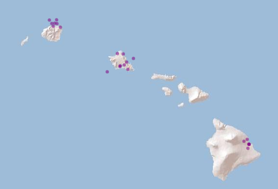

# Usage of hydrographr with other stream networks

Load required libraries:

``` r

library(hydrographr)
library(nhdplusTools)
library(rgbif)
library(dplyr)
library(archive)
library(terra)
library(leaflet)
library(data.table)
library(igraph)
```

Define working directory:

``` r

wdir <- paste0(here(), "/vignettes/data_other_networks")
if(!dir.exists(paste0(wdir, "/data"))) dir.create(paste0(wdir, "/data"))
```

### Download NHDPlusHR data

``` r

# Define the working directory for the region Hawaii
wdir <- "my/working/directory/data_hawaii"
data_dir <- paste0(wdir, "/data")
rast_dir <- paste0(data_dir, "/raster")
vect_dir <- paste0(data_dir, "/vector")
sp_dir <- paste0(data_dir, "/species")
out_dir  <- paste0(wdir, "/output")

# Create a new folder in the working directories to store all the data
dir.create(data_dir)
dir.create(rast_dir)
dir.create(vect_dir)
dir.create(sp_dir)
dir.create(out_dir)
```

Data of the NHDPlusHR dataset can be downloaded using the R package
`nhdplusTools` or from this USGS website:
<https://apps.nationalmap.gov/downloader/>

``` r

# Download NHDPlus raster data for Hawaii 
download_nhdplusv2(outdir = rast_dir,
                   url = paste0(
                     "https://prd-tnm.s3.amazonaws.com/StagedProducts/",
                                "Hydrography/NHDPlusHR/Beta/GDB/",
                                "NHDPLUS_H_2006_HU4_RASTER.7z"),
                   progress = TRUE)

# Unzip -- can also be done manually
# When called with default arguments extracts all files in the archive.
archive_extract(archive = paste0(rast_dir, "/NHDPLUS_H_2006_HU4_RASTER.7z"),
                dir = paste0(rast_dir, "/NHDPLUS_H_2006_HU4_RASTER")
)
```

``` r

# Download NHDPlus vector data for Hawaii 
download_nhdplusv2(outdir = vect_dir,
                   url = paste0(
                     "https://prd-tnm.s3.amazonaws.com/StagedProducts/",
                      "Hydrography/NHDPlusHR/Beta/GDB/",
                      "NHDPLUS_H_2006_HU4_GDB.zip"),
                   progress = TRUE)

# Unzip -- can also be done manually
archive_extract(archive = paste0(vect_dir, "/NHDPLUS_H_2006_HU4_GDB.zip"),
                dir = paste0(vect_dir, "/NHDPLUS_H_2006_HU4_GDB")
)
```

Check directory structure

``` r

list.files(paste0(rast_dir, "/NHDPLUS_H_2006_HU4_RASTER"), recursive = T, 
           pattern = ".tif$")
```

### Species data

Download occurrence records of *Stenogobius hawaiiensis* from GBIF.org
using the R package `rgbif`.

``` r

# Download occurrence data with coordinates from GBIF
gbif_data <- occ_data(scientificName = "Stenogobius hawaiiensis", 
                      hasCoordinate = TRUE)

# To cite the data use:
# gbif_citation(gbif_data)

# Clean the data
spdata <- gbif_data$data %>% 
  select(decimalLongitude, decimalLatitude, species, occurrenceStatus, 
         country, stateProvince, year) %>% 
  filter(!is.na(year),
         stateProvince == "Hawaii") %>% 
  distinct() %>% 
  mutate(occurrence_id = 1:nrow(.)) %>% 
  rename("longitude" = "decimalLongitude",
         "latitude" = "decimalLatitude") %>% 
  select(8, 1:7)

# Save the data
write.csv(spdata, paste0(sp_dir, "/stenogobius_hawaiiensis.csv"), row.names = F,
          quote = F)

spdata
```

### Visualise species data

``` r

m <- leaflet() %>%
  addProviderTiles('Esri.WorldShadedRelief') %>%
  addCircles(data = spdata, color = "purple") 

m
```



By inspecting the NHDPlusHR data, we observe that the coordinate
reference system is not WGS84, but the EPSG:26904.

``` r

rast(paste0(rast_dir, 
            "/NHDPLUS_H_2006_HU4_RASTER/HRNHDPlusRasters2006/cat.tif"))
```

Therefore we will need to convert the species points’ coordinates to
EPSG:26904, so that they match with the spatial layers.

``` r

# Convert the coordinate columns to a matrix
spdata_coord <- spdata %>% 
  select(longitude, latitude) %>% 
  as.matrix()

# Project to the coordinate reference system of the NHDPlus dataset
spdata_coord <- project(spdata_coord, 
                        from = "+proj=longlat +datum=WGS84", 
                        to = "EPSG:26904")

# Replace the WGS84 coordinates with the EPSG:26904 coordinates in the species 
# points' data frame
spdata <- spdata %>% 
  mutate(longitude = spdata_coord[,1],
         latitude = spdata_coord[,2])
```

### Crop and merge raster data

``` r

# The coordinates of the bounding box should also be in the NAD_1983_UTM_Zone_4N projection system
bbox <- c(582638, 2361564, 594373, 2370255)
crop_to_extent(raster_layer = paste0(rast_dir, "/NHDPLUS_H_2006_HU4_RASTER/HRNHDPlusRasters2006/cat.tif"), 
               bounding_box = bbox,
               out_dir = out_dir,
               file_name = "cat_crop.tif",
               compression = "high"
              )

# We can crop to another bounding box, and then try to merge the two cropped 
# layers
bbox2 <- c(595603, 2371564, 604373, 2380255)
crop_to_extent(raster_layer = paste0(rast_dir, "/NHDPLUS_H_2006_HU4_RASTER/HRNHDPlusRasters2006/cat.tif"), 
               bounding_box = bbox2,
               out_dir = out_dir,
               file_name = "cat_crop2.tif",
               compression = "high"
              )
# Merge the two cropped layers
merge_tiles(tile_dir = out_dir, 
            tile_names = c("cat_crop.tif", "cat_crop2.tif"),
            out_dir = out_dir,
            file_name = "cat_merged.tif",
            compression = "high")
```

### Extract IDs, Report no data value, Set no data value

``` r

spdata_ids <- extract_ids(data = spdata, 
            lon = "longitude", lat = "latitude",
            id = "occurrence_id",
            basin_layer  = paste0(rast_dir, "/NHDPLUS_H_2006_HU4_RASTER/HRNHDPlusRasters2006/cat.tif")) 

spdata_ids

# We observe that some points obtain basin_id=NA, because they fall out of the 
# extent of the downloaded raster layer. We will filter these points out, 
# keeping only those which overlap with the raster.

spdata_ids <- spdata_ids %>% 
   filter(!is.na(basin_id))

spdata_ids

# On the other hand, some other points obtain basin_id=-32768. This should be 
# the no data value of the raster layer, meaning a value attributed to the sea 
# cells. We can double-check this using the report_no_data function:
no_data_val <- report_no_data(data_dir = paste0(rast_dir, "/NHDPLUS_H_2006_HU4_RASTER/HRNHDPlusRasters2006"), var_layer = "cat.tif")

no_data_val
# We can filter out these points, too, so that we only keep the points sampled 
# in rivers. 
spdata_ids <- spdata_ids %>% 
   filter(basin_id != no_data_val$NoData)
spdata_ids
```

``` r

# Don't run:
# If we wanted to change the no data value of a layer, we could do it using the 
# function:
set_no_data(data_dir = paste0(rast_dir, "/NHDPLUS_H_2006_HU4_RASTER/HRNHDPlusRasters2006"), 
            var_layer = "cat.tif", 
            no_data = -32768)

# Remember to set it back to the original value!
```

### Extract zonal statistics

To extract zonal statistics of a raster layer using the NHDPlus basins
as zones, we first need to download and crop to our extent an example
raster layer. We will use the CHELSA Bioclim 12 (BIO12) layer of
1981-2010 for this example.

For this operation, we also need to convert the projection system of the
cat.tif raster to EPSG:4326 using the ‘terra’ package, so that it is
compatible with the coordinate system of CHELSA Bioclim files.

``` r

# Download bio12 in the rast_dir
download.file(
  "https://os.zhdk.cloud.switch.ch/envicloud/chelsa/chelsa_V2/GLOBAL/climatologies/1981-2010/bio/CHELSA_bio12_1981-2010_V.2.1.tif",
destfile = paste0(rast_dir, "/bio12_1981-2010.tif"), mode = "wb")


# Crop bio12 to bounding box
# We first need to convert the bounding box coordinates to WGS84, that is the 
# coordinate system of the CHELSA Bioclim layers.
bbox_wgs84 <- project(ext(bbox), from = "EPSG:26904", to = "EPSG:4326")
# Now crop
crop_to_extent(raster_layer = paste0(rast_dir, "/bio12_1981-2010.tif"), 
               bounding_box = bbox_wgs84,
               out_dir = out_dir,
               file_name = "bio12_crop.tif",
               compression = "high"
              )

# Load the cat.tif layer
cat_rast <- rast(paste0(rast_dir, "/NHDPLUS_H_2006_HU4_RASTER/HRNHDPlusRasters2006/cat.tif"))

# Reproject to WGS84 and write out the file with a new name
cat_rast <- project(cat_rast, 
                  y = "epsg:4326", 
                  filename = paste0(rast_dir, "/NHDPLUS_H_2006_HU4_RASTER/HRNHDPlusRasters2006/cat_wgs84.tif"))

# Extract the zonal statistics of bio12 based on the NHDPlus basins
zonal_stats <- extract_zonal_stat(data_dir = out_dir,
                subc_id = "all", 
                subc_layer =  paste0(rast_dir, "/NHDPLUS_H_2006_HU4_RASTER/HRNHDPlusRasters2006/cat_wgs84.tif"),
                var_layer = "bio12_crop.tif",
                quiet = F)

# Same as before, we need to filter out the no data values to get a better 
# grasp of the resulting table
zonal_stats <- zonal_stats %>% 
  filter(bio12_crop_data_cells !=0 )
zonal_stats
```

### Reclassify raster

``` r

# Create example dataframe with reclassification rules to reclassify the value 
# of all basins containing species data to 1, and all the rest to -99999.
reclass_rules <- data.frame(cat = as.integer(spdata_ids$basin_id), 
                            new_val = as.integer(1))

# Apply reclassification
reclass_raster(
  data = reclass_rules,
  rast_val = "cat",
  new_val = "new_val",
  raster_layer = paste0(rast_dir, "/NHDPLUS_H_2006_HU4_RASTER/HRNHDPlusRasters2006/cat.tif"),
  recl_layer = paste0(rast_dir, "/NHDPLUS_H_2006_HU4_RASTER/HRNHDPlusRasters2006/cat_reclass.tif"),
  read = FALSE, 
  no_data = no_data_val$NoData)
```

### 

### Read a .GPKG

See \[Download NHDPlus data\] to download NHDPlus vector data for
Hawaii.

``` r

gdb_dir <- paste0(vect_dir, "/NHDPLUS_H_2006_HU4_GDB")

# Write out a .gpkg file based on the .gdb files
get_nhdplushr(gdb_dir, file.path(gdb_dir, "nhdplus_2006-HU4.gpkg"))


# Import flow line attribute table as a data.table
flow_line <- read_geopackage(gpkg = paste0(gdb_dir, "/nhdplus_2006-HU4.gpkg"), 
                layer_name = "NHDFlowline")


# To import flow line as a graph, first import the attribute table as a 
# data.table and then transform to a graph. Note that the first two columns 
# need to be the "from" and "to" columns

setcolorder(flow_line, c("FromNode", "ToNode"))

# Create the graph
flow_line_graph  <- graph_from_data_frame(flow_line, directed = TRUE)

# Import the catchment layer as a spatial vector
catchment_sp <- read_geopackage(
                gpkg = paste0(gdb_dir, "/nhdplus_2006-HU4.gpkg"), 
                layer_name = "NHDPlusCatchment",
                name = "REACHCODE",
                import_as = "SpatVect")
```

### Snap points to the network

``` r

# Define full path to the stream network raster layer
stream_rast <- paste0(rast_dir, "/NHDPLUS_H_2006_HU4_RASTER/HRNHDPlusRasters2006/swnet.tif")

# Define full path to the flow accumulation raster layer
flow_rast <- paste0(rast_dir, 
                    "/NHDPLUS_H_2006_HU4_RASTER/HRNHDPlusRasters2006/fac.tif")

# Define thresholds for the flow accumulation of the stream segment, where
# the point location should be snapped to
accu_threshold <- 700
# Define the distance radius
dist_radius <- 20

# Snap point locations to the stream network
point_locations_snapped <- snap_to_network(data = spdata_ids,
                                             lon = "longitude",
                                             lat = "latitude",
                                             id = "occurrence_id",
                                             stream_layer = stream_rast,
                                             accu_layer = flow_rast,
                                             method = "both",
                                             distance = dist_radius,
                                             accumulation = accu_threshold,
                                             quiet = FALSE)
```

Note: The columns “subc_id_snap_dist” and “subc_id_snap_accu” of the
table “point_locations_snapped” are only meaningful in case that the
stream and flow accumulation raster layers were derived from the
Hydrography90m.

### References

Appelhans, Tim. 2022. *Leafem: Leaflet Extensions for Mapview*.
<https://CRAN.R-project.org/package=leafem>.

Appelhans, Tim, Florian Detsch, Christoph Reudenbach, and Stefan
Woellauer. 2022. *Mapview: Interactive Viewing of Spatial Data in r*.
<https://github.com/r-spatial/mapview>.

Blodgett, David, and Mike Johnson. 2023a. *nhdplusTools: NHDPlus Tools*.
[https://doi-usgs.github.io/nhdplusTools/
https://github.com/doi-usgs/nhdplusTools/](https://doi-usgs.github.io/nhdplusTools/%0Ahttps://github.com/doi-usgs/nhdplusTools/).

Blodgett, David, and Mike Johnson. 2023b. *nhdplusTools: Tools for
Accessing and Working with the NHDPlus*. Version 0.6.2. U.S. Geological
Survey; U.S. Geological Survey. <https://doi.org/10.5066/P97AS8JD>.

Chamberlain, Scott, and Carl Boettiger. 2017. “R Python, and Ruby
Clients for GBIF Species Occurrence Data.” *PeerJ PrePrints*.
<https://doi.org/10.7287/peerj.preprints.3304v1>.

Chamberlain, Scott, Damiano Oldoni, and John Waller. 2023. *Rgbif:
Interface to the Global Biodiversity Information Facility API*.
<https://CRAN.R-project.org/package=rgbif>.

Cheng, Joe, Bhaskar Karambelkar, and Yihui Xie. 2023. *Leaflet: Create
Interactive Web Maps with the JavaScript Leaflet Library*.
<https://rstudio.github.io/leaflet/>.

Hester, Jim, and Gábor Csárdi. 2022. *Archive: Multi-Format Archive and
Compression Support*. <https://CRAN.R-project.org/package=archive>.

Hijmans, Robert J. 2023. *Terra: Spatial Data Analysis*.
<https://rspatial.org/>.

Müller, Kirill. 2020. *Here: A Simpler Way to Find Your Files*.
<https://CRAN.R-project.org/package=here>.

R Core Team. 2023. *R: A Language and Environment for Statistical
Computing*. R Foundation for Statistical Computing.
<https://www.R-project.org/>.

Schürz, Marlene, Afroditi Grigoropoulou, Jaime Garcia Marquez, et al.
2023. *Hydrographr: Scalable Hydrographic Data Processing in r*.
<https://glowabio.github.io/hydrographr/>.

Vaidyanathan, Ramnath, Yihui Xie, JJ Allaire, Joe Cheng, Carson Sievert,
and Kenton Russell. 2023. *Htmlwidgets: HTML Widgets for r*.
<https://github.com/ramnathv/htmlwidgets>.

Wickham, Hadley, Romain François, Lionel Henry, Kirill Müller, and Davis
Vaughan. 2023. *Dplyr: A Grammar of Data Manipulation*.
<https://CRAN.R-project.org/package=dplyr>.

Xie, Yihui. 2014. “Knitr: A Comprehensive Tool for Reproducible Research
in R.” In *Implementing Reproducible Computational Research*, edited by
Victoria Stodden, Friedrich Leisch, and Roger D. Peng. Chapman;
Hall/CRC.

Xie, Yihui. 2015. *Dynamic Documents with R and Knitr*. 2nd ed. Chapman;
Hall/CRC. <https://yihui.org/knitr/>.

Xie, Yihui. 2023. *Knitr: A General-Purpose Package for Dynamic Report
Generation in r*. <https://yihui.org/knitr/>.

Zhu, Hao. 2021. *kableExtra: Construct Complex Table with Kable and Pipe
Syntax*. <https://CRAN.R-project.org/package=kableExtra>.
