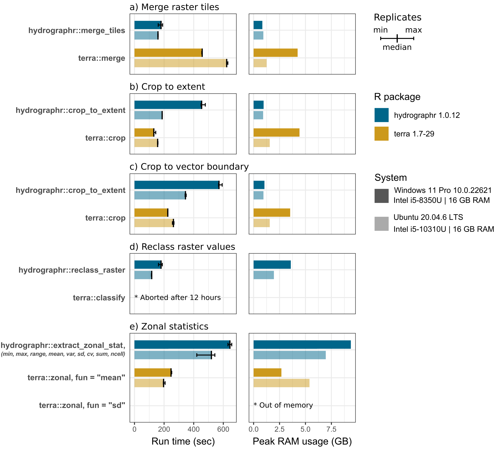

  
  ```{r, include = FALSE, eval = FALSE}
# writes out the references for all packages
knitr::write_bib(file = "packages.bib")
```

## Introduction and scope

The main focus of `hydrographr` is to process Hydrography90m [@amatulli2022hydrography90m] data and include them in workflows in `R`. Nevertheless, `hydrographr` provides geospatial functions which can be useful when working with geospatial data in general, with the goal to be computationally and RAM usage efficient. Benchmark tests for selected `hydrographr` functions should demonstrate the capabilities of the `R` package. We compared the tested functions to corresponding workflows which employ the `terra` package to put the performance into perspective without claiming any superiority of either one of the `R` packages over the other.

We focused on five common geospatial tasks that can be easily implemented with both `hydrographr` and `terra`:
  
  - Merging multiple raster layers to one file.
- Cropping a raster layer to a bounding box extent.
- Cropping a raster layer to an irregular boundary of a vector polygon.
- Reclassifying the values of a raster layer.
- Zonal statistics of a raster layer.

All benchmark experiment tasks consisted of reading the input data, processing the data, and writing the results back to disk (if the output is a raster layer). For each experiment we recorded the total run-time of the entire task using the function `microbenchmark::microbenchmark`. The peak RAM usage was estimated by observing the task manager (in Windows) and top (on Linux). To ensure reliable estimates of the total run-time, we repeated each experiment three times. `hydrographr` requires a different implementations on Windows and Linux systems. Therefore we performed the experiments on two systems, a Windows laptop computer (Windows 11 Pro 10.0.22621/Intel i5-8350U/16 GB RAM) and a Laptop running Ubuntu Linux (Ubuntu 20.04.6 LTS/Intel i5-10310U/16 GB RAM) to identify any major performance differences between operating systems. The following chapter summarizes the results of the benchmark experiments which where performed on the two different systems. After the results summary we documented the code for the individual geospatial tasks for reproducability. We implemented all `hydrographr` and `terra` functions with default settings and we acknowledge that specific input arguments may improve the performance. Nevertheless the benchmark experiments provide a first general performance overview.


```{r setup, eval=FALSE, include=FALSE}
knitr::opts_chunk$set(echo = TRUE, warning=FALSE, message=FALSE,  
                      out.width="50%", fig.align="center")
knitr::opts_knit$set(root.dir = "./data_cuba")
library(hydrographr)
library(terra)
library(ranger)
library(knitr)
library(kableExtra)
library(here)
```

## Results of benchmark experiments

The benchmark shows that `hydrographr::merge_tiles` overall merged the six tiles faster and using less RAM compared to `terra` where the tiles are loaded in R merged with `terra::merge` and written to the hard drive. On average, the performance of `hydrographr::merge_tiles` surpassed that of `terra` on both Windows and Ubuntu, completing the task 2.5 times faster (179 compared to 457 seconds) and 4 times faster (158 compared to 623 seconds), respectively. Additionally, `terra` required on Windows five times the amount of RAM to perform the merge operation compared to `hydrographr` (0.84 compared to 4.24 GB).

For both tasks, cropping a raster to the extent of a bounding box and to the boundary of a vector polygon, `terra::crop` outperforms `hydrographr::crop_to_extent` in the experiments on the Windows system, performing the tasks 3.5 times (130 compared to 454 seconds) and 2.5 times  (225 compared to 571 seconds) faster. The differences on the Ubuntu system were less significant. Particularly, on the Windows system, `terra` used 4.5 times (4.43 compared to 0.97 GB) and 3.4 times (3.53 compared to 1.05 GB) more RAM to perform the cropping task. 

The reclassification task was performed for the sub-catchments of the entire Amazon basin, reassigning random integer values to the over 31 million sub-catchment IDs, thus requiring a rather large reclassification table. While `hydrographr::reclass_raster` was able to perform the task in 179 (Windows) and 116 seconds (Ubuntu), respectively, while we aborted the `terra::classify` after 12 hours of run-time with a progress of approximately 10\%. 

To assess the performance of computing zonal statistics using `hydrographr::extract_zonal_stat`, we implemented `terra::zonal` to calculate the mean and the standard deviation of a flow accumulation raster layer, where the ca. 31 million sub-catchments of the Amazon basin were used as the zones. `hydrographr::extract_zonal_stat` returns the following nine statistical measures by default in a single run: the number of cells within each zone, minimum and maximum cell values, range, arithmetic mean, population variance, standard deviation, coefficient of variation, and sum (as provided by the underlying r.univar function in GRASS GIS). Hence, if several statistical measures are of interest, the run-times of individual `terra::zonal` executions must be added up for comparison. The calculation of the means is 2.6 times faster when performed with `terra::zonal` on Windows 247 compared to 645 seconds) and Ubuntu (197 compared to 520 seconds). The RAM usage is fairly large when calculating all zonal statistics with `hydrographr`, with 9.38 GB on Windows and 6.96 GB on Linux, while the mean calculation with `terra` only used 2.68 and 5.39 GB, respectively. While the standard deviation is included in the `hydrographr` output table, `terra::zonal` could not complete the task of calculating the standard deviation and ran out of memory.



## Benchmark experiments

### R packages and paths

Load required libraries:
  
  ```{r, eval=F}
library(hydrographr)
library(terra)
library(microbenchmark)
library(readr)
```

Function definitions:
  
  ```{r, eval=FALSE}
# Small helper function to print benchmark experiments
print_experiment <- function(micro) {
  cat("Run times in seconds:\n")
  t <- round(sort(micro$time*1e-9), digits = 1)
  names(t) <- c("min", "median", "max")
  t
}
```


Define working directory:
  
  ```{r, eval=FALSE, include=FALSE}
wdir <- "/home/mueblacker/Documents/Glowabio/Code/hydrographr/vignettes/benchmark"
data_dir <- paste0(wdir, "/data")
out_dir  <- paste0(wdir, "/output")

tile_dir   <- paste0(data_dir, "/r.watershed/sub_catchment_tiles20d")
tile_tifs  <- list.files(tile_dir, pattern = ".tif$")
basin_gpkg <- paste0(data_dir, "/basin_514761/basin_514761.gpkg")
```


```{r, eval = FALSE}
# Define the working directory for the benchmark experiments
wdir <- "my/working/directory/benchmark"

data_dir <- paste0(wdir, "/data")
out_dir  <- paste0(wdir, "/output")

# Create a new folder in the working directory to store all the data
dir.create(data_dir)
dir.create(out_dir)
```

### Loading and preparing Hydrography90m test data 

We selected the Amazon river basin as a test case, which covers six Hydrography90m tiles in total. The required tile ids which we have to download are defined with `tile_id`. The calculation of zonal statistics we want to perform for the flow accumulation. So we also download the respective layer tiles from Hydrography90m (defined with `vars_tif`). We will also load the Amazon `"basin"` boundary vector layer and will use it in a cropping task. To download the Hydrography90m data we can use the `hydrographr` function `download_tiles` as shown below.

```{r, eval=FALSE}
# Define tile IDs
tile_id <-  c("h10v06","h10v08", "h10v10", "h12v06", "h12v08", "h12v10")
# Variables in raster format
vars_tif <- c("sub_catchment", "accumulation")
# Variables in vector format
vars_gpkg <- "basin"

# Download the .tif tiles of the desired variables
download_tiles(variable = vars_tif, tile_id = tile_id, file_format = "tif",
               download_dir = data_dir)

# Download the .gpkg tiles of the desired variables
download_tiles(variable = vars_gpkg, tile_id = tile_id, file_format = "gpkg",
               download_dir =   paste0(wdir, "/data"))
```

We also define the extent of the bounding box of the Amazon basin. The bounding box will be used in a benchmark test for cropping, but also for the preparation of the flow accumulation layer.

```{r, eval=FALSE}
bbox <- c(-79.6175000, -20.4991667, -50.3400000, 5.2808333)
```


For the use in the zonal statistics calculation we merge the downloaded flow accumulation tiles with the `hydrographr` function `merge_tiles`and crop the merged layer to the defined bounding box with `crop_to_extent`.

```{r, eval=FALSE}
# Path where the flow accumulation tiles where loaded to.
acc_dir <- paste0(data_dir, "/r.watershed/accumulation_tiles20d/")
# List all flow accumulation tiles in the folder.
acc_tifs <- list.files(acc_dir)

# Merge the tiles to one flow accumulation layer.
merge_tiles(tile_dir = acc_dir,
            tile_names = acc_tifs,
            out_dir = acc_dir,
            file_name = "acc_merge.tif")

crop_to_extent(raster_layer = paste0(acc_dir, "acc_merge.tif"),
               bounding_box = bbox,
               out_dir = acc_dir,
               file_name =  "acc_merge_crop.tif")
```

### Experiment 1: Merging tiles

The first benchmark experiment is to merge the 6 tiles which cover the Amazon basin to on ".tif" file. The run time of the entire workflow is evaluated, which includes loading and merging the input tiles and writing the outputs back to the hard drive. 

The tile files (`tile_tifs`) were loaded into the data folder which we will now define as `tile_dir`. 

```{r, eval=FALSE}
# Folder where the sub-catchment tiles were downloaded to.
tile_dir   <- paste0(data_dir, "/r.watershed/sub_catchment_tiles20d")
# List all tile names in tile_dir
tile_tifs  <- list.files(tile_dir, pattern = ".tif$")
```

Merging tiles with `hydrographr` is performed with the function `merge_tiles`. The output layer is saved into `out_dir`. The default compression level (`compression`) is `"low"`, which results already in relatively small output files while not compromising run time too much.

```{r, eval=FALSE}
# Run the benchmark test 3 times and save the run times in t_merge_hydr
t_merge_hydr <- microbenchmark({
  merge_tiles(tile_dir = tile_dir,
              tile_names = tile_tifs,
              out_dir = out_dir,
              file_name = "merge_hydr.tif",
              compression = "low")
}, times = 3)

# Print the run times
print_experiment(t_merge_hydr)
```

```{r, echo=FALSE}
cat("Run times in seconds:\n   min median    max \n 160.5  179.4  190.3")
```

The tested `terra` workflow involves reading the 6 sub-catchment tiles with the function `rast`, merging them with `merge` and writing the result layer with `writeRaster`.

```{r, eval=FALSE}
# Run the benchmark test 3 times and save the run times in t_merge_terra
t_merge_terra <- microbenchmark({
  r1 <- rast(paste0(tile_dir, "/", tile_tifs[1]))
  r2 <- rast(paste0(tile_dir, "/", tile_tifs[2]))
  r3 <- rast(paste0(tile_dir, "/", tile_tifs[3]))
  r4 <- rast(paste0(tile_dir, "/", tile_tifs[4]))
  r5 <- rast(paste0(tile_dir, "/", tile_tifs[5]))
  r6 <- rast(paste0(tile_dir, "/", tile_tifs[6]))
  r_merge <- merge(r1, r2, r3, r4, r5, r6)
  writeRaster(r_merge, paste0(out_dir, "/merge_terra.tif"), overwrite = TRUE)
}, times = 3)

# Print the run times
print_experiment(t_merge_terra)
```

```{r, echo=FALSE}
cat("Run times in seconds:\n   min median    max \n 454.9  457.4  457.4")
```

### Experiment 2: Cropping to bounding box

In the following experiment the merged layer "merge_hydr.tif" is cropped to the defined bounding box of the Amazon basin. Cropping with `hydrographr` is performed with the function `crop_to_extent`. 

```{r, eval=FALSE}
# Run the benchmark test 3 times and save the run times in t_crop_bbox_hydr
t_crop_bbox_hydr <- microbenchmark({
  crop_to_extent(raster_layer = paste0(out_dir, '/merge_hydr.tif'),
                 bounding_box = bbox,
                 out_dir = out_dir,
                 file_name =  'crop_bbox_hydr.tif')
}, times = 3)

# Print the run times
print_experiment(t_crop_bbox_hydr)
```

```{r, echo=FALSE}
cat("Run times in seconds:\n   min median    max \n 449.8  453.7  478.4")
```

The corresponding `terra` workflow includes loading the merged layer with `rast`, cropping the layer to the defined bounding box with `crop` and writing the cropped layer to the hard drive with `writeRaster`.

```{r, eval=FALSE}
# Convert the numeric extent vector to an extent
bboxe <- ext(bbox)

# Run the benchmark test 3 times and save the run times in t_crop_bbox_terra
t_crop_bbox_terra <- microbenchmark({
  r <- rast(paste0(out_dir, '/merge_hydr.tif'))
  r_crop <- crop(r, bboxe)
  writeRaster(r_crop, paste0(out_dir, '/crop_bbox_terra.tif'), overwrite = TRUE)
}, times = 3)

# Print the run times
print_experiment(t_crop_bbox_terra)
```

```{r, echo=FALSE}
cat("Run times in seconds:\n   min median    max \n 130.1  130.6  143.6")
```

### Experiment 3: Cropping to basin boundary

Experiment 3 is generally the same as experiment 2, but instead of a bounding box the merged layer was cropped and masked with the basin boundary of the Amazon basin. The basin boundary layer shold be located in the data folder.

```{r,eval=FALSE}
basin_gpkg <- paste0(data_dir, "/basin_514761/basin_514761.gpkg")
```

Cropping with `hydrographr` is again performed with the function `crop_to_extent`. Instead of the `bounding_box` the path to the 'gpkg' input file of the basin boundary is passed to the function with `vector_layer`.

```{r, eval=FALSE}
# Run the benchmark test 3 times and save the run times in t_crop_vect_hydr
t_crop_vect_hydr <- microbenchmark({
  crop_to_extent(raster_layer = paste0(out_dir, '/merge_hydr.tif'),
                 vector_layer = basin_gpkg,
                 out_dir = out_dir,
                 file_name =  'crop_vect_hydr.tif')
}, times = 3)

# Print the run times
print_experiment(t_crop_vect_hydr)
```

```{r, echo=FALSE}
cat("Run times in seconds:\n   min median    max \n 568.0  571.0  592.3")
```

The corresponding `terra` workflow includes loading the merged layer with `rast`, loading the basin boundary with `vect`, cropping the layer to the basin boundary with `crop` and writing the cropped layer to the hard drive with `writeRaster`. For `crop` the input argument `mask = TRUE` is set, to crop and mask the layer with the basin boundary polygon.

```{r, eval=FALSE}
# Run the benchmark test 3 times and save the run times in t_crop_vect_terra
t_crop_vect_terra <- microbenchmark({
  r <- rast(paste0(out_dir, '/merge_terra_linux.tif'))
  basin <- vect(basin_gpkg)
  r_crop <- crop(r, basin, mask = TRUE)
  writeRaster(r_crop, paste0(out_dir, '/crop_vect_terra.tif'), overwrite = TRUE)
}, times = 3)

# Print the run times
print_experiment(t_crop_vect_terra)
```

```{r, echo=FALSE}
cat("Run times in seconds:\n   min median    max \n 224.3  225.0  225.5")
```

### Experiment 4: Reclassifying raster values

For the reclassification task all sub-catchment IDs of the Amazon basin should be reassigned a new random value. To set up the experiment, a table is generated which includes all unique sub-catchment IDs (`recl_hydr$id`) and a corresponding "new" random integer number between 1 and 100 (`recl_hydr$new`). The Amazon basin has approximately 31 million sub-catchments which should be reclassified.

```{r,eval=FALSE}
r <- rast(paste0(out_dir, '/crop_vect_hydr.tif'))
ids <- terra::unique(r)

recl_hydr <- data.frame(id = ids$crop_vect_hydr_low_linux, 
                        new = round(runif(nrow(ids), 1, 100)))
recl_hydr$id <- as.integer(recl_hydr$id)
recl_hydr$new <- as.integer(recl_hydr$new)
```

The reclassification with `hydrographr` was performed with the function `reclass_raster`. For the reclassification of the sub-catchment IDs the generated dummy input table  `recl_hydr` was passed to the function with `data` and the cropped and masked sub-catchment layer was used for the reclass task.

```{r, eval=FALSE}
# Run the benchmark test 3 times and save the run times in t_recl_hydr
t_recl_hydr <- microbenchmark({
  reclass_raster(data = recl_hydr, rast_val = "id", new_val = "new",
                 raster_layer = paste0(out_dir, '/crop_vect_hydr.tif'),
                 recl_layer = paste0(out_dir, '/recl_hydr.tif'),
                 read = FALSE, no_data = 0, type = "Int32")
}, times = 3)

# Print the run times
print_experiment(t_recl_hydr)
```

```{r, echo=FALSE}
cat("Run times in seconds:\n   min median    max \n 162.4  179.5  188.0")
```

The corresponding `terra` workflow includes loading the cropped sub-catchment layer with `rast`, the reclassification with `classify` and writing the cropped layer to the hard drive with `writeRaster`. `classify` requires a matrix which defines the from/to values. The reclass workflow with `terra` was aborted after 12 hours and a progress of approximately 10% and cannot be compared to the performance of `hydrographr`.

```{r, eval=FALSE}
ids_mtx <- as.matrix(recl_hydr)

# Run the benchmark test 3 times and save the run times in t_recl_terra
t_recl_terra <-microbenchmark({
  r <- rast(paste0(out_dir, '/crop_vect_hydr.tif'))
  recl_terra <- classify(r, ids_mtx)
  writeRaster(recl_terra, paste0(out_dir, '/recl_terra.tif'))
}, times = 5)
```

### Experiment 5: Zonal statistics

Zonal statistics were calculated based on the cropped and masked sub-catchment layer to define the zones and the flow accumulation of the Amazon basin for which zonal statistics were calculated. `hydrographr` calculates zonal statistics with the function `extract_zonal_stat`. In its current version it cannot select specific statistical metrics which should be calculated, but returns a table of statistics including the minimum and maximum values, the range, the arithmetic mean, variance and standard deviation, the coefficient of variation, and the number of cells per zone. Therefore, the run time to calculate all of these metrics is compared to the calculation of the arithmetic mean and the standard deviation with `terra`.

```{r,eval=FALSE}
# Run the benchmark test 3 times and save the run times in t_zonal_hydr
t_zonal_hydr <- microbenchmark({
  extract_zonal_stat(data_dir= acc_dir,
                     subc_id = "all",
                     subc_layer = paste0(out_dir, '/crop_vect_hydr.tif'),
                     var_layer = "acc_merge_crop.tif",
                     out_dir = out_dir,
                     file_name = "zonal_hydr.csv",
                     n_cores =1)
}, times = 3)

# Print the run times
print_experiment(t_zonal_hydr)
```

```{r, echo=FALSE}
cat("Run times in seconds:\n   min median    max \n 631.6  644.7  657.0")
```


In a first test workflow with `terra` the mean value of flow accumulation for the sub-catchments is calculated.  The corresponding `terra` workflow includes loading the cropped and masked sub-catchment layer with `rast`, loading the cropped flow accumulation layer, calculating the mean value for all sub-catchments with `zonal` and the input argument `fun = "mean"` and writing the cropped layer to the hard drive with `writeRaster`.

```{r, eval=FALSE}
# Run the benchmark test 3 times and save the run times in t_zonal_terra_mean
t_zonal_terra_mean <- microbenchmark({
  z <- rast(paste0(out_dir, '/crop_vect_hydr.tif'))
  acc <- rast(paste0(acc_dir, "/acc_merge_crop.tif"))
  zonal_terra_mean <- zonal(acc, z, fun = "mean")
}, times = 3)

# Print the run times
print_experiment(t_zonal_terra_mean)
```

```{r, echo=FALSE}
cat("Run times in seconds:\n   min median    max \n 246.6  247.0  251.7")
```

In a second experiment with `terra` the standard deviation should be calculated. The workflow remains the same. The only difference is the input argument `fun` in `zonal` which is now set as `fun = "sd"`. The execution of this experiment resulted in a memory overflow and could not be completed.

```{r, eval=FALSE}
# Run the benchmark test 3 times and save the run times in t_zonal_terra_sd
t_zonal_terra_sd <- microbenchmark({
  z <- rast(paste0(out_dir, '/crop_vect_hydr.tif'))
  acc <- rast(paste0(acc_dir, "/acc_merge_crop.tif"))
  zonal_terra_sd <- zonal(acc, z, fun = "sd")
}, times = 3)
```

### References
