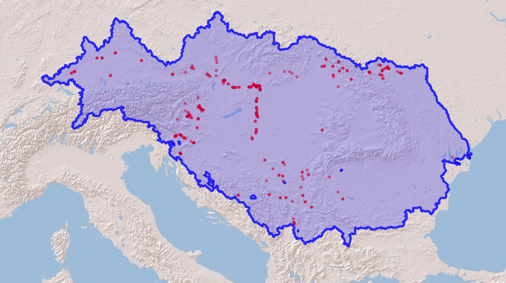

```{r, include = FALSE, eval = FALSE}
# writes out the references for all packages
knitr::write_bib(file = 'packages.bib')
```


```{r setup, include=FALSE}
# Load libraries
library(hydrographr)
library(sf)
library(data.table)
library(dplyr)
library(terra)
library(tools)
library(stringr)
library(ranger)
library(kableExtra)
library(leaflet)
library(leafem)
library(htmlwidgets)
library(here)

knitr::opts_chunk$set(echo = TRUE, fig.align = "center")
```

## Introduction

The following workflow uses the new functionalities of the hydrographr
R package to download and process the Hydrography90m [@amatulli2022hydrography90m] and the Environment90m
[@garcia2025environment90m] datasets with the aim of preparing and processing the data needed to run a species distribution model to predict the habitat suitability of a fish species in the Danube basin.


```{r danube-workflow, fig.cap = "Figure 1. Schematic workflow", echo = F, out.width='200%'}
 knitr::include_graphics(here( "man", "figures", "danube_workflow3.png"))
```


The Environment90m dataset consists of tables with summary information of several environmental factors, for each of the 7 million sub-catchments available in the Hydrography90m dataset. In comparison to the previous version of hydrographr, where the user needed to download raster files and run the calculations of the summary statistics for the environmental layers of interest, the new functions allow the user to directly download the environmental data that has been already summarised for each sub-catchment.

The study area is the Danube basin but we will be using a bounding box around 
the basin as a geographic reference to subset and crop the data and finally project the current
habitat suitability of a species. Given the extent of the Danube Basin and the resolution of the data, we will be dealing with large amounts of data and therefore we need to be sure to have enough disk space (at least 15 GB). We selected this case on purpose to present the efficiency of the new functionalities when analyzing large datasets.

We will use the species _Zingel treber_ as an example. We used the same bounding box to retrieve occurrence records of the species from GBIF. 

## Setting the scene

Load all libraries required for the analysis:

```{r, eval=FALSE}
library(hydrographr)
library(sf)
library(data.table)
library(dplyr)
library(terra)
library(tools)
library(stringr)
library(ranger)
library(kableExtra)
library(leaflet)
library(leafem)
library(htmlwidgets)
```

```{r, include=FALSE}
# Set working directory and global options
wdir <- here("vignettes", "data_danube")
options(scipen = 999)
```


Create and define a directory (e.g. data_danube) as your working directory. We will store and organize all the data in this folder. 

```{r, eval=FALSE, include=FALSE}
wdir = "/mnt/marquez/marquez/vignette"
setwd(wdir)
```

```{r, eval=TRUE, include=FALSE}
wdir <- paste0(here(), "/vignettes/data_danube")
# setwd(wdir)
```

```{r, eval=FALSE, include=TRUE}
# Set working directory and global options
wdir <- "my/working/directory/data_danube"
setwd(wdir)
options(scipen = 999)
```


Let's download some data we have prepared beforehand, including the polygon of the Danube basin and the table with species occurrences.

```{r, eval=FALSE, include=TRUE }
# download_dir needs to be a full (not relative!) path
download_test_data(download_dir = wdir)
```


## Area of interest

The area of interest is the Danube basin (Figure 2). We will use as a reference the polygon of the basin that we downloaded previously. We will also specify a set coordinates to define a bounding box around the basin (see table below and red rectangle in Figure 2). This bounding box will be useful as a reference for visualization purposes and to restrict the spatial extent and information requirements of the analysis.

Corner Coordinates (WGS84, EPSG:4326):

| Upper Left  |  8.0 | 51.0 |

| Lower Left  |  8.0 | 42.0 |

| Upper Right | 30.0 | 51.0 |

| Lower Right | 30.0 | 42.0 |


Create a bounding box object with the coordinates 

```{r}
bbox <- c(8, 42, 30, 51)

dan <- read_sf(file.path(wdir, "hydrography90m_test_data/DanubeMSK.gpkg"))
bbcor <- as.data.frame(st_coordinates(dan))
# tile_id <- get_tile_id(data = bbcor, lon = "X", lat = "Y")
```


```{r tiles-danube, fig.cap = "Figure 2. Tiles overlapping with the Danube basin", echo = F, out.width='80%'}
knitr::include_graphics(here( "man", "figures", "tilesDanube.png"))

```

<!--  -->

## Sub-catchments in the Danube basin

The units of analysis for this exercise are the single sub-catchments, meaning that the final habitat suitability values will be assigned to each of the sub-catchments. Therefore, one of the key layers for the analysis is the raster of sub-catchments for the study area. 

Here are the steps to prepare the sub-catchment raster file for the Danube basin:

1. identify the rectangular tiles that overlap with the Danube basin. By looking at Figure 2, we see that the study area overlaps with four tiles

```{r, eval = FALSE}
tile_id <- c("h18v02", "h18v04", "h20v02", "h20v04")
tile_id
```

2. download the raster files of sub-catchments for the four tiles

```{r, eval = FALSE}
download_tiles(variable = c("sub_catchment"), tile_id = tile_id, file_format = "tif",
              download_dir = wdir)
```

Note that the files have been downloaded to a new folder (i.e., "r.watershed").
Each file covers the full extent of the corresponding tile, which is often larger than the Danube basin. Before merging the tiles, in order to avoid working with unnecessary data, we 

3. crop the files to the extent of the Danube basin. We will use the function 'crop_to_extent' and the polygon vector file of the Danube basin as a cutline. We can apply the cropping to all files in a for loop:

```{r, eval = F}

raster_files <- list.files(file.path(wdir, "r.watershed", "sub_catchment_tiles20d"), 
                           pattern = ".tif$", full.names = TRUE)

for (ifile in raster_files) {
  crop_to_extent(
    ifile,
    vector_layer = file.path(wdir, "hydrography90m_test_data/hydrographr_data/DanubeMSK.gpkg"),
    out_dir = wdir,
    file_name = paste0(str_remove(basename(ifile), ".tif"), "_crop.tif"),
    read = FALSE,
    quiet = TRUE
  )
}
```

4. now we can merge the four cropped files to obtain the sub-catchment raster file for the Danube basin

```{r, eval = FALSE}
  merge_tiles(tile_dir = wdir,
              tile_names = list.files(wdir, full.names = FALSE,
                                      pattern = "_crop.tif"),
              out_dir = wdir,
              file_name = "subcatchments.tif",
              read = FALSE, 
              bigtiff = TRUE)

```

It is always good practice to clean disk space by removing the files and folders we don't need anymore.

```{r, eval = FALSE}
# remove files
file.remove(list.files(wdir, pattern = "_crop.tif", full.names = TRUE))
# remove folder
unlink("r.watershed", recursive = TRUE)
```

Using the sub-catchment raster file for the Danube basin we will create a new file containing a list with all sub-catchments IDs. This list of IDs will be our reference file to extract the information from the environmental tables during the next steps. We will create the file using the function *extract_ids*.

```{r, eval = FALSE}
subc_ids <- extract_ids(subc_layer = file.path(wdir, "subcatchments.tif"))
head(subc_ids)
dim(subc_ids)

# save the object to a file
fwrite(subc_ids, file=file.path(wdir, "subc_ids.txt"))
```

As you can see, the file consists of one column with all the sub-catchment IDs. In the Danube basin there are around 4,3 million sub-catchments!

## Environmental information

Now we proceed to download the tables of the Environment90m dataset with the environmental layers of interest. Note that we have developed downloading functions for each of the different datasets available.

You can check the variable names of each dataset by calling the function without arguments. For example, if you want to check which climatic variables are available you can use:

```{r}
download_observed_climate_tables()
```

We will download few variables related to climate, the land cover, and few morphometric variables describing the properties of the stream segments.

- Observed climate:

```{r, eval = FALSE}

download_observed_climate_tables(
  subset = c("bio01_1981-2010_observed", "bio02_1981-2010_observed"),
  tile_ids = tile_id,
  download = TRUE,
  download_dir = wdir,
  file_format = "txt",
  delete_zips = TRUE,
  ignore_missing = FALSE,
  tempdir = NULL,
  quiet = FALSE
)
```

The tables have been downloaded to a new folder which has been named according to each dataset and automatically unzipped. By taking a look at any of the tables with climate information we can see that for every sub-catchment different statistics (i.e., minimum, maximum, mean, standard deviation, range) are available and that the format is columns separated by space.


```{r, eval=FALSE}
# read first 10 rows without reading the table into R
system( "head chelsa_bioclim_v2_1/1981-2010_observed/bio01/bio01_1981-2010_observed_h18v02.txt ")
```

- Land cover: forest proportion per sub-catchment for the year 2020

```{r, eval = FALSE}
download_landcover_tables(
  base_vars = c("c60"),
  years = c("2020"),
  tile_ids = tile_id,
  download = TRUE,
  download_dir = wdir,
  file_format = "txt",
  delete_zips = TRUE,
  ignore_missing = FALSE,
  tempdir = NULL,
  quiet = FALSE
)
```

The land cover tables, unlike the climate tables, only have one column containing the proportion of the specific land cover category in each sub-catchment.


```{r, eval=FALSE}
# read first 10 rows without reading the table into R
system(" head esa_cci_landcover_v2_1_1/c60/c60_2020_h18v02.txt")
```

- Hydrography90m: flow accumulation, length and slope of the stream segment

```{r, eval = FALSE}

download_hydrography90m_tables(
  subset = c("accumulation", "length", "slope_grad_dw_cel"),
  tile_ids = tile_id,
  download = TRUE,
  download_dir = wdir,
  file_format = "txt",
  delete_zips = TRUE,
  ignore_missing = FALSE,
  tempdir = NULL,
  quiet = FALSE
)
```

We have downloaded approximately 14 GB of information. The tables at this point consist of the environmental information for the selected variables for all sub-catchments in each of the four complete tiles. But we are only interested in the information of those sub-catchments within our bounding box. To achieve this filtering and join all environmental variables in one single table we will use the function *get_predict_table* in the next step. 

## Prediction table

The prediction table contains the values of environmental variables for all sub-catchments of interest. It is called "prediction table" because it will be used as the reference table to predict the model's output using any of the *predict* functions in R. For example, we will predict the habitat suitability values to all sub-catchments in this table at the end of the exercise.

The *get_predict_table* function will join all environmental variables based on the sub-catchments of interest; in our case, the sub-catchment IDs available in the *subc_id* object (which we have previously saved in the file *subc_ids.txt*).

The function can be run in parallel, with parallelisation occurring at the level of the variable. Since we are using 6 variables in this example, we can utilise 6 cores. To check the number of available cores on your system, you can use the following line:

```{r}
parallel::detectCores()
```

As a best practice, it is recommended to use at most the number of available cores minus one.

```{r, eval = FALSE}
tb <- get_predict_table(variable = c("bio01_1981-2010_observed", "bio02_1981-2010_observed", "c60_2020", "accumulation", "length", "slope_grad_dw_cel"),
  statistics = c("mean", "sd"),
  tile_id = tile_id,
  input_var_path = wdir,
  subcatch_id = file.path(wdir, "subc_ids.txt"),
  out_file_path = file.path(wdir, "predictTB.csv"),
  read = TRUE,
  quiet = FALSE,
  n_cores = 6)
```

Note that we specify the parameter read=TRUE, so that the table is created as an R object. The table is automatically created on disk by the function but the default parameter is FALSE because in some cases the table could be very large and there is no need to load it into the R workspace. In our example the table is 311 MB in size!

You can double check that all the sub-catchments are included in the table and all
the environmental parameters of interest are attached.

```{r, eval = F}
dim(tb)
names(tb)
```

The table should have 4,267,964 rows and 11 columns (since we are retrieving the mean and standard deviation for some of the variables). If the table was created successfully, we can remove the original tables and save some disk space.

```{r, eval = FALSE}
### remove original tables
# remove folders
unlink("chelsa_bioclim_v2_1", recursive = TRUE)
unlink("esa_cci_landcover_v2_1_1", recursive = TRUE)
unlink("hydrography90m_v1_0", recursive = TRUE)
```

## Species data

We collected and filtered occurrence records for the fish species *Zingel streber* from the GBIF repository. The final table consists of three columns: species name, longitude and latitude coordinates. The original data can be found [here](https://www.gbif.org/occurrence/download/0028469-231002084531237) [@gbifdata].

Read the file into the R session and have a look at it

```{r, eval = TRUE}
spdata <- fread(file.path(wdir, "hydrography90m_test_data/hydrographr_data/Zingel_streber.csv"), sep = ",")
spdata
```

```{r, echo=F, eval=F}
kbl(spdata) %>%                        
  kable_styling(bootstrap_options = "striped", full_width = F, position = "left") %>%     scroll_box(width = "500px", height = "200px")
```

Visualize the species occurrence records on a map.

```{r, eval=F}
# Convert species data to a spatial vector object to plot the points
spdata_vect <- vect(spdata, geom=c("Longitude", "Latitude"))

# read the polygon of the Danube basin
danube_pol = read_sf(file.path(wdir, "hydrography90m_test_data/hydrographr_data/DanubeMSK.gpkg"))
```


```{r, include = FALSE, eval = FALSE}
m <- leaflet() %>%
  addProviderTiles('Esri.WorldShadedRelief') %>%
  setMaxBounds(bbox[1], bbox[2], bbox[3], bbox[4]) %>%
  addCircles(data = spdata_vect, color = "red") %>% 
  addPolygons(data = danube_pol, color = "blue", stroke = 0.7, opacity = 0.8)

  saveWidget(m, file=paste0(wdir, "/../../man/figures/danube_map.html"))
```

```{r, eval = FALSE}
m <- leaflet() %>%
  addProviderTiles('Esri.WorldShadedRelief') %>%
  setMaxBounds(bbox[1], bbox[2], bbox[3], bbox[4]) %>%
  addCircles(data = spdata_vect, color = "red") %>% 
  addPolygons(data = dan, color = "blue", stroke = 0.7, opacity = 0.8)
m
```


```{r danube-map, fig.cap = "Figure 3. Species occurrences in the Danube basin", echo = F, out.width='80%'}
knitr::include_graphics(here( "man", "figures", "danube_map.png"))

```


<!--  -->


## Model Table

The next step is to prepare the so called *model fit table*.In this table, we link the sub-catchments containing species occurrence points with the environmental data previously compiled in the "predict table". For this purpose we use the function `get_model_fit`. If we have many species of interest we can run this function in a for loop to create the model fit table for each species separately. 

Most of the algorithms available to run SDMs need presence and absence data. In the lack of absence data, pseudoabsence points can be generated in different ways. The function `get_model_fit` provides this functionality and by default creates randomly a specified number of pseudoabsences.

```{r, eval = FALSE}

spptb <- get_modelfit_table(
  data=spdata,
  spec="Species",
  lon="Longitude",
  lat = "Latitude",
  pseudoabs = 5000,
  subc = "subcatchments.tif",
  predict_table = "predictTB.csv",
  mod_fit_table = "modelFit.csv",
  read = TRUE)

head(spptb)
```

The new table consists of the sub-catchment IDs, a new column indicating if the species is present (1) or absent (0) in the sub-catchment and the values of all environmental variables in the sub-catchment. In this case we created 5000 pseudo-absences.

## Application of a Species Distribution Model

There are many models or statistical techniques available to delineate species geographic distributions. A common technique is random forest (RF), a machine learning algorithm that is computationally very efficient when dealing with large amounts of data and producing constantly very accurate results.

### Model training

We need to be sure that the column of presence-absence (0-1) information is set to a factor and that the table does not contain no data values.

```{r, eval=F}
spptb$PresAbs <- as.factor(spptb$PresAbs)
spptb <- na.omit(spptb)
```

Now, we are a ready to run the model. We will use the function ['ranger'](https://www.rdocumentation.org/packages/ranger/versions/0.16.0/topics/ranger) available in the ranger R package. We will first shorten the column names of the table to avoid redundant information.


```{r, eval=F}
colnames(spptb) <- gsub("_1981-2010_observed", "", colnames(spptb))

```

```{r, eval=F}
model <- ranger(spptb$PresAbs ~ .,
                 data = spptb[, 3:11],
                 replace = T,
                 probability = T)
```

### Model prediction

Now we want to predict the probability of occurrence of the species for the Danube basin. We predict by relating our model with the large *predict table*. The process might require a lot of computing resources, especially if the *predict table* is large as in our case. An average laptop can easily run out of memory and the process can crash. One solution is to run the prediction calculations in small subsets of the large table. We can split the large table with the function `split_table`. In the following code we will split the large table (4,267,964 rows) in subsets of 500,000 records. 

```{r,eval=F}
split_table("predictTB.csv", split=500000, wdir)
```

The result is a list of 9 tables.  By default, the function creates new files with names starting with the prefix 'predTB'.

```{r,eval=F}
list.files(pattern = "predTB*")
n_splits <- length(list.files(pattern = "predTB*"))
```

Now we can run the predictions for each subset table.  We will store the results of the 9 predictions in a list object. At the same time we will store the sub-catchment IDs of each table in a different list object.

```{r,eval=F}
# create the output list
pred_list <- list()
subc_list <- list()

for(i in 1:n_splits) {
    cat("Now predicting on chunk", i, "\n")
    
    arc <- paste0("predTB_", i, ".csv")
    predtb <- read.csv(arc)
    predtb <- na.omit(predtb)

    colnames(predtb) <- gsub("_1981.2010_observed", "", colnames(predtb))

    pred <- predict(model, data = predtb[,2:10])
    subc <- predtb[,1]
    
    pred_sub <- setDT(as.data.frame(pred))
    subc_sub <- setDT(as.data.frame(subc))
    
    names(pred_sub) <- c("prob_0", "prob_1")
    names(subc_sub) <- "subcID"
  
    pred_list[[i]] <- pred_sub
    subc_list[[i]] <- subc_sub
}
```

The predictions consist of data frames with two columns. The first column is the probability of absence and the second column the probability of presence of the species. We are interested in the second column. Let's take a look at the first rows of the prediction in the first table:

```{r,eval=F}
head(pred_list[[1]])
```

We can now combine all predictions and sub-catchment IDs.

```{r,eval=F}
# combine all predictions
pred_all <- rbindlist(pred_list)
# combine all sub-catchments
subc_all <- rbindlist(subc_list)

```

Our final goal is to visualize the probability of occurrence -or habitat suitability- of the fish species on a map of the Danube basin. In order to transfer the prediction values into the map we will use the function 'reclass_raster' to reclassify the sub-catchment raster values with the prediction values. For this we need to first create a reclassification rule data frame associating the sub-catchment IDs with the prediction values in each sub-catchment. Importantly, the prediction values need to be presented as integers, so we will multiply the probability values by 100.

```{r,eval=F}

# multiply the probability values by 100
pred_all$prob_1_int <- as.integer(round(pred_all$prob_1, 2) * 100)

## merge the sub-catchment IDs and the prediction values
reclassTB <- cbind(subc_all, pred_all[,3])

```

We can now reclassify the sub-catchment raster

```{r, eval = FALSE}
reclass_raster(
  data = reclassTB,
  rast_val = "subcID",
  new_val = "prob_1_int",
  raster_layer = "subcatchments.tif",
  recl_layer = "prediction.tif",
  read = FALSE)
```

Visualization

```{r, eval = FALSE}
# Define colour palette
num_pal <- colorNumeric(
  viridisLite::inferno(256)
  , domain = pred_all[,3]
  , na.color = "transparent"
)

p <- leaflet() %>% addTiles() %>%
  setMaxBounds(bbox[1], bbox[2], bbox[3], bbox[4]) %>%
    leafem::addGeotiff(
  file = paste0(wdir, "/prediction.tif"), opacity = 1,
   colorOptions = colorOptions(
                  palette = hcl.colors(256, palette = "inferno"),
                  na.color = "transparent"
                  ) # read external raster file without loading it to R
  ) %>%
  leaflet::addCircles(data = spdata_vect, color = "turquoise", stroke = TRUE,                      weight = 5, opacity = 1) %>% # add points
  addLegend(pal = num_pal,
           values = pred_all$prob_1_int,
           labels = palette(),
           title = "Future habitat suitability map</br>for Zingel streber",
           position = "bottomleft", opacity = 1, labFormat = labelFormat(suffix = "%"))  # add a legend
saveWidget(p, file=paste0(wdir, "/prediction_map.html"))
p
```
```{r danube-prediction, fig.cap = "Figure 4. Habitat suitability map of the species in the Danube basin", echo = F, out.width='80%'}
knitr::include_graphics(here( "man", "figures", "danube_prediction_map.png"))

```

### References
