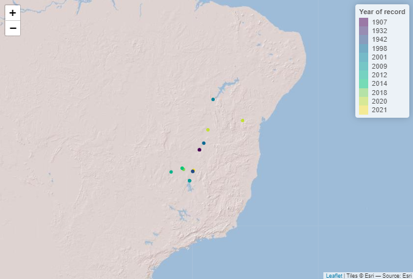
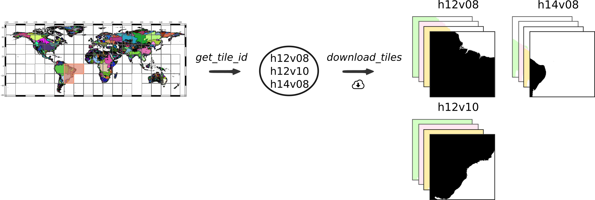
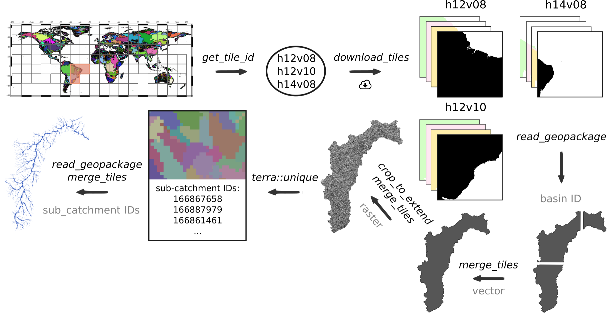
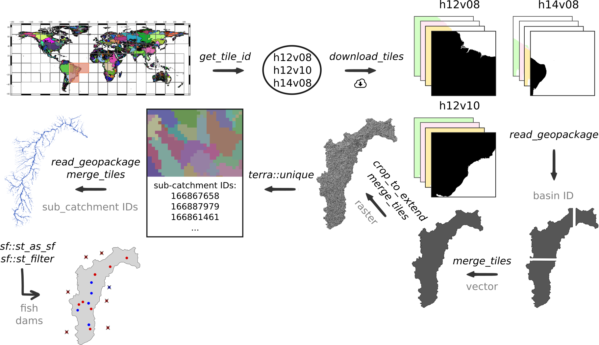
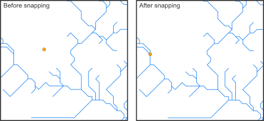
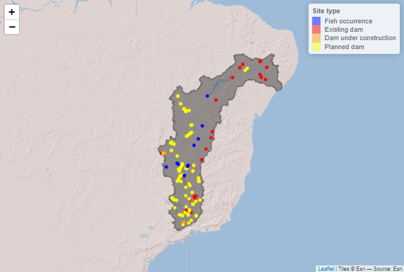
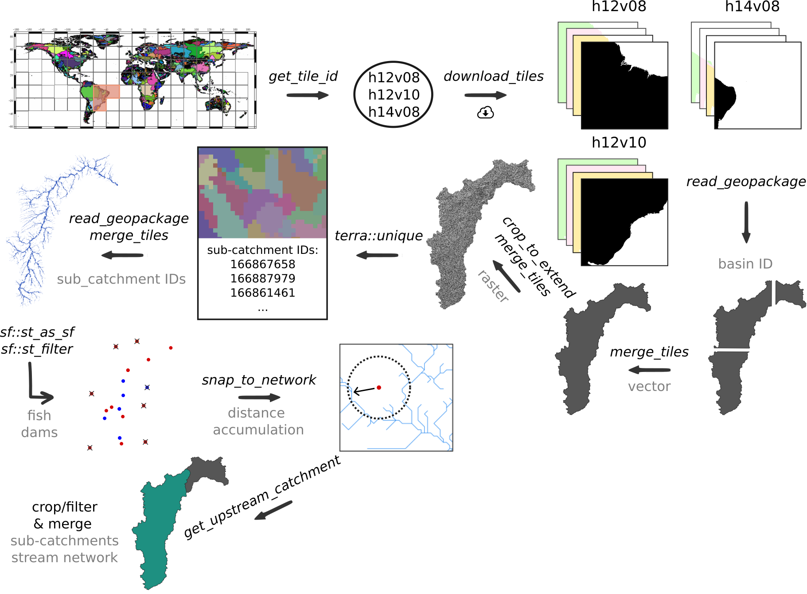
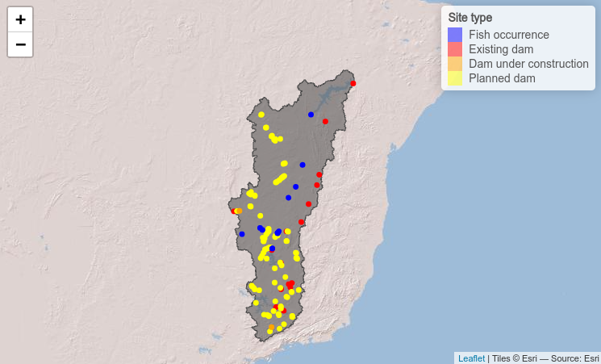
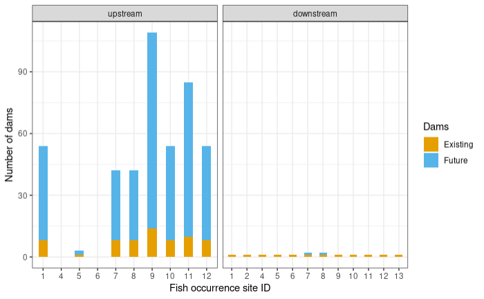
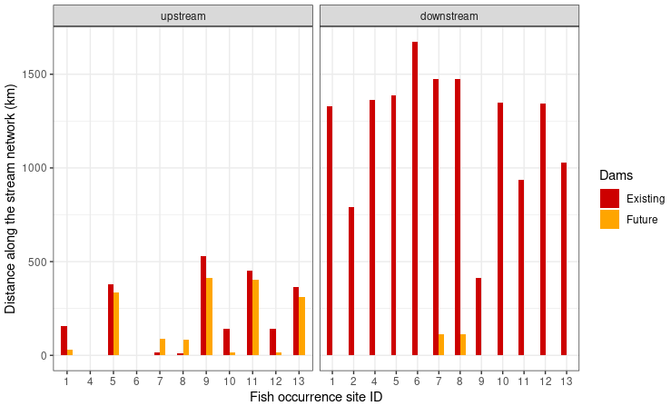

```{r, include = FALSE, eval = FALSE}
# writes out the references for all packages
# knitr::write_bib(file = 'packages.bib')
```

### Introduction

The following example showcases the functionality of the `hydrographr`
package along a workflow to analyse the fragmentation of a stream network. 
We will evaluate how many dams are up- and downstream of each fish occurrence 
site and the distance along the stream network from each fish occurrence site 
to the closest existing and future dam.

In our example we will focus on the catfish species *Conorhynchos conirostris*, 
which is a catfish species endemic to the São Francisco drainage basin in Brazil.
The catfish is listed as 'endangered' by the IUCN red list (IUCN, 2022). Wetlands
are the preferred habitat of the species and it is migrating for spawning. As an 
migratory species, it is mostly threatened by dams along the stream network. 
Further, it is threatened by fishing during the spawning season in the upstream 
part of the river. 

We will start by defining the regular tiles of the Hydrography90m 
(Amatulli et al., 2022) where the occurrence points of the species are located. 
Afterwards we will download the Hydrography90m layers, filter/crop and merge them.
Then we will select our fish occurrence and dam point locations using the polygon 
of the drainage basin and snap the point locations to the stream network. 
Afterwards, we will reduce our drainage basin using the dam downstream of all fish
occurrence sites, the Sobradinho dam, as our outlet location to calculate the 
upstream catchment from this point location. In a next step, we will calculate 
the distances along the stream network between each point location (fish and dams) 
and get the up- and downstream stream segments from each point locations as a graph. 
Afterwards, we will query the tables and evaluate the shortest distance to the 
next dam as well as the number of dams. 


Let's get started!

```{r setup, include=FALSE}
knitr::opts_chunk$set(echo = TRUE, warning=FALSE, message=FALSE,  
                      out.width='50%', fig.align='center')
knitr::opts_knit$set(root.dir = "./data_brazil")
library(hydrographr)
library(rgbif)
library(dplyr)
library(data.table)
library(kableExtra)
library(leaflet)
library(knitr)
library(stringr)
library(terra)
library(sf)
library(purrr)
library(ggplot2)
library(forcats)
library(here)
#library(leafem)
#library(leafletCN)
#library(mapview)
#library(tools)
#library(htmlwidgets)
```


```{r, eval=FALSE}
# Load libraries
library(hydrographr)
library(terra)
library(sf)
library(rgbif)
library(data.table)
library(dplyr)
library(stringr)
library(purrr)
library(forcats)
library(leaflet)
library(ggplot2)
```


```{r, eval = FALSE, include=FALSE}
wdir <- paste0(here(), "/vignettes/data_brazil")

```

```{r, eval = FALSE}
# Define working directory
wdir <- "my/working/directory"
# Set defined working directory
setwd(wdir)
# Create a directory to store all the data of the case study
dir.create("data")
```


### Species data

We will start by downloading occurrence records of *Conorhynchos conirostris* 
from GBIF.org using the R package `rgbif`.

```{r, eval = FALSE}
# Download occurrence data with coordinates from GBIF
gbif_data <- occ_data(scientificName = "Conorhynchos conirostris", 
                      hasCoordinate = TRUE)

# To cite the data use:
# gbif_citation(gbif_data)        

# Clean the data
spdata <- gbif_data$data %>% 
  select(decimalLongitude, decimalLatitude, species, occurrenceStatus, 
         country, year) %>% 
  filter(!is.na(year)) %>% 
  distinct() %>% 
  mutate(occurence_id = 1:nrow(.)) %>% 
  rename("longitude" = "decimalLongitude",
         "latitude" = "decimalLatitude") %>% 
  select(7, 1:6)

```

```{r, echo=FALSE}
#fwrite(spdata, paste0(wdir,"/data/conorhynchos_conirostris/conorhynchos_conirostris_occurrence_20230329.csv"))
#spdata <- fread(paste0(wdir,"/data/conorhynchos_conirostris/conorhynchos_conirostris_occurrence_20230329.csv"))
spdata <- fread( "./data/conorhynchos_conirostris/conorhynchos_conirostris_occurrence_20230329.csv")

kbl(spdata) %>%                        
  kable_styling(bootstrap_options = "striped", full_width = F, position = "left") %>%     
  scroll_box(width = "700px", height = "200px")
```

Let's visualise the species occurrences on a map.


```{r, eval = FALSE}
# Define the extent
bbox <- c(min(spdata$longitude), min(spdata$latitude),
          max(spdata$longitude), max(spdata$latitude))

# Define color palette for the different years of record
factpal <- colorFactor(hcl.colors(unique(spdata$year)), spdata$year)

# Create leaflet plot
spdata_plot <- leaflet(spdata) %>%
  addProviderTiles('Esri.WorldShadedRelief') %>%
  setMaxBounds(bbox[1], bbox[2], bbox[3], bbox[4]) %>%
  addCircles(lng = ~longitude, lat = ~ latitude, color =  ~factpal(as.factor(year)),
              opacity = 1) %>%
  addLegend(pal = factpal, values = ~as.factor(year),
            title = "Year of record")
spdata_plot
```




### Download files

In order to download layers of the Hydrography90m, we need to know the
IDs of the 20°x20° tiles in which the occurrence sites are located. We can 
obtain these IDs using the function *get_tile_id()*. This function downloads and
uses the auxiliary raster file that contains all the regional units globally,
and thus requires an active internet connection.

<!-- -->


```{r, eval = FALSE}
# Get the tile IDs where the points are located
tile_id <- get_tile_id(data = spdata, lon = "longitude", lat = "latitude")
```

```{r, echo = FALSE}
# Get the tile IDs 
tile_id <- c("h12v08", "h12v10", "h14v08")
```

```{r}
tile_id
```

Currently the function returns all the tiles of the regional unit where
the input points are located. However, some of them may be far from the
study area and hence not always needed in further steps. Please double
check which tile IDs are relevant for your purpose using the **Tile
map** found
[here](https://hydrography.org/hydrography90m/hydrography90m_layers/).

In our case, the São Francisco river basin spreads across all three tiles,
so we will keep all.

Let's define the Hydrography90m raster layers and GeoPackages that we would 
like to download. We will use the 
[basin](https://geo.igb-berlin.de/maps/new?layer=geonode:hydrography90m_v1_basin_cog&view=True)
raster and vector layer, which contains the drainage basin of the São Francisco 
river basin. The
[sub_catchment](https://geo.igb-berlin.de/maps/new?layer=geonode:hydrography90m_v1_sub_catchment_cog&view=True)
layer, which contains the sub-catchment for each single stream segment with an
unique ID. We will need these layers for cropping and filtering.

We will need the raster layer of the stream 
[segment](https://geo.igb-berlin.de/layers/geonode:hydrography90m_v1_segment_cog&view=True) 
and the flow 
[accumulation](https://geo.igb-berlin.de/layers/geonode:hydrography90m_v1_accumulation_cog&view=True) 
to snap our fish occurrence and dam sites to the stream network.

Further, we will download the raster layer of the 
[direction](https://geo.igb-berlin.de/layers/geonode:hydrography90m_v1_direction_cog&view=True)
to calculate the upstream catchment from a defined point location.

We will need the Geopackage
[order_vect_segment](https://geo.igb-berlin.de/maps/new?layer=geonode:hydrography90m_v1_stream_order_strahler_cog&view=True),
containing the stream network, with the stream (sub-catchment) IDs, the ID of 
the next stream and some additional attributes. We will need the GeoPackage to 
calculate the distance between point locations and to create a graph to find
out which stream segments are up- and downstream of the fish occurrence sites. 

A list of all available Hydrography90m variables, as well as details and
visualisations are available
[here](https://hydrography.org/hydrography90m/hydrography90m_layers/).

```{r, eval = FALSE}
# Define the raster layers
vars_tif <- c("basin", "sub_catchment", "segment", "accumulation", "direction")
# Define the vector layers
vars_gpkg <- c("basin", "order_vect_segment")
```

```{r, eval = FALSE}
# Download the .tif tiles of the defined raster layer
download_tiles(variable = vars_tif, tile_id = tile_id, file_format = "tif",
               download_dir = paste0(wdir, "/data"))

# Download the .gpkg tiles of the defined vector layers
download_tiles(variable = vars_gpkg, tile_id = tile_id, file_format = "gpkg",
               download_dir =   paste0(wdir, "/data"))
```

### Filtering, cropping and merging

After having downloaded all the layers, we need to filter and crop them to the
extent of our study area. 

For a faster processing, we recommend to filter (vector) or crop (raster) the 
files first and then merge them.

First, we will filter the GeoPackage tiles containing the drainage basins for 
the basin ID 481051 (São Francisco drainage basin) and merge them to get the 
extent of the drainage basin of São Francisco river. We will then use the polygon 
of the drainage basin to crop all downloaded raster tiles and then merge them. 
Afterwards, we will extract the unique sub-catchment IDs from the raster layer 
to filter the stream network GeoPackage tiles (oder_vect_segment) for 
stream segments with the same sub-catchment ID and merge them as well.

<!-- -->

```{r, eval = FALSE}
# Define a directory for the São Francisco drainage basin
saofra_dir <-  paste0(wdir, "/data/basin_481051")
if(!dir.exists(saofra_dir)) dir.create(saofra_dir)


# Get the full paths of the basin  GeoPackage tiles
basin_dir <- list.files(wdir, pattern = "basin_h[v0-8]+.gpkg$",
                         full.names = TRUE, recursive = TRUE)

# Filter basin ID from the GeoPackages of the basin tiles
# Save the filtered tiles
for(itile in basin_dir) {
  
  filtered_tile <- read_geopackage(itile,
                                   import_as = "sf",
                                   subc_id = 481051,
                                   name = "ID")
  
    
  write_sf(filtered_tile, paste(saofra_dir,
                                paste0(str_remove(basename(itile), ".gpkg"),
                                       "_tmp.gpkg"), sep="/"))
}

# Merge filtered GeoPackage tiles
merge_tiles(tile_dir = saofra_dir,
            tile_names = list.files(saofra_dir, full.names = FALSE,
                                    pattern = "basin_.+_tmp.gpkg$"),
            out_dir = saofra_dir,
            file_name = "basin_481051.gpkg",
            name = "ID",
            read = FALSE)


# Get the full paths of the raster tiles
raster_dir <- list.files(paste0(wdir, "/data/r.watershed"), pattern = ".tif",
                       full.names = TRUE, recursive = TRUE)

# Crop raster tiles to the extent of the drainage basin
for(itile in raster_dir) {
  
  crop_to_extent(raster_layer = itile,
                 vector_layer = paste0(saofra_dir, "/basin_481051.gpkg"),
                 out_dir = saofra_dir,
                 file_name =  paste0(str_remove(basename(itile), ".tif"), 
                                     "_tmp.tif"))
  
}  

# Merge the cropped raster layers of the different variables
merge_tiles(tile_dir = saofra_dir,
            tile_names = list.files(saofra_dir, full.names = FALSE,
                                    pattern = "basin_.+_tmp.tif$"),
            out_dir = saofra_dir,
            file_name = "basin_481051.tif")

merge_tiles(tile_dir = saofra_dir,
            tile_names = list.files(saofra_dir, full.names = FALSE,
                                    pattern = "segment_.+_tmp.tif$"),
            out_dir = saofra_dir,
            file_name = "segment_481051.tif")

merge_tiles(tile_dir = saofra_dir,
            tile_names = list.files(saofra_dir, full.names = FALSE,
                                    pattern = "accumulation_.+_tmp.tif$"),
            out_dir = saofra_dir,
            file_name = "accumulation_481051.tif")


merge_tiles(tile_dir = saofra_dir,
            tile_names = list.files(saofra_dir, full.names = FALSE,
                                    pattern = "direction_.+_tmp.tif$"),
            out_dir = saofra_dir,
            file_name = "direction_481051.tif")


# Merge the cropped sub-catchment raster layers
subc_layer <- merge_tiles(tile_dir = saofra_dir,
                          tile_names = list.files(saofra_dir, full.names = FALSE,
                                                  pattern = "sub_.+_tmp.tif$"),
                          out_dir = saofra_dir,
                          file_name = "sub_catchment_481051.tif",
                          read = TRUE)
# Load the merged sub-catchment raster layer of the São Francisco drainage basin
subc_layer <- rast(paste0(saofra_dir, "/sub_catchment_481051.tif"))
# Get all sub-catchment IDs of the São Francisco drainage basin
subc_ids <- terra::unique(subc_layer)


# Get the full paths of the stream order segment GeoPackage tiles
order_dir <- list.files(wdir, pattern = "order_.+_h[v0-8]+.gpkg$",
                        full.names = TRUE, recursive = TRUE)

# Filter the sub-catchment IDs from the GeoPackage of the order_vector_segment
# tiles (sub-catchment ID = stream ID)
# Save the stream segments of the São Francisco drainage basin
for(itile in order_dir) {
  
  filtered_tile <- read_geopackage(itile,
                                   import_as = "sf",
                                   subc_id = subc_ids$sub_catchment_481051,
                                   name = "stream")
  
   
  write_sf(filtered_tile, paste(saofra_dir,
                                paste0(str_remove(basename(itile), ".gpkg"),
                                       "_tmp.gpkg"), sep="/"))
  }
  

# Merge filtered GeoPackage tiles
# This process takes a few minutes
merge_tiles(tile_dir = saofra_dir,
            tile_names = list.files(saofra_dir, full.names = FALSE,
                                    pattern = "order_.+_tmp.gpkg$"),
            out_dir = saofra_dir,
            file_name = "order_vect_segment_481051.gpkg",
            name = "stream",
            read = FALSE)


# Delete temporary files of the filtered and cropped tiles 
tmp_files <-  list.files(saofra_dir, pattern = "_tmp.", 
                         full.names = TRUE, recursive = TRUE)
file.remove(tmp_files)

```


### Filtering of the species occurrences and dams

The information of the existing and future dams is provided by the GRanD 
(Lehner et al., 2011) and the FHReD (Zarfl et al., 2015) database, respectively. 
Both datasets can be downloaded from
[globaldamwatch.org](https://www.globaldamwatch.org/directory).

To select those point locations of the fish occurrences and dams, which are located
within the the São Francisco drainage we will use the polygon of the drainage 
basin. For this step we will use the functions of the  R package `sf`.  

<!-- -->

```{r, eval = FALSE}
# Load the GRanD data shape file
grand_pts <- st_read(paste0(wdir, "/data/GRanD_Version_1_3/GRanD_dams_v1_3.shp"))
# Load the FHReD dataset
fhred_corr <- fread(paste0(wdir, "/data/FHReD_2015/FHReD_2015_future_dams_Zarfl_et_al_beta_version.csv"))
# Load the polygon of the drainage basin
basin_poly <- read_sf(paste0(saofra_dir,"/basin_481051.gpkg"))

# Create simply features from the data tables 
spdata_pts <- st_as_sf(spdata,  coords = c("longitude","latitude"), remove = FALSE, crs="WGS84")
fhred_pts <- st_as_sf(fhred_corr, coords = c("Lon_Cleaned","LAT_cleaned"), crs="WGS84")

# Only keep species occurrences and dams within the drainage basin
spdata_pts_481051 <- st_filter(spdata_pts, basin_poly)
grand_pts_481051 <- st_filter(grand_pts, basin_poly)
fhred_pts_481051 <- st_filter(fhred_pts, basin_poly)


# Transfer the simply featurs back to a data table  and harmonise the column names
# Existing dams (ED)
existing_dams <- grand_pts_481051 %>% 
  mutate(longitude = st_coordinates(.)[,1],
         latitude = st_coordinates(.)[,2]) %>% 
  st_drop_geometry() %>% 
  mutate(type = "ED") %>%
  rename(site_id = GRAND_ID) %>% 
  select(site_id, type, longitude, latitude)

# Future dams (Under construction UD, planned PD)
future_dams <- fhred_pts_481051 %>% 
  mutate(longitude = sf::st_coordinates(.)[,1],
         latitude = sf::st_coordinates(.)[,2]) %>% 
  sf::st_drop_geometry() %>% 
  mutate(type = paste0(.$Stage, "D")) %>% 
  rename(site_id = DAM_ID) %>% 
  select(site_id, type, longitude, latitude)

# Fish occurrence (FS)
species_occurrence <- spdata_pts_481051 %>%
  sf::st_drop_geometry() %>% 
  mutate(type = "FS") %>% 
  rename(site_id = occurence_id) %>%
  select(site_id, type, longitude, latitude)

# Bind the data.frames of the dam  and the fish occurrence locations
# Remove locations of the same type with duplicated coordinates
point_locations <- existing_dams %>% 
  bind_rows(future_dams) %>% 
  bind_rows(species_occurrence) %>% 
  distinct(type, longitude, latitude, .keep_all = TRUE)
```


### Snap species occurrences and dams to a stream segment within a certain distance and with a certain flow accumulation

Before we can calculate the upstream catchment for a defined point location or
the distance along the stream network between species occurrences and dams, 
we need to snap the coordinates of the sites to the stream network. (Recorded
coordinates of point locations usually do not exactly overlap with the digital
stream network and therefore, need to be corrected slightly.)

The `hydrographr` package offers two different snapping functions the 
`snap_to_network` and the `snap_to_subc_segment`. The first function uses
a defined distance radius and a flow accumulation threshold, 
while the second function snaps the point to the stream segment of the 
sub-catchment the point was originally located.

For this case study we will use the function `snap_to_network` to be able to
define a certain flow accumulation threshold and to ensure that the fish 
occurrences and dams will not be snapped to a headwater stream (first order
stream) also there is a higher order stream next to it. 



The function is implemented in a for-loop to start searching for streams with a 
very high flow accumulation of 400,000 km² in a very short distance and then 
slowly decreases the flow accumulation to 100 km². If there are still sites left
which were not snapped to a stream segment yet. The distance will increase from 10 
up to 30 cells.

In addition to the new coordinates the function will also report the unique
sub-catchment IDs.

<!-- -->

```{r eval=FALSE}
# Define full path to the stream network raster layer
stream_rast <- paste0(saofra_dir, "/segment_481051.tif")
# Define full path to the flow accumulation raster layer
flow_rast <- paste0(saofra_dir, "/accumulation_481051.tif")


# Define thresholds for the flow accumulation of the stream segment, where
# the point location should be snapped to
accu_threshold <- c(400000, 300000, 100000, 50000, 10000, 5000, 1000, 500, 100) 
# Define the distance radius
dist_radius <- c(10, 20, 30)

# Create a temporary data.table
point_locations_tmp <- point_locations

# Note: The for loop takes about 9 minutes
first <- TRUE
for (idist in dist_radius) {
    
   # If the distance increases to 20 cells only a flow accumulation of 100 km²
   # will be used
   if (idist == 20) {
    # Set accu_threshold to 100
    accu_threshold <- c(100)
   }
  

  for (iaccu in accu_threshold) {
    # Snap point locations to the stream network
    point_locations_snapped_tmp <- snap_to_network(data = point_locations_tmp,
                                                   lon = "longitude",
                                                   lat = "latitude",
                                                   id = "site_id",
                                                   stream_layer = stream_rast,
                                                   accu_layer = flow_rast,
                                                   method = "accumulation",
                                                   distance = idist,
                                                   accumulation = iaccu,
                                                   quiet = FALSE)
    
    # Keep point location with NAs for the next loop
    point_locations_tmp <- point_locations_snapped_tmp %>% 
      filter(is.na(subc_id_snap_accu))
  
  if (first == TRUE) {
    # Keep the point locations with the new coordinates and remove rows with NA
    point_locations_snapped <- point_locations_snapped_tmp %>% 
    filter(!is.na(subc_id_snap_accu))
    first <- FALSE
  } else {
    # Bind the new data.frame to the data.frame of the loop before
    # and remove the NA
    point_locations_snapped <- point_locations_snapped %>% 
      bind_rows(point_locations_snapped_tmp) %>% 
      filter(!is.na(subc_id_snap_accu))
    
  }
  
  }
    
}
```

In some cases the GRASS GIS function r.stream.snap does not snap some of the
point locations to the stream network, no matter how much you increase the 
distance radius. If this happens the coordinates need to be changed slightly 
within the same cell until the point gets snapped. It might happen that this 
needs to be done multiple times.

```{r eval=FALSE}
# Run the snapping function until all points are snapped
# Note: The while condition runs a few times and
# takes about 5 minutes
while(nrow(point_locations_tmp) > 0) {
  # Create random number smaller than the size if a cell
  rn <- runif(n=1, min=-0.000833333, max=+0.000833333)
  # Add random number to the longitude and latitude 
  point_locations_tmp <- point_locations_tmp %>% 
    mutate(longitude = longitude + rn,
           latitude = latitude + rn)
      
  point_locations_snapped_tmp <- snap_to_network(data = point_locations_tmp,
                                                   lon = "longitude",
                                                   lat = "latitude",
                                                   id = "site_id",
                                                   stream_layer = stream_rast,
                                                   accu_layer = flow_rast,
                                                   method = "accumulation",
                                                   distance = idist,
                                                   accumulation = iaccu,
                                                   quiet = FALSE)
    
  # Keep point location with NAs for the next loop
  point_locations_tmp <- point_locations_snapped_tmp %>% 
    filter(is.na(subc_id_snap_accu))
    
  # Bind the new data.frame to the data.frame of the loop before
  # and remove the NA
  point_locations_snapped <- point_locations_snapped %>% 
    bind_rows(point_locations_snapped_tmp) %>% 
    filter(!is.na(subc_id_snap_accu))
}
```


```{r include=FALSE}
# fwrite(point_locations_snapped, paste0(saofra_dir, "/point_locations_snapped.csv")) 
# point_locations_snapped <- fread(paste0(saofra_dir, "/point_locations_snapped.csv"))
knitr::opts_knit$set(root.dir = "./data_brazil")
point_locations_snapped <- fread("./data/basin_481051/point_locations_snapped.csv")

```


```{r echo=FALSE}
kbl(head(point_locations_snapped)) %>%                        
  kable_styling(bootstrap_options = "striped", full_width = F, position = "left") %>%     
  scroll_box(width = "700px", height = "200px")
```


```{r, eval = FALSE}
# Load the polygon of the drainage basin
basin_poly <- read_sf(paste0(saofra_dir,"/basin_481051.gpkg"))

# Define the extent
bbox <- c(min(spdata$longitude), min(spdata$latitude),
          max(spdata$longitude), max(spdata$latitude))

point_locations_snapped <- point_locations[ ,1:2] %>% 
  left_join(., point_locations_snapped, 
            by=c("site_id")) %>% 
  mutate(type = factor(type, levels = c("FS", "ED", "UD", "PD")))


# Define color palette for the different site types
pal <- colorFactor(
  palette = c('blue', 'red', 'orange', 'yellow'),
  domain = point_locations_snapped$type
)

labels <-  c("Fish occurrence", "Existing dam", "Dam under construction ", "Planned dam")

# Create leaflet plot
locations_plot <- leaflet() %>%
  addProviderTiles('Esri.WorldShadedRelief') %>%
  setMaxBounds(bbox[1], bbox[2], bbox[3], bbox[4]) %>%
  addPolygons(data = basin_poly ,color = "#444444", weight = 1, smoothFactor = 0.5,
    opacity = 1.0, fillOpacity = 0.5 ) %>% 
  #addPolylines(data = stream_vect) %>% 
  addCircles(data = point_locations_snapped, lng = ~lon_snap_accu, 
             lat = ~lat_snap_accu, radius = 0.2, color = ~pal(type),
              opacity = 1) %>%
  addLegend(data = point_locations_snapped, pal = pal, values = ~type,
            labFormat = function(type, cuts, p) {paste0(labels)},
            title = "Site type")

locations_plot
```




### Snap point locations to the stream segment within the sub-catchment with the same unique ID

We will not use the `snap_to_subc_segment` in this example and the code below
is just to show the second option to snap point locations to the stream network. 
Points snapped with this function will always be located in the middle of the 
stream segment. For the calculation the function needs the unique basin and sub-
catchment IDs. This can be done before by using the function `extract_ids` or
if the arguments subc_id and basin_id are set to NULL the `snap_to_subc_segment` 
function will extract the IDs as well. 

```{r eval=FALSE}
# # Define full path to the GeoPackage of the stream segments
# stream_vect <- paste0(saofra_dir, "/order_vect_segment_481051.gpkg")
# 
#
# # Note: The snapping of 138 points will takes about an hour
# # Snap point locations to the stream segment within the sub-catchment the fish
# # occurrence or dam site is located
# point_data_snapped <- snap_to_subc_segment(data = point_locations,
#                                            lon = "longitude",
#                                            lat = "latitude"",
#                                            id = "site_id",
#                                            basin_id = NULL,
#                                            subc_id = NULL,
#                                            basin_layer = basin_rast,
#                                            subc_layer = subc_rast,
#                                            stream_layer = stream_vect,
#                                            n_cores = 3)

```


### Get upstream catchment

On the website of the [IUCN red list](https://www.iucnredlist.org/species/187028/1822039)
we can see that the habitat range of *Conorhynchos conirostris* is  
restricted to the area upstream of the Sobradinho dam (site ID 2516) and all
our fish occurrences are located upstream of the dam as well. Therefore,
we are only interested in dams upstream of the Sobradinho dam. To get the 
upstream catchment from the point location of the Sobradinho dam we will use
the function `get_upstream_catchment`. Afterwards we will use the `terra` 
package to polygonise the raster file of the upstream catchment and use the 
polygon of the upstream catchment to select our point locations using the functions
provided by the `sf` package.

<!-- -->

```{r eval=FALSE}
# Define full path for the direction raster layer
direction_rast <- paste0(saofra_dir, "/direction_481051.tif")
# Define full path for the output
upcatch_dir <- paste0(saofra_dir, "/upstream_catchment")
# Create output folder if it doesn't exist
if(!dir.exists(upcatch_dir)) dir.create(upcatch_dir)

# Get the upstream catchment of ED 2516
# Increasing the number of cores only makes sense if the calculation
# is done for multiple points
get_upstream_catchment(as.data.table(point_locations_snapped)[site_id == 2516,],
                       lon = "lon_snap_accu",
                       lat = "lat_snap_accu",
                       id = "site_id",
                       direction_layer = direction_rast,
                       out_dir = upcatch_dir,
                       n_cores = 1)

# Load raster file of the upstream catchment 
upstream_basin_rast <- rast(paste0(upcatch_dir , "/upstream_basin_2516.tif"))
# Polygonise the raster
upstream_basin_vect <- as.polygons(upstream_basin_rast)
# Save the vector file of the upstream catchment
writeVector(upstream_basin_vect, paste0(upcatch_dir , "/upstream_basin_2516.gpkg"), 
            filetype = "gpkg", overwrite=TRUE )

upstream_subc_rast <- crop_to_extent(raster_layer = paste0(saofra_dir,
                                                           "/sub_catchment_481051.tif"),
                                     vector_layer =  paste0(upcatch_dir ,
                                                            "/upstream_basin_2516.gpkg"),
                                     out_dir = upcatch_dir,
                                     file_name =  "sub_catchment_2516.tif",
                                     read = TRUE)


# Get all sub-catchment IDs of the upstream basin
subc_ids <- terra::unique(upstream_subc_rast)


# Filter the sub-catchment IDs from the GeoPackages of the order_vector_segment
# basin file (sub-catchment ID = stream ID)
upstream_segment_vect <- read_geopackage(gpkg =  paste0(saofra_dir, 
                                                "/order_vect_segment_481051.gpkg"),
                                        import_as = "sf",
                                        subc_id = subc_ids$sub_catchment_2516,
                                        name = "stream")
# Save the stream segments of the upstream drainage basin  
write_sf(upstream_segment_vect, paste0(upcatch_dir, "/order_vect_segment_2516.gpkg"))
                              

# Convert the data.frame into a simply feature
point_locations_snapped_pts <- st_as_sf(point_locations_snapped,  
                                        coords = c("lon_snap_accu","lat_snap_accu"), 
                                        remove = FALSE, crs="WGS84")
# Save point locations as a GeoPackage
# write_sf(point_locations_snapped_pts, paste0(upcatch_dir, "/point_locations_snapped_2516.gpkg"))

# Use the polygon to filter the upstream point locations
upstream_point_locations <- st_filter(point_locations_snapped_pts, 
                                      st_as_sf(upstream_basin_vect)) %>% 
  sf::st_drop_geometry()

# Save upstream point locations
fwrite(upstream_point_locations, paste0(upcatch_dir, "/upstream_point_locations_2516.csv"))

```

```{r eval=FALSE, include=FALSE}
upstream_segment_vect <- read_sf(paste0(upcatch_dir, "/order_vect_segment_2516.gpkg"))       
point_locations_snapped_pts <- read_sf( paste0(upcatch_dir, "/point_locations_snapped_2516.gpkg"))
upstream_point_locations <- fread(paste0(upcatch_dir, "/upstream_point_locations_2516.csv"))
```

```{r eval=FALSE}
# Load the GeoPackage of the upstream basin (if not already loaded)
# upstream_basin_vect <- vect(paste0(upcatch_dir , "/upstream_basin_2516.gpkg"))

# Create leaflet plot
upcatch_plot <- leaflet() %>%
  addProviderTiles('Esri.WorldShadedRelief') %>%
  setMaxBounds(bbox[1], bbox[2], bbox[3], bbox[4]) %>%
  addPolygons(data = st_as_sf(upstream_basin_vect) ,color = "#444444", weight = 1, smoothFactor = 0.5,
    opacity = 1.0, fillOpacity = 0.5 ) %>% 
  #addPolylines(data = stream_vect) %>% 
  addCircles(data = upstream_point_locations, lng = ~lon_snap_accu, 
             lat = ~lat_snap_accu, radius = 0.2, color = ~pal(type),
              opacity = 1) %>%
  addLegend(data = upstream_point_locations, pal = pal, values = ~type,
            labFormat = function(type, cuts, p) {paste0(labels)},
            title = "Site type")

upcatch_plot
```




### Get distance along the stream network

To determine the distance to the closest dam up- and downstream of each
fish occurrence we will first calculate the distance between all point 
locations (fish occurrences and dams) using the function `get_distance`.

<!-- -->

```{r eval=FALSE}
# Define the full path to the upstream basin raster layer and the GeoPackage
# of the upstream stream segments 
upstream_basin_rast <- paste0(upcatch_dir, "/upstream_basin_2516.tif")
upstream_segment_vect <- paste0(upcatch_dir, "/order_vect_segment_2516.gpkg")

# Get the distances along the stream network between each pair of point locations
# The process takes about 1 hour 
# Increasing the number of cores only makes sense if the calculation
# is done for point locations in multiple drainage basins
upstream_point_locations <- upstream_point_locations %>% 
  mutate(basin_id = 2516)

network_distance <- get_distance(data = upstream_point_locations,
                                 lon = "lon_snap_accu",
                                 lat = "lat_snap_accu",
                                 id = "site_id",
                                 basin_id = "basin_id",
                                 basin_layer = upstream_basin_rast,
                                 stream_layer = upstream_segment_vect,
                                 distance = "network",
                                 n_cores = 1)

```

```{r include=FALSE}
# fwrite(network_distance, paste0(upcatch_dir, "/network_distance_2516.csv"))
# network_distance <- fread(paste0(upcatch_dir, "/network_distance_2516.csv"))
network_distance <- fread("./data/basin_481051/upstream_catchment/network_distance_2516.csv")
```

```{r echo=FALSE}

kbl(head(network_distance)) %>%                        
  kable_styling(bootstrap_options = "striped", full_width = F, position = "left") %>%     
  scroll_box(width = "700px", height = "200px")
```

### Get catchment graph

To evaluate which and how many dames are located up- and downstream of the 
fish occurrences, we need to load the GeoPackage of the stream segments (
order_vect_segment) as a graph. Further, we will need the sub-catchment IDs of 
the fish occurrences to use the function `get_catchment_graph`. The
function will return for each fish occurrence all sub-catchment IDs 
which are located up- or downstream.

<!-- -->

```{r eval=FALSE}
# Define full path to the GeoPackage of the stream segments
# upstream_segment_vect <- paste0(upcatch_dir, "/order_vect_segment_2516.gpkg")

# Load the GeoPackage as graph
stream_network_graph <- read_geopackage(gpkg = upstream_segment_vect, import_as = "graph")

# Get sub-catchment IDs of the fish occurrences
fs_subc_ids <- upstream_point_locations %>% 
  rename(subcatchment_id = subc_id_snap_accu) %>% 
  filter(site_id %in% c(1:2, 4:14)) %>% 
  .$subcatchment_id %>%
  unique() %>% 
  as.character()

# Get all stream segment IDs (=sub-catchments IDs) upstream of each
# fish occurrence
# Note: There will be no output for fish occurrences which are located
# in headwaters (Strahler order 1)
upstream_segments <- get_catchment_graph(g = stream_network_graph,
                                         subc_id = fs_subc_ids, mode = "in")

# Get all stream segment IDs downstream for each
# fish occurrence
# Note: There will be no output for fish occurrences which are located
# in the last segments before the outlet
downstream_segments <- get_catchment_graph(g = stream_network_graph,
                                           subc_id = fs_subc_ids, mode = "out")

```

Here the head of an example data.frame of one fish occurrence site 
(sub-catchment ID 168036446).
```{r include=FALSE}
# saveRDS(upstream_segments, paste0(upcatch_dir, "/upstream_segments.rds"))
# upstream_segments <- readRDS(paste0(upcatch_dir, "/upstream_segments.rds"))
# saveRDS(downstream_segments, paste0(upcatch_dir, "/downstream_segments.rds"))
# downstream_segments <- readRDS(paste0(upcatch_dir, "/downstream_segments.rds"))
# fwrite(upstream_segments[[1]], paste0(upcatch_dir, "/upstream_segments_168036446.csv"))

knitr::opts_knit$set(root.dir = "./data_brazil")
upstream_segments_168036446 <- fread("./data/basin_481051/upstream_catchment/upstream_segments_168036446.csv")

```


```{r echo=FALSE}

kbl(head(upstream_segments_168036446[,1:8])) %>%                        
  kable_styling(bootstrap_options = "striped", full_width = F, position = "left") %>%     
  scroll_box(width = "700px", height = "200px")
```

### Determine the number of dams and the distance along the network to the closest dam

After we have determined the distance between the point locations and now
the sub-catchment IDs up- and downstream of each fish occurrence we can 
estimate the number of dams and evaluate the distance to the closest dam.

<!--  -->

```{r eval=FALSE}

# Get all sub-catchment IDs of fish occurrences with stream segments upstream
fs_subc_ids_up <- names(upstream_segments)

# Get unique site IDs of the fish occurrences
fs_site_id <- upstream_point_locations %>% 
  filter(subc_id_snap_accu %in% fs_subc_ids_up) %>% 
  arrange(match(subc_id_snap_accu, fs_subc_ids_up)) %>% 
  select(site_id) %>% 
  rename(from_site_id = site_id)

# Get the sub-catchment IDs where the existing dams are located
ed_site_id <- upstream_point_locations %>% 
  filter(type == "ED") %>% 
  rename(stream =  subc_id_snap_accu) %>% 
  mutate(stream = as.character(stream))

# Get the number of existing dams upstream and the distance to the closest
# dam upstream
ed_upstream <- upstream_segments %>% 
  map(., ~ inner_join(ed_site_id, .x, by= "stream")) %>% 
  map2(., fs_site_id$from_site_id, ~ mutate(.x, from_site_id = .y)) %>% 
  list_rbind(.) %>% 
  rename(., to_site_id = site_id) %>% 
  select(., from_site_id, to_site_id) %>% 
  inner_join(network_distance, ., by=c("from_site_id", "to_site_id")) %>% 
  group_by(from_site_id) %>% 
  mutate(., n_dams = n()) %>% 
  filter(., dist == min(dist)) %>% 
  left_join(fs_site_id, ., by = "from_site_id") %>% 
  mutate(type = "ED",
         direction = "upstream")

# Get the sub-catchment IDs where the future dams will be located
fd_site_id <- upstream_point_locations %>% 
  filter(site_id > 100 & site_id < 2000) %>% 
  rename(stream =  subc_id_snap_accu) %>% 
  mutate(stream = as.character(stream)) %>% 
  inner_join(.,point_locations, by = c("site_id", "longitude", "latitude"))

# Get the number of future dams upstream and the distance to the closest
# dam upstream
fd_upstream <- upstream_segments %>% 
  map(., ~ inner_join(fd_site_id, .x, by= "stream")) %>% 
  map2(., fs_site_id$from_site_id, ~ mutate(.x, from_site_id = .y)) %>% 
  list_rbind(.) %>% 
  rename(., to_site_id = site_id) %>% 
  select(., from_site_id, to_site_id) %>% 
  inner_join(network_distance, ., by=c("from_site_id", "to_site_id")) %>% 
  group_by(from_site_id) %>% 
  mutate(., n_dams = n()) %>% 
  filter(., dist == min(dist)) %>% 
  left_join(fs_site_id, ., by = "from_site_id")  %>% 
  mutate(type = "FD",
         direction = "upstream")

# Get all sub-catchment IDs of fish occurrence sites with stream 
# segments downstream
fs_subc_ids_down <- names(downstream_segments)

# Get unique site IDs of the fish occurrences 
fs_site_id <- upstream_point_locations %>% 
  filter(subc_id_snap_accu %in% fs_subc_ids_down) %>% 
  arrange(match(subc_id_snap_accu, fs_subc_ids_down)) %>% 
  select(site_id) %>% 
  rename(from_site_id = site_id) %>% 
  filter(from_site_id != 14)


# Get the number of existing dams downstream and the distance to the closest
# dam downstream
ed_downstream <- downstream_segments %>% 
  map(., ~ inner_join(ed_site_id, .x, by= "stream")) %>% 
  map2(., fs_site_id$from_site_id, ~ mutate(.x, from_site_id = .y)) %>% 
  list_rbind(.) %>% 
  rename(., to_site_id = site_id) %>% 
  select(., from_site_id, to_site_id) %>% 
  inner_join(network_distance, ., by=c("from_site_id", "to_site_id")) %>% 
  group_by(from_site_id) %>% 
  mutate(., n_dams = n()) %>% 
  filter(., dist == min(dist)) %>% 
  left_join(fs_site_id, ., by = "from_site_id") %>% 
  mutate(type = "ED",
         direction = "downstream")

# Get the number of future dams downstream and the distance to the closest
# dam downstream
fd_downstream <- downstream_segments %>% 
  map(., ~ inner_join(fd_site_id, .x, by= "stream")) %>% 
  map2(., fs_site_id$from_site_id, ~ mutate(.x, from_site_id = .y)) %>% 
  list_rbind(.) %>% 
  rename(., to_site_id = site_id) %>% 
  select(., from_site_id, to_site_id) %>% 
  inner_join(network_distance, ., by=c("from_site_id", "to_site_id")) %>% 
  group_by(from_site_id) %>% 
  mutate(., n_dams = n()) %>% 
  filter(., dist == min(dist)) %>% 
  left_join(fs_site_id, ., by = "from_site_id") %>% 
  mutate(type = "FD",
         direction = "downstream")

# Bind tables
dam_num_dist <- ed_upstream %>% 
  bind_rows(fd_upstream) %>% 
  bind_rows(ed_downstream) %>% 
  bind_rows(fd_downstream)

```


```{r include=FALSE}
#fwrite(dam_num_dist, paste0(upcatch_dir, "/dam_num_dist.csv"))
#knitr::opts_knit$set(root.dir = "./data_brazil")
#dam_num_dist <- fread("./data/basin_481051/upstream_catchment/dam_num_dist.csv")

```


```{r eval = FALSE} 
# Prepare data.frame for the plot
plot_data <- dam_num_dist %>% 
  mutate(dist = dist/1000) %>% 
  mutate(direction = factor(direction, levels = c("upstream", "downstream")))

# Define colors
cols <- c(ED = "#E69F00", FD = "#56B4E9")

# Create plot to show the number of dams
ggplot(plot_data, aes(x = as.factor(from_site_id), y = n_dams, fill = fct_rev(type))) + 
  geom_bar(stat="identity", position= "stack", width = 0.5) + 
  facet_grid(~ direction, scales = "free") +
  theme_bw() +
  scale_fill_manual(name = "Dams",
                      breaks = c("ED", "FD"),
                      labels = c("Existing", "Future"),
                      values = cols) +
  labs(x = "Fish occurrence site ID", y = "Number of dams")

```


With the exception of the fish occurrence sites 4 and 6 the number of upstream dams will dramatically increase. Especially for site 9, which has already 14 dams located upstream, the number might increase in the future to 94 dams. Downstream of all fish occurrence sites there is currently only one existing dam. It is the dam with the ID 2516 at the outlet of our delineated upstream catchment. This leads to the assumption that all fish occurrence sites are currently connected. In the future the number of dams will increase for the fish occurrence sites 7 and 8 from one to two dames. The future dam might lead to a disconnection of these two sites from the others. 


```{r eval = FALSE} 
# Create plot to show the distance to the closest dam
ggplot(plot_data, aes(x = as.factor(from_site_id), y = dist, fill = type)) + 
  geom_bar(stat="identity", position= "dodge", width = 0.5) + 
  facet_grid(~ direction, scales = "free") +
  theme_bw() +
  scale_fill_manual(name = "Dams",
                      breaks = c("ED", "FD"),
                      labels = c("Existing", "Future"),
                      values = cols) +
  labs(x = "Fish occurrence site ID", y = "Distance along the stream network (km)")

```


The distance to the next existing dam upstream ranges from 12.6km for the fish occurrence site 8 to 528.9km  for the fish occurrence site 9. For most sites the the distance to the next dam upstream will decrease in the future. Only for the fish occurrence sites 7 and 8 the next future dam upstream will farther away than the existing dam. The distance to the existing dam downstream ranges between 415.2km and 1672.0km. In the future the distance for the next dam downstream will decrease from about 1475km to about 114km for the fish occurrence sites 7 and 8. 


### References
