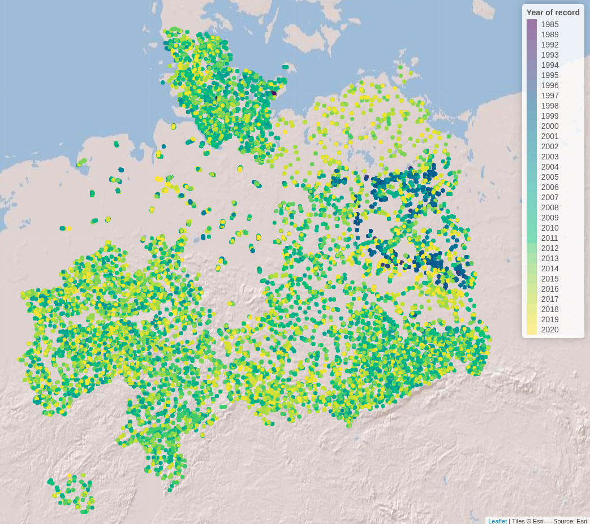

```{r, include = FALSE, eval = FALSE}
# writes out the references for all packages
knitr::write_bib(file = 'bib/references_lakes.bib')
```

### Introduction

The following workflow showcases the functionality of the hydrographr package to
integrate lakes into a stream network and species distribution analysis. 
We will use freshwater fish species occurrence data from the [cite German freshwater
fish GBIF database] and HydroLAKES shape files and integrate them into the 
Hydrography90m stream network (Amatulli et al., 2022).

```{r setup, include=FALSE}
knitr::opts_chunk$set(echo = TRUE, warning=FALSE, message=FALSE,  
                      out.width='50%', fig.align='center')
knitr::opts_knit$set(root.dir = "./data_lakes")


library(hydrographr)
library(rgbif)
library(terra)
library(tools)
library(data.table)
library(dplyr)
library(stringr)
library(knitr)
library(kableExtra)
library(leaflet)
library(leafem)
library(htmlwidgets)
library(mapview)
library(here)
library(sf)
library(tidyr)
library(readr)
library(tibble)
```

Load required libraries

```{r}
library(hydrographr)
library(rgbif)
library(data.table)
library(dplyr)
library(terra)
library(tools)
library(stringr)
library(leaflet)
library(leafem)
library(sf)
library(tidyr)
library(readr)
```

Define working directory

```{r, eval=TRUE, include=FALSE}
wdir <- paste0(here(), "/vignettes/data_lakes")
if(!dir.exists(paste0(wdir, "/data"))) dir.create(paste0(wdir, "/data"))
```

```{r, eval = FALSE}
# Define the "data_lakes" directory, where you have downloaded all the data,
# as the working directory
wdir <- "my/working/directory/data_lakes"
setwd(wdir)

# Create a new folder in the working directory to store all the data
dir.create("data")
```

### Species data

We first download the occurrence data with coordinates from GBIF

```{r, eval = T}
# Once: Download species occurrence data based on the key of the dataset
# and write out to working directory
spdata_all <- occ_download_get(key="0004551-231002084531237",
                              overwrite = TRUE) %>%
  occ_download_import
fwrite(spdata_all, paste0(wdir, "/data/fish_germany_gbif.csv"),
    row.names = F, quote = F, sep = "\t")
```

```{r, eval = T}
# Import and clean the data
spdata <- fread(paste0(wdir, "/data/fish_germany_gbif.csv"), sep = "\t") %>%
  select(gbifID, decimalLongitude, decimalLatitude, species, year) %>%
  rename("longitude" = "decimalLongitude",
         "latitude" = "decimalLatitude")
```

```{r, echo = F}
spdata <- head(spdata)
```

```{r, eval = F}
head(spdata)
```

Let´s remove point occurrences without assigned species names from the data table

```{r, eval = FALSE}
indx <- which(spdata$species == "")
spdata <- spdata[-c(indx),]

```

```{r, echo = F}
kbl(head(spdata)) %>%
  kable_styling(bootstrap_options = "striped", 
                full_width = F, position = "left") %>%
  scroll_box(width = "500px", height = "200px")
```

Let's visualise the species occurrences on the map

Let's define the extent (bounding box) of the study area (xmin, ymin,
xmax, ymax)

```{r, eval = F}
# Define the extent
bbox <- c(min(spdata$longitude), min(spdata$latitude),
          max(spdata$longitude), max(spdata$latitude))
```

```{r, eval = F}
# Define color palette for the different years of record
factpal <- colorFactor(hcl.colors(unique(spdata$year)), spdata$year)

# Create leaflet plot
spdata_plot <- leaflet(spdata) %>%
  addProviderTiles('Esri.WorldShadedRelief') %>%
  setMaxBounds(bbox[1], bbox[2], bbox[3], bbox[4]) %>%
  addCircles(lng = ~longitude, lat = ~ latitude, 
             color =  ~factpal(as.factor(year)),
             opacity = 1) %>%
  addLegend(pal = factpal, values = ~as.factor(year),
            title = "Year of record")
spdata_plot

```

```{r, echo = F, eval = F}
saveWidget(spdata_plot, file=paste0(here(), "man/figures/germany_map.html"))
```

{width="800"}
### Abiotic variables data

#### 1. Hydrography90m

In order to integrate lakes into the Hydrography90m, we need to download the following GEO.tiff files (in brackets the variable and folder name to download):
1. basin files ("basin")
2. sub-catchment files ("SUb_catchment)
3. stream network ("segment")
4. flow accumulation ("accumulation")
5. flow direction

First, we identify the tile ID covering our species data. In our case that are three tiles (h16v02; h18v00; h18v02).

```{r, eval = FALSE}
# get tile ID for Germany
tile_id <- get_tile_id(data = spdata,
                       lon = "longitude", 
                       lat = "latitude")

```

Secondly, we select and download all relevant hydrological variables necessary to intersect lakes and stream network and to delineate lake catchments.

```{r, eval = FALSE}
# select the necessary hydrological variables for downloading
vars_tif <- c("basin", "sub_catchment", "segment", "accumulation", "direction")
# Extend timeout to 1000s to allow uninterrupted downloading
options(timeout = 1000)

# Download the tif.files of the selceted variables
download_tiles(variable = vars_tif,
               tile_id = tile_id,
               file_format = "tif",
               download_dir = paste0(wdir, "data"))

```

Note that the files have been downloaded to a new folder (i.e., “r.watershed”).

Now we can merge the three tile files to obtain the sub-catchment raster file for the lakes in Germany
```{r, eval = FALSE} 

for (var in vars_tif) {
  # Define the folder for the current variable
  var_dir <- paste0(wdir, "data/r.watershed/", var, "_tiles20d/")
  
  # Build path to .tif file names for each variable and tile ids
  tile_files <- paste0(var, "_", tile_id, ".tif")
  
  # List only the matching .tif files in that folder
  tile_names <- list.files(var_dir, pattern = "\\.tif$", full.names = FALSE)
  tile_names <- tile_names[tile_names %in% tile_files]
  
  # Run the merge function
  merge_tiles(
    tile_dir = var_dir,
    tile_names = tile_names,
    out_dir = paste0(wdir, "data/"),
    file_name = paste0(var, ".tif"),
    read = FALSE,
    bigtiff = TRUE
  )
}

```

It is always good practice to clean disk space by removing the files and folders we don’t need anymore.
```{r, eval = FALSE}
# remove folder
unlink("r.watershed", recursive = TRUE)

```

#### 2. HydroLAKES

For the lake data we use the geo-spatial information from the HydroLAKES global lake data set and more specifically their lake polygons. You can either download the lake data stored in shapefiles or in the geodatabase format, both work with the hydrographr package lake functions.
For more information on the data set you can have a look [here](https://www.hydrosheds.org/products/hydrolakes)

```{r, eval = FALSE}
# Extend timeout to 1000s to allow uninterrupted downloading
options(timeout = 1000)

# Download URL of the HydroLAKES shapefile
hydrolakes_url <- "https://data.hydrosheds.org/file/hydrolakes/HydroLAKES_polys_v10_shp.zip"
hydrolakes <- paste0(wdir, "/data/", "HydroLAKES_polys_v10_shp.zip")

# Download the dataset
download.file("https://data.hydrosheds.org/file/hydrolakes/HydroLAKES_polys_v10_shp.zip", destfile = hydrolakes, mode = "wb")
unzip(hydrolakes, exdir = paste0(wdir, "/data"))

```

### Morphological Spatial Pattern Analysis (MSPA) tool from GuidosToolbox Workbench (GWB)

We need the open source MSPA analysis tool from GuidosToolbox Workbench (GWB), in order to identify the intersection points between our stream network and the lake polygons. You can find more information about the tool [here](https://forest.jrc.ec.europa.eu/en/activities/lpa/gwb/)

#### Linux
Follow the installation guidelines for your Linux system under [here](https://gwbdoc.readthedocs.io/en/latest/installation.html) or download the generic installer [GWB_linux64.run](https://ies-ows.jrc.ec.europa.eu/gtb/GWB/GWB_linux64.run) to your `$HOME` account.
Open a terminal, make the installer executable, and run it using the command:

```{bash, eval = FALSE}
$ wget https://ies-ows.jrc.ec.europa.eu/gtb/GWB/GWB_linux64.run
$ chmod u+x GWB_linux64.run
$  ./GWB_linux64.run
```

#### Windows
Windows user need to install the GWB tool to their linux virtual machine. If you don't have the linux virtual machine isntalled on your computer please follow the instructions [here](https://glowabio.github.io/hydrographr/articles/windows_system_setup.html) in order to be able to run the hydrographr R package.
Then go to your linux system, open the terminal and install GuidosToolbox Workbench.

```{bash, eval = FALSE}
$ wget https://ies-ows.jrc.ec.europa.eu/gtb/GWB/GWB_linux64.run
$ chmod u+x GWB_linux64.run
$ ./GWB_linux64.run
```

Citation: 
a) GWB (GuidosToolbox Workbench) is available at:
   https://forest.jrc.ec.europa.eu/en/activities/lpa/gtb/
b) The algorithms of this software are
   based on concepts of mathematical morphological image
   analysis described in the publications:
   Vogt, P., Riitters, K. (2017).
   GuidosToolbox: universal digital image object analysis.
   European Journal of Remote Sensing (TEJR),
   https://doi.org/10.1080/22797254.2017.1330650 and
   Soille, P., Vogt, P. (2009). Morphological Segmentation
   of Binary Patterns. Pattern Recognition Letters,
   https://doi.org/10.1016/j.patrec.2008.10.015

#### Lake analysis
### Lake ID identification

Let's start the lake analysis by identifying all HydroLAKES which are spatially overlapping with our species data and extract the corresponding lake IDs.
We can do that in two ways:

1. Extracting all HydroLAKES IDs within the bounding box of our species data

```{r, eval = FALSE}
head(spdata)
# let's avoid spaces between species names, since it can lead to names being assigned to different columns and instead connect them via an underscore
spdata$species <- gsub(" ", "_", spdata$species)

extract_lake_ids(spdata,
                 lon = "longitude",
                 lat = "latitude",
                 xmin = min(spdata$longitude),
                 ymin = min(spdata$latitude),
                 xmax = max(spdata$longitude),
                 ymax = max(spdata$latitude),
                 lake_shape = paste0(wdir, "/data/HydroLAKES_polys_v10_shp/HydroLAKES_polys_v10.shp"),
                 lake_id_table = paste0(wdir, "/data/lakes_vignette/"))
```

This option leaves us with 3419 lakes, saved under the text file "lake_id.txt". Let's get more specific and only look at the lakes with species data within them.

2. Extracting all HydroLAKES IDs of lakes that contain species data

```{r, eval = FALSE}
extract_lake_ids(spdata,
                 lon = "longitude",
                 lat = "latitude",
                 lake_shape = paste0(wdir, "/data/HydroLAKES_polys_v10_shp/HydroLAKES_polys_v10.shp"),
                 lake_id_table = paste0(wdir, "/data/lakes_vignette/"))
```

### Stream network and lake intersection
Now we can overlay our stream segments with the lake shapefile. In that way we identify per lake all intersection points between stream network and lake.


```{r, eval = FALSE}

get_lake_intersection(data = lake_ids,
                      lakes = paste0(wdir, "/data/HydroLAKES_polys_v10_shp/HydroLAKES_polys_v10.shp"),
                      lake_name =,
                      buffer = TRUE,
                      edge = GWB,
                      stream = paste0(wdir, "/data/r.watershed/segment/"),
                      flow =,
                      glbasin =,
                      lake_dat =,
                      n_cores = 5,
                      quiet = FALSE)

```

### Lake catchment delineation

Having identified the lake intersection points enables us to delineate for each intersection point the corresponding upstream catchment area. Doing this for the lake outlet (i.e the intersection point with the highest flow accumulation value) gives us the entire lake catchment area. To do this we apply the `get_lake_catchment` function:

```{r, eval = FALSE}
get_lake_catchment(data = data,
                               top = 1,
                               direction = paste0(wdir, "/data/r.watershed/direction/"),
                               catch = "/data/ttomiczek/hydrographr/lakes_vignette/intersection_tables/",
                               lake_id = "lake_ID",
                               n_cores = 5)
}

```

With the delineated lake catchments and having identified the Hydrography90m unique stream segments IDs intersecting with lakes lets us use hydrographr R functions for additional analysis.

#### Environment90m data integration
We can now integrate the Environment90m dataset [cite Environment90m paper], which include over 50 variables related to topography, hydrology and climate data aggregated to the subcatchment level of the Hydrograpyh90m stream network and apply them to [see also https://hydrography.org/environment90m] our newly delineated lake catchments. 

### Land cover per lake catchment
For instance, we can download the land cover data to create time series representing the land cover change within a lake catchments. Let`s look at how the percentage of rainfed cropland and decidous forest changed during the time period 1992 to 2020 at lake Rangsdorf (HydroLAKE ID 165245).

```{r, eval = FALSE}
download_landcover_tables(
  base_vars = c("c10", "c20"),
  years = NULL,
  tile_ids = tile_id,
  download = TRUE,
  download_dir = wdir,
  file_format = "txt",
  delete_zips = TRUE,
  ignore_missing = FALSE,
  tempdir = NULL,
  quiet = FALSE
)
```

First we identify all sub-catchments of the lake catchment using the `extract_ids` function:
Note check again visually which basin.tif files are covered by the lake catchment, since it can span over multiple basin tiles. In our case the lake catchment is situated only in one tile (tile id h18v02).

```{r, eval = FALSE}
lake_catch <- terra::rast(paste0(wdir, "/lake_1330758/basin_lake_1330758_coord_1.tif"))
sub_catch <- terra::rast(paste0(wdir, "/data/sub_catchment_h18v02.tif"))
lake_catch_crop <- terra::crop(sub_catch, lake_catch)
lake_catch_crop <- terra::mask(lake_catch_crop, lake_catch)

terra::writeRaster(lake_catch_crop, paste0(wdir, "/data/lake_catch_crop.tif"), overwrite = TRUE)
lake_catch_crop <- (paste0(wdir, "/data/lake_catch_crop.tif"))
lake_catch_ids <- extract_ids(subc_layer = lake_catch_crop)

fwrite(lake_catch_ids, paste0(wdir, '/data/subc_IDs.txt'))

```

Now we subset the Environment90m land cover data by the sub_catchment ID and join the yearly data table to create a time series of land cover change.

```{r, eval = FALSE}
years <- 1992:2020
tile_id <- "h18v02"
# Initialize empty data.frames
c10_long <- data.frame()
c20_long <- data.frame()


# Loop through each year and read + filter files
for (year in years) {
  
  # File paths
  path_c10 <- paste0(wdir, "esa_cci_landcover_v2_1_1/c10/c10_", year, "_", tile, ".txt")
  path_c20 <- paste0(wdir, "esa_cci_landcover_v2_1_1/c20/c20_", year, "_", tile, ".txt")
  
  # Read and coerce types
  c10_tmp <- read_table(path_c10, col_names = FALSE, col_types = cols()) %>%
    rename(ID = X1, c10 = X2) %>%
    mutate(
      ID = as.numeric(as.character(ID)),  # robust ID coercion
      c10 = as.numeric(c10),
      year = year
    ) %>%
    filter(ID %in% lake_catch_ids)
  
  c20_tmp <- read_table(path_c20, col_names = FALSE, col_types = cols()) %>%
    rename(ID = X1, c20 = X2) %>%
    mutate(
      ID = as.numeric(as.character(ID)),  # robust ID coercion
      c20 = as.numeric(c20),
      year = year
    ) %>%
    filter(ID %in% lake_catch_ids)
  
  # Append
  c10_long <- bind_rows(c10_long, c10_tmp)
  c20_long <- bind_rows(c20_long, c20_tmp)
}

# Final join
joined_data <- left_join(c10_long, c20_long, by = c("ID", "year"))

# Create name vectors
c10_names <- paste0("c10_", years)
c20_names <- paste0("c20_", years)

var <- c(c10_names, c20_names)


tb <- get_predict_table(variable = var,
  statistics = c("mean"),
  tile_id = tile_id,
  input_var_path = paste0(wdir, "esa_cci_landcover_v2_1_1/"),
  subcatch_id = file.path(wdir, "data/subc_ids.txt"),
  out_file_path = paste0(wdir, "data/predictTB.csv"),
  read = TRUE,
  quiet = FALSE,
  overwrite = TRUE,
  n_cores = 1)

fwrite(tb, paste0(wdir, '/data/land_cover_subc.txt'))


```

The landcover values show the percentage covered by the different land use categories.To show a change in land cover we will convert the percentage in the area they cover of any given sub-catchment. For this we will calculate the area of our sub-catchments.

```{r, eval = FALSE}
lakec_area <- terra::expanse(lake_catch_crop, unit="km", zones=lake_catch_crop)
tb[, 2:59] <- tb[, 2:59] * lakec_area$area
col_sums <- colSums(tb[, 2:59])

# Convert named vector to data frame
df <- enframe(col_sums, name = "id", value = "value")

# Separate 'id' into 'variable' and 'year', remove "y" prefix from year
df <- df %>%
  separate(id, into = c("variable", "year"), sep = "_y") %>%
  mutate(year = as.numeric(year))

```

Lets portrait the land cover time series within a simple histogram, showcasing the change over time in the rainfed and irrigated crop in the lake catchment. 

Add histogram
```{r, eval = FALSE}
# Plot
ggplot(df, aes(x = year, y = value, color = variable)) +
  geom_line(size = 1.2) +
  scale_color_manual(values = c("c10" = "blue", "c20" = "orange")) +
  scale_x_continuous(
    breaks = seq(min(df$year), max(df$year), by = 2)  # Every 2nd year
  ) +
  labs(x = "Year", y = "Land cover percentage", color = "Variable") +
  theme_minimal() +
  theme(
    axis.text.x = element_text(angle = 45, hjust = 1)
  )
```

Additionally to the environmental analysis we can look at the position of lakes within the stream network. For instance we can calculate the distance between the Rangsdorfer lake and the Zeuthener lake (lake ID 165161). Do to this we first need to download vector data of the Hydrography90m stream network and abstract it into a graph. 

#### Calculating distances between lakes
### Download  the vector stream network geopackage
```{r, eval = FALSE}
# Download the tif.files of the selceted variables
download_tiles(variable = "order_vect_segment",
               tile_id = tile_id,
               file_format = "gpkg",
               download_dir = paste0(wdir, "data"))

```

Note that the data is stored in a separate folder called r.stream.order.

```{r, eval = FALSE}
# define the path to the vector stream network data
var_dir <- paste0(wdir, "data/r.stream.order/", "order_vect", "_tiles20d/")
  
# Build path to .tif file names for each variable and tile ids
tile_files <- paste0("order_vect_segment", "_", tile_id, ".gpkg")
  
# List only the matching .tif files in that folder
tile_names <- list.files(var_dir, pattern = "\\.gpkg$", full.names = FALSE)
tile_names <- tile_names[tile_names %in% tile_files]
  
# Run the merge function
merge_tiles(
  tile_dir = var_dir,
  tile_names = tile_names,
  out_dir = paste0(wdir, "data/r.stream.order"),
  file_name = paste0("order_vect_merge", ".gpkg"),
  read = FALSE,
  bigtiff = TRUE,
  quiet = FALSE
  )


```
To calculate the distance between lakes we first represent the vector stream network in a graph.

```{r, eval = FALSE}
my_graph <- read_geopackage(gpkg = paste0(wdir,
                                          "data/r.stream.order",
                                          "/order_vect_tiles20d/order_vect_segment_h18v02.gpkg"),
                            import_as = "graph")

my_graph <- read_geopackage(gpkg = paste0(wdir,
                                          "/data/r.stream.order",
                                          "/order_vect_merge.gpkg"),
                            import_as = "graph")

```

Now we extract the stream segment ID of the lake outlets. Between the two lakes of interest we will calculate the distance in m.

```{r, eval = FALSE}

lake_165245_intersect <- fread(paste0(wdir, "data/intersection_tables/lake_165245/coord_lake_165245.txt"))
head(lake_165245_intersect)

lake_165161_intersect <- fread(paste0(wdir, "data/intersection_tables/lake_165245/coord_lake_165161.txt"))
head(lake_165161_intersect)

```
In both tables the first row represents the lake outlet (having the highest flow accumulation value). We can now calculate the distance between the two outlets using the sub-catchment ID of the first row found in the column subc_id. That are for the Rangsdorfer lake subc_id 39089860 and for the Zeuthener lake subc_id 39220004. They correspond to the unique sub-catchment and stream segment ID of the Hydrography90m stream network.

```{r, eval = FALSE}

subc_id <- as.numeric(c("39089860", "39220004"))

subc_distances <- get_distance_graph(my_graph,
                                      subc_id = subc_id,
                                      variable = "length",
                                      distance_m = TRUE,
                                      )

```

```{r, echo = F, eval = FALSE}
fwrite(subc_distances, 
        paste0(wdir, "/subc_distances.csv"), sep = ",", row.names = F, quote = F)
```

```{r, echo = F}
subc_distances <- fread(paste0(wdir, "/data/subc_distances.csv")) %>% head()
```

```{r, eval = F}
head(subc_distances)
```


### References
