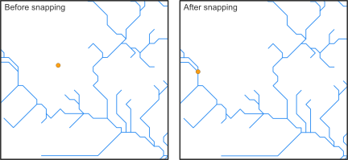

```{r, include = FALSE, eval = FALSE}
# writes out the references for all packages
knitr::write_bib(file = 'bib/references_lakes.bib')
```

### Introduction

The following workflow showcases the functionality of the hydrographr package to
integrate lakes into a stream network and species distribution analysis. 
We will use freshwater fish species occurrence data from the [cite German freshwater
fish GBIF database] and HydroLAKES shape files and integrate them into the 
Hydrography90m stream network (Amatulli et al., 2022).

```{r setup, include=FALSE}
knitr::opts_chunk$set(echo = TRUE, warning=FALSE, message=FALSE,  
                      out.width='50%', fig.align='center')
knitr::opts_knit$set(root.dir = "./data_lakes")


library(hydrographr)
library(rgbif)
library(terra)
library(tools)
library(data.table)
library(dplyr)
library(stringr)
library(knitr)
library(kableExtra)
library(leaflet)
library(leafem)
library(htmlwidgets)
library(mapview)
library(here)
library(sf)
library(tidyr)
```

Load required libraries

```{r}
library(hydrographr)
library(rgbif)
library(data.table)
library(dplyr)
library(terra)
library(tools)
library(stringr)
library(leaflet)
library(leafem)
library(sf)
library(tidyr)
```

Define working directory

```{r, eval=TRUE, include=FALSE}
wdir <- paste0(here(), "/vignettes/data_lakes")
if(!dir.exists(paste0(wdir, "/data"))) dir.create(paste0(wdir, "/data"))
```

```{r, eval = FALSE}
# Define the "data_lakes" directory, where you have downloaded all the data,
# as the working directory
wdir <- "my/working/directory/data_lakes"
setwd(wdir)

# Create a new folder in the working directory to store all the data
dir.create("data")
```

### Species data

We first download the occurrence data with coordinates from GBIF

```{r, eval = F}
# Once: Download species occurrence data based on the key of the dataset
# and write out to working directory
spdata_all <- occ_download_get(key="0004551-231002084531237",
                              overwrite = TRUE) %>%
  occ_download_import
fwrite(spdata_all, paste0(wdir, "/data/fish_germany_gbif.csv"),
    row.names = F, quote = F, sep = "\t")
```

```{r}
# Import and clean the data
spdata <- fread(paste0(wdir, "/data/fish_germany_gbif.csv"), sep = "\t") %>%
  select(gbifID, decimalLongitude, decimalLatitude, species, year) %>%
  rename("longitude" = "decimalLongitude",
         "latitude" = "decimalLatitude")
```

```{r, echo = F}
spdata <- head(spdata)
```

```{r, eval = F}
head(spdata)
```

Let´s remove point occurrences without assigned species names from the data table

```{r, eval = FALSE}
indx <- which(spdata$species == "")
spdata <- spdata[-c(indx),]

```

```{r, echo = F}
kbl(head(spdata)) %>%
  kable_styling(bootstrap_options = "striped", 
                full_width = F, position = "left") %>%
  scroll_box(width = "500px", height = "200px")
```

Let's visualise the species occurrences on the map

Let's define the extent (bounding box) of the study area (xmin, ymin,
xmax, ymax)

```{r, eval = F}
# Define the extent
bbox <- c(min(spdata$longitude), min(spdata$latitude),
          max(spdata$longitude), max(spdata$latitude))
```

```{r, eval = F}
# Define color palette for the different years of record
factpal <- colorFactor(hcl.colors(unique(spdata$year)), spdata$year)

# Create leaflet plot
spdata_plot <- leaflet(spdata) %>%
  addProviderTiles('Esri.WorldShadedRelief') %>%
  setMaxBounds(bbox[1], bbox[2], bbox[3], bbox[4]) %>%
  addCircles(lng = ~longitude, lat = ~ latitude, 
             color =  ~factpal(as.factor(year)),
             opacity = 1) %>%
  addLegend(pal = factpal, values = ~as.factor(year),
            title = "Year of record")
spdata_plot

```

```{r, echo = F, eval = F}
saveWidget(spdata_plot, file=paste0(here(), "man/figures/germany_map.html"))
```

{width="800"}
### Abiotic variables data

#### 1. Hydrography90m

In order to integrate lakes into the Hydrography90m, we need to download the following global GEO.tiff files:
1. stream network
1. flow accumulation
1. flow direction
1. overview basin computational units  
1. basin files
1. basin computational units


```{r, eval = FALSE}
# Extend timeout to 1000s to allow uninterrupted downloading
options(timeout = 1000)
# create a fred data list for download or separate download function for the package
# for each tif file:
download.file("https://fred.igb-berlin.de/data/file_download/",
              destfile = paste0(wdir, "/data/tif_files.tif"), mode = "wb")

```

#### 2. HydroLAKES

Secondly, for the lake data we use the geo-spatial information from the HydroLAKES global lake data set and more specifically their lake polygons. You can either download the lake data stored in shapefiles or in the geodatabase format, both work with the hydrographr package lake functions.
For more information on the data set you can have a look [here](https://www.hydrosheds.org/products/hydrolakes)

```{r, eval = FALSE}
# Extend timeout to 1000s to allow uninterrupted downloading
options(timeout = 1000)

# Download URL of the HydroLAKES shapefile
hydrolakes_url <- "https://data.hydrosheds.org/file/hydrolakes/HydroLAKES_polys_v10_shp.zip"
hydrolakes <- paste0(wdir, "/data/", "HydroLAKES_polys_v10_shp.zip")

# Download the dataset
download.file("https://data.hydrosheds.org/file/hydrolakes/HydroLAKES_polys_v10_shp.zip", destfile = hydrolakes, mode = "wb")
unzip(hydrolakes, exdir = paste0(wdir, "/data"))

```

### Morphological Spatial Pattern Analysis (MSPA) tool from GuidosToolbox Workbench (GWB)

We need the open source MSPA analysis tool from GuidosToolbox Workbench (GWB), in order to identify the intersection points between our stream network and the lake polygons. You can find more information about the tool [here](https://forest.jrc.ec.europa.eu/en/activities/lpa/gwb/)

#### Linux
Follow the installation guidelines for your Linux system under [here](https://gwbdoc.readthedocs.io/en/latest/installation.html) or download the generic installer [GWB_linux64.run](https://ies-ows.jrc.ec.europa.eu/gtb/GWB/GWB_linux64.run) to your `$HOME` account.
Open a terminal, make the installer executable, and run it using the command:

```{bash, eval = FALSE}
$ wget https://ies-ows.jrc.ec.europa.eu/gtb/GWB/GWB_linux64.run
$ chmod u+x GWB_linux64.run
$  ./GWB_linux64.run
```

#### Windows
Windows user need to install the GWB tool to their linux virtual machine. If you don't have the linux virtual machine isntalled on your computer please follow the instructions [here](https://glowabio.github.io/hydrographr/articles/windows_system_setup.html) in order to be able to run the hydrographr R package.
Then go to your linux system, open the terminal and install GuidosToolbox Workbench.

```{bash, eval = FALSE}
$ wget https://ies-ows.jrc.ec.europa.eu/gtb/GWB/GWB_linux64.run
$ chmod u+x GWB_linux64.run
$ ./GWB_linux64.run
```

Citation: 
a) GWB (GuidosToolbox Workbench) is available at:
   https://forest.jrc.ec.europa.eu/en/activities/lpa/gtb/
b) The algorithms of this software are
   based on concepts of mathematical morphological image
   analysis described in the publications:
   Vogt, P., Riitters, K. (2017).
   GuidosToolbox: universal digital image object analysis.
   European Journal of Remote Sensing (TEJR),
   https://doi.org/10.1080/22797254.2017.1330650 and
   Soille, P., Vogt, P. (2009). Morphological Segmentation
   of Binary Patterns. Pattern Recognition Letters,
   https://doi.org/10.1016/j.patrec.2008.10.015

### Lake analysis

Let's start the lake analysis by identifying all HydroLAKES which are spatially overlapping with our species data and extract the corresponding lake IDs.
We can do that in two ways:

1. Extracting all HydroLAKES IDs within the bounding box of our species data

```{r, eval = FALSE}
head(spdata)
# let's avoid spaces between species names, since it can lead to names being assigned to different columns and instead connect them via an underscore
spdata$species <- gsub(" ", "_", spdata$species)

extract_lake_ids(spdata,
                 lon = "longitude",
                 lat = "latitude",
                 xmin = min(spdata$longitude),
                 ymin = min(spdata$latitude),
                 xmax = max(spdata$longitude),
                 ymax = max(spdata$latitude),
                 lake_shape = paste0(wdir, "/data/HydroLAKES_polys_v10_shp/HydroLAKES_polys_v10.shp"),
                 lake_id_table = paste0(wdir, "/data/lakes_vignette/"))
```

This option leaves us with 3419 lakes, saved under the text file "lake_id.txt". Let's get more specific and only look at the lakes with species data within them.

2. Extracting all HydroLAKES IDs of lakes that contain species data

```{r, eval = FALSE}
extract_lake_ids(spdata,
                 lon = "longitude",
                 lat = "latitude",
                 lake_shape = paste0(wdir, "/data/HydroLAKES_polys_v10_shp/HydroLAKES_polys_v10.shp"),
                 lake_id_table = paste0(wdir, "/data/lakes_vignette/"))
```

#### 2. Elevation - MERIT-HYDRO

To download the elevation files of MERIT-HYDRO, we visit
<https://hydro.iis.u-tokyo.ac.jp/~yamadai/MERIT_Hydro/> to define the
tiles that need to be downloaded. We download the zipped tiles into a
new directory called ***elv***, unzip the downloaded .tar file and keep
only the tiles that we need

```{r, eval = FALSE}
elv_dir <- paste0(wdir, "/data/elv") 
dir.create(elv_dir)
```

#### 3. Climate - CHELSA Bioclim

Finally, we will download three CHELSA present Bioclim variables. For a
quick outlook on the bioclimatic variables you can have a look
[here](https://chelsa-climate.org/bioclim/).

```{r, eval = FALSE}
# Create download directory
dir.create(paste0(wdir, "/data/chelsa_bioclim"))
```

```{r, eval = FALSE}
# Extend timeout to 1000s to allow uninterrupted downloading
options(timeout = 1000)

# Download
# Present, 1981-2010
download.file("https://os.zhdk.cloud.switch.ch/envicloud/chelsa/chelsa_V2/GLOBAL/climatologies/1981-2010/bio/CHELSA_bio12_1981-2010_V.2.1.tif",
destfile = "data/chelsa_bioclim/bio12_1981-2010.tif", mode = "wb")
download.file("https://os.zhdk.cloud.switch.ch/envicloud/chelsa/chelsa_V2/GLOBAL/climatologies/1981-2010/bio/CHELSA_bio15_1981-2010_V.2.1.tif",
destfile = "data/chelsa_bioclim/bio15_1981-2010.tif", mode = "wb")
download.file("https://os.zhdk.cloud.switch.ch/envicloud/chelsa/chelsa_V2/GLOBAL/climatologies/1981-2010/bio/CHELSA_bio1_1981-2010_V.2.1.tif",
destfile = "data/chelsa_bioclim/bio1_1981-2010.tif", mode = "wb")
```

### Cropping the raster files

After having downloaded all the layers, we need to crop them to the
extent of our study area extended by 500 km, so that our basins are not
split in half.

```{r, include = FALSE}
# Define and create a directory for the study area
#study_area_dir <-  paste0(wdir, "/data/study_area")
study_area_dir <- "/home/afroditi/Documents/PhD/external/fish_germany/data/study_area"

if(!dir.exists(study_area_dir)) dir.create(study_area_dir)


# Get the full paths of the raster tiles
raster_tiles_watershed <- list.files(paste0(wdir, "/data/r.watershed"),
                          pattern = ".tif", full.names = TRUE, recursive = TRUE)
raster_tiles_dist <- list.files(paste0(wdir, "/data/r.stream.distance"),
                          pattern = ".tif", full.names = TRUE, recursive = TRUE)
raster_tiles_chan <- list.files(paste0(wdir, "/data/r.stream.channel"),
                          pattern = ".tif", full.names = TRUE, recursive = TRUE)
raster_tiles_ord <- list.files(paste0(wdir, "/data/r.stream.order"),
                               pattern = ".tif", full.names = TRUE, recursive = TRUE)
raster_tiles <- c(raster_tiles_watershed, raster_tiles_dist, 
                  raster_tiles_chan, raster_tiles_ord)
```

Let's define the extent (bounding box) of the study area (xmin, ymin,
xmax, ymax)

```{r, include = FALSE}
bb <- ext(vect(paste0(wdir, "/data/r.watershed/basin_tiles20d/basin_h18v02_filtered.gpkg")))
```

```{r, eval = F}
bb <- c(0.256, 20, 45, 55.4325)
```

We then crop the raster tiles to the extent using the function
*crop_to_extent()* in a loop

```{r, eval = FALSE}

for(itile in raster_tiles) {

  crop_to_extent(raster_layer = itile,
                 bounding_box = bb,
                 out_dir = study_area_dir,
                 file_name =  paste0(str_remove(basename(itile), ".tif"),
                                     "_crop.tif"),
                 quiet = FALSE,
                 compression = "high",
                 bigtiff = TRUE,
                 read = FALSE)
}
```

### Filtering the sub-catchment and basin .gpkg files

In case you don't work on a server, we suggest you to download the
output files of this chunk from the following links and then copy them
in the folder *`study_area_dir`*:

-   [order_vect_segment_h18v02_crop.gpkg](https://drive.google.com/file/d/14jh2zG7eqlS-KQZlZufLcZfPdEhRncd8/view?usp=drive_link)

-   [basin_h18v02_crop.gpkg](https://drive.google.com/file/d/1l9l7k3s9YIVkjhSoRqLVb8L2rGStSvz0/view?usp=drive_link)

```{r, eval = FALSE}
# !! Only run this chunk on a machine with more than 16 GB RAM, 
# as the input files are really big !!

# Load the cropped stream and basin raster layer of the study area.
# The stream raster can be used interchangeably with the sub_catchment raster, 
# because the stream IDs are the same as the sub-catchment IDs. 
# Here we use the stream raster because it's smaller in size. 

stream_layer <- rast(paste0(study_area_dir, "/segment_h18v02_crop.tif"))
basin_layer <- rast(paste0(study_area_dir, "/basin_h18v02_crop.tif"))

# Get all sub-catchment and basin IDs of the study area
subc_ids <- terra::unique(stream_layer)
basin_ids <- terra::unique(basin_layer)

# Get the full path of the stream order segment GeoPackage tile
order_tile <- list.files(wdir, pattern = "order.+_h[v0-8]+.gpkg$",
                         full.names = TRUE, recursive = TRUE)
basin_gpkg_tile <- list.files(wdir, pattern = "bas.+_h[v0-8]+.gpkg$",
                              full.names = TRUE, recursive = TRUE)

# Filter the sub-catchment IDs from the GeoPackage of the order_vector_segment
# tiles (sub-catchment ID = stream ID)
# Save the stream segments of the study area
filtered_stream <- read_geopackage(order_tile,
                                 import_as = "sf",
                                 subc_id = subc_ids$segment_h18v02_crop,
                                 name = "stream")

sf::write_sf(filtered_stream, paste(study_area_dir,
                              paste0(str_remove(basename(order_tile), ".gpkg"),
                                         "_crop.gpkg"), sep="/"))

filtered_bas <- read_geopackage(basin_gpkg_tile,
                                 import_as = "sf",
                                 subc_id = basin_ids$basin_h18v02_crop,
                                 name = "ID")

sf::write_sf(filtered_bas, paste(study_area_dir,
                          paste0(str_remove(basename(basin_gpkg_tile), ".gpkg"),
                                         "_crop.gpkg"), sep="/"))

```

### Merging the elevation tiles

```{r, eval = FALSE}
# These are the elevation tiles that include our study area
elv_tiles <- c("n45e000_elv.tif", "n50e010_elv.tif", "n60e000_elv.tif",
                "n45e005_elv.tif", "n50e015_elv.tif", "n60e005_elv.tif",
                "n45e010_elv.tif", "n55e000_elv.tif", "n60e010_elv.tif",
                "n45e015_elv.tif", "n55e005_elv.tif", "n60e015_elv.tif",
                "n50e000_elv.tif", "n55e010_elv.tif", "n50e005_elv.tif",
                "n55e015_elv.tif")

merge_tiles(tile_dir = elv_dir, 
            tile_names = elv_tiles,
            out_dir = study_area_dir, 
            file_name = "elv_study_area.tif",
            compression = "high",
            bigtiff = TRUE,
            quiet = FALSE)


# crop to our extent
crop_to_extent(raster_layer = paste0(study_area_dir, "/elv_study_area.tif"),
               bounding_box = bb,
               out_dir = study_area_dir,
               file_name =  "elv_study_area_crop.tif",
               quiet = FALSE,
               compression = "high", 
               bigtiff = TRUE, 
               read = FALSE)

```

Finally, we will crop the CHELSA Bioclim layers.

We define the directory containing the layers to be cropped and we list
their file names

```{r, eval = FALSE}
dir_chelsa <- paste0(wdir, "/data/chelsa_bioclim")
files_chelsa <- list.files(dir_chelsa, pattern = ".tif", full.names = TRUE)
```

```{r, eval = FALSE}
for(ifile in files_chelsa) {
    crop_to_extent(
      raster_layer = ifile,
      bounding_box = bb,
      out_dir = study_area_dir,
      file_name = basename(ifile),
      read = FALSE,
      quiet = TRUE)
}
```

### Extracting sub-catchment IDs

Extract the IDs of the sub-catchments where the points are located. This
step is crucial, as many of the functions that we will later use require
a vector of sub-catchment IDs as input. Note that the function
*extract_ids()* can be used to extract the values at specific points of
any raster file provided to the argument *subc_layer*. It can be safely
used to query very large raster files, as these are not loaded into R.

```{r, eval = TRUE}
spdata_ids <- extract_ids(data = spdata,
  id = "gbifID",
  lon = "longitude", lat = "latitude",
  basin_layer = paste0(study_area_dir, "/basin_h18v02_crop.tif"),
  subc_layer = paste0(study_area_dir, "/sub_catchment_h18v02_crop.tif"))
```

```{r, echo = FALSE}
knitr::kable(head(spdata_ids),
             caption = "The species data have now their corresponding sub-catchment ids")
```

```{r, echo = FALSE}
# # write points as gpkg
# spdata_vect <- vect(spdata_ids, geom=c("longitude", "latitude"))
# writeVector(spdata_vect, paste0(wdir, "/data/spdata.gpkg"), overwrite=T)
```

### Snapping points to the network

Before we can calculate the distance along the stream network between
species occurrences, we need to snap the coordinates of the sites to the
stream network. Recorded coordinates of point locations usually do not
exactly overlap with the digital stream network and, therefore, need to
be slightly corrected.

The hydrographr package offers two different snapping functions,
`snap_to_network` and `snap_to_subc_segment`. The first function uses a
defined distance radius and a flow accumulation threshold, while the
second function snaps the point to the stream segment of the
sub-catchment the point was originally located in.

For this case study we will use the function `snap_to_network` to be
able to define a certain flow accumulation threshold and ensure that the
fish occurrences will not be snapped to a headwater stream (first order
stream) if there is also a higher order stream next to it.



```{r, eval = FALSE}
# Define full paths of raster layers
stream_rast <- paste0(study_area_dir, "/segment_h18v02_crop.tif")
flow_rast <- paste0(study_area_dir, "/accumulation_h18v02_crop.tif")
```

```{r, eval = FALSE}
# We need to shorten the gbifIDs because they are too long for GRASS-GIS
# We will delete the first 2 characters ("40") from all IDs
spdata_ids$gbifID_tmp <- str_replace(spdata_ids$gbifID, "40", "")
```

The function is implemented in a for-loop that starts searching for
streams with a very high flow accumulation of 400,000 km² in a very
short distance and then slowly decreases the flow accumulation to 100
km². If there are still sites left which were not snapped to a stream
segment, the distance will increase from 10 up to 30 cells.

```{r, eval = FALSE}
# Define thresholds for the flow accumulation of the stream segment, where
# the point location should be snapped to
accu_threshold <- c(400000, 300000, 100000, 50000, 10000, 5000, 1000, 500, 100) 
# Define the distance radius
dist_radius <- c(10, 20, 30)

# Create a temporary data.table
point_locations_tmp <- spdata_ids

# Note: The for loop takes about 9 minutes
first <- TRUE
for (idist in dist_radius) {
    
   # If the distance increases to 20 cells only a flow accumulation of 100 km²
   # will be used
   if (idist == 20) {
    # Set accu_threshold to 100
    accu_threshold <- c(100)
   }
  

  for (iaccu in accu_threshold) {
    # Snap point locations to the stream network
    point_locations_snapped_tmp <- snap_to_network(data = point_locations_tmp,
                                    id = "gbifID",
                                    lon = "longitude", lat = "latitude",
                                    stream_layer = stream_rast,
                                    accu_layer = flow_rast,
                                    method = "accumulation",
                                    distance = idist,
                                    accumulation = iaccu,
                                    quiet = FALSE)

    
    # Keep point location with NAs for the next loop
    point_locations_tmp <- point_locations_snapped_tmp %>% 
      filter(is.na(subc_id_snap_accu))
  
  if (first == TRUE) {
    # Keep the point locations with the new coordinates and remove rows with NA
    point_locations_snapped <- point_locations_snapped_tmp %>% 
    filter(!is.na(subc_id_snap_accu))
    first <- FALSE
  } else {
    # Bind the new data.frame to the data.frame of the loop before
    # and remove the NA
    point_locations_snapped <- point_locations_snapped %>% 
      bind_rows(point_locations_snapped_tmp) %>% 
      filter(!is.na(subc_id_snap_accu))
    
  }
  
  }
    
}
```

We can write out the result of the snapping

```{r, eval=F}
fwrite(point_locations_snapped, paste0(wdir, "/data/spdata_snapped.csv"), sep = ",", 
                      row.names = FALSE, quote = FALSE)
```

```{r, echo = F}
point_locations_snapped <- fread(paste0(wdir, "/data/spdata_snapped.csv"), sep = ",") %>% 
  head()
```

```{r, eval = F}
head(point_locations_snapped)
```

```{r, echo = FALSE}
knitr::kable(head(point_locations_snapped),
      caption = "The species data have been attributed new coordinates and in 
      some cases a new sub-catchment id (\"subc_id_snap_accu\")")
```

### Calculating distances between points

We will calculate the distance between all point locations. The
following chunks are computationally heavy, so we suggest to run them on
a server.

```{r, eval = FALSE}
# Load as graph
stream_graph <- read_geopackage(
  gpkg = paste0(study_area_dir, "/order_vect_segment_h18v02_crop.gpkg"),
  import_as = "graph")

# Get the network distance (in meters) between all input pairs.
# We provide the subcatchment ids of the snapped points to the argument "subc_id"
subc_distances <- get_distance_graph(stream_graph,
                            subc_id = point_locations_snapped$subc_id_snap_accu,
                            variable = "length",
                            distance_m = TRUE)

```

```{r, echo = F, eval = FALSE}
fwrite(subc_distances, 
        paste0(wdir, "/subc_distances.csv"), sep = ",", row.names = F, quote = F)
```

```{r, echo = F}
subc_distances <- fread(paste0(wdir, "/data/subc_distances.csv")) %>% head()
```

```{r, eval = F}
head(subc_distances)
```

```{r, echo =F}
kbl(subc_distances)
```

### Obtaining network centrality indices

We will now calculate centrality indices using the directed stream
network graph and the function `get_centrality` We want to consider only
the upstream connected segments, so we set `mode = "in".`

The following chunks are computationally heavy, so we suggest to run
them on a server.

```{r, eval = F}
centrality <- get_centrality(stream_graph, index = "all", mode = "in")
```

```{r, echo = F}
centrality <- fread(paste0(wdir, "/data/subc_centrality.csv"), sep = ",", quote = F)
```

We can reclassify the stream segment and sub-catchment raster layers
based on the centrality value of each stream, using the function
`reclass_raster`. Essentially, we will create two new raster files, in
which each stream pixel will have a centrality value, instead of the
unique ID of the stream or sub-catchment.

```{r, eval = F}

# This data.frame includes some NAs in some of the columns, because some centrality metrics by default cannot be defined for some the subcatchments. We have to discard subcatchments with NAs before reclassifying.
centrality <- drop_na(centrality)

# Then we convert the values in the centrality data.frame into integers
centrality <- centrality %>% mutate_if(is.numeric, as.integer)

reclass_raster(data = centrality, 
                            rast_val = "subc_id", 
                            new_val = "betweeness", 
                            raster_layer = paste0(study_area_dir, "/segment_h18v02_crop.tif"), 
                            recl_layer = paste0(study_area_dir,"/segment_h18v02_betweeness_all.tif"), 
                            read = F)

reclass_raster(data = centrality, 
               rast_val = "subc_id", 
               new_val = "degree", 
               raster_layer = paste0(study_area_dir, "/sub_catchment_h18v02_crop.tif"),
               recl_layer = paste0(study_area_dir,"/sub_catchment_h18v02_degree_all.tif"), 
               read = F)

reclass_raster(data = centrality, 
               rast_val = "subc_id", 
               new_val = "betweeness", 
               raster_layer = paste0(study_area_dir, "/sub_catchment_h18v02_crop.tif"),
               recl_layer = paste0(study_area_dir,"/sub_catchment_h18v02_betweeness_all.tif"), 
               read = F)

reclass_raster(data = centrality, rast_val = "subc_id", 
               new_val = "farness", 
               raster_layer = paste0(study_area_dir, "/sub_catchment_h18v02_crop.tif"),
               recl_layer = paste0(study_area_dir,"/sub_catchment_h18v02_farness_all.tif"), 
               read = F)

reclass_raster(data = centrality, 
               rast_val = "subc_id", 
               new_val = "eccentricity", 
               raster_layer = paste0(study_area_dir, "/sub_catchment_h18v02_crop.tif"),
               recl_layer = paste0(study_area_dir,"/sub_catchment_h18v02_eccentricity_all.tif"), 
               read = F)

```

Here's what the new segment and sub-catchment layers look like on QGIS.
Yellow sub-catchments have the highest values, whereas dark blue have
the lowest values for the different metrics.

The node **betweenness** is (roughly) defined by the number of geodesics
(shortest paths) going through a node:


The **degree** of a node is the number of its adjacent edges:

{width="800"}

**Farness** centrality is the sum of the length of the shortest paths
between the node and all other nodes. It is the reciprocal of closeness
(Altermatt, 2013):

{width="800"}

The **eccentricity** of a node is its shortest path distance from the
farthest other node in the graph (West,
1996):{width="800"}

We can add the centrality metrics' values to the table of our points,
using the sub-catchment id:

```{r, eval = F}
point_locations_snapped <- left_join(point_locations_snapped, centrality, 
                          by = c('subc_id_snap_accu'= 'subc_id'))
head(point_locations_snapped)
```

```{r, echo = F}

point_locations_snapped <- fread(paste0(wdir, "/data/spdata_centrality.csv")) %>% 
  head()
```

```{r, echo = F}
kbl(point_locations_snapped)
```

Bonus! If we want to include the centrality indices to the stream
network .gpkg, we can import the .gpkg and merge it with the centrality
table

```{r, eval = F}
# Load stream network .gpkg as vector
stream_vect <- read_geopackage(paste0(study_area_dir, "/order_vect_segment_h18v02_crop.gpkg"),
                               import_as = "SpatVect")

# Merge the centrality table with the vector
stream_vect <- terra::merge(stream_vect, spdata_centr, 
                        by.x = c('stream'), by.y="subc_id")

# Write out the stream gpkg including the centrality indices
writeVector(stream_vect, paste0(study_area_dir, "/order_vect_segment_centr.gpkg"))
```

### Extracting zonal statistics of topographic variables

We will calculate the zonal statistics of the Hydrography90m,
MERIT-HYDRO DEM and the CHELSA Bioclim variables for the sub-catchments
of our species points. Caution, don't increase the number of cores to
more than 3 as this can cause memory problems. However, this highly
depends to the number of sub-catchments as well. We recommend to test
the function with different parameters to find out what works best for
your case.

Let's first define the input `var_layers` for the `extract_zonal_stat`
function

```{r, eval = F}
list.files(study_area_dir)
var_layers <- c("bio1_1981-2010.tif", "bio12_1981-2010.tif",
                "bio15_1981-2010.tif", "elv_study_area_crop.tif",
                "outlet_dist_dw_basin_h18v02_crop.tif")
```

A good practice before aggregating the variables is to check their
NoData values:

```{r, eval = FALSE}
report_no_data(data_dir = study_area_dir, var_layer = var_layers)
```

```{r, eval = F}
#                                 Raster                  NoData
# 1                   bio1_1981-2010.tif                  -99999
# 2                  bio15_1981-2010.tif 3.40282346600000016e+38
# 3 outlet_dist_dw_basin_h18v02_crop.tif                   -9999
# 4                  bio12_1981-2010.tif                  -99999
# 5              elv_study_area_crop.tif                   -9999
```

```{r, eval = FALSE}
# Run the function that returns the zonal statistics.
# We provide the subcatchment ids of the fish points to the argument 'subc_id'.
stats_table_zon <- extract_zonal_stat(
                    data_dir = study_area_dir,
                    subc_layer = paste0(study_area_dir, "/sub_catchment_h18v02_crop.tif"),
                    subc_id = point_locations_snapped$subc_id_snap_accu,
                    var_layer = var_layers,
                    out_dir = paste0(wdir, "/data"),
                    file_name = "zonal_stats.csv",
                    n_cores = 3)
```

The function also reports the NoData values that are used in the
calculation of the zonal statistics of each variable.

We will keep only the mean and sd of each variable of the stats_table:

```{r, eval = F}
stats_table_zon <- stats_table_zon %>%
  dplyr::select(contains("subc") |  ends_with("_mean") | ends_with("_sd")) %>%
  rename('subcatchment_id' = 'subc_id')

```

The values in some of the original raster files were scaled, so we need
to re-scale them before proceeding to any analyses.

We define the following functions:

```{r, eval = F}
clim_scale <- function(x, na.rm = F) (x * 0.1)
offset <- function(x, na.rm = F) (x - 273.15)
```

... and apply them to rescale the values

```{r, eval = F}
stats_table_zon <- stats_table_zon  %>%
  mutate(across(starts_with("bio"), clim_scale))  %>%
  mutate(across(matches("bio1_.*_mean"), offset))
```

```{r, eval = F, echo = F}
fwrite(stats_table_zon, paste0(wdir, "/data/zonal_stats.csv"), 
       sep =",", quote=F, row.names=F)
```

```{r, eval=F}
head(stats_table_zon)
```

```{r, echo = F}
stats_table_zon <- fread(paste0(wdir, "/data/zonal_stats.csv")) %>% head()
kbl(stats_table_zon) %>% 
  kable_styling(bootstrap_options = "striped", 
                full_width = F, position = "left") %>%
  scroll_box(width = "500px", height = "200px")


```

### Putting together the final table

We will now perform some left joins to match the zonal statistics table
with the original species data.

```{r, eval = F}
data_fin <- left_join(point_locations_snapped, stats_table_zon, 
          by = c('subc_id_snap_accu'= 'subcatchment_id'))

data_fin$gbifID <- as.character(data_fin$gbifID)
data_fin <- left_join(spdata_ids, data_fin)

# Convert the gbifIDs back to the original values
data_fin$gbifID <- str_c("40", data_fin$gbifID)
spdata$gbifID <- as.character(spdata$gbifID)

data_fin <- left_join(spdata, data_fin)
```

```{r, eval=F, echo=F}
fwrite(data_fin, paste0(wdir, "/data/data_final.csv"), 
       sep = ",", quote = F, row.names = F)
```

```{r, eval = F}
head(data_fin)
```

```{r, echo = F}
data_fin <- fread(paste0(wdir, "/data/data_final.csv")) %>% head()
kbl(data_fin) %>% 
  kable_styling(bootstrap_options = "striped", 
                full_width = F, position = "left") %>%
  scroll_box(width = "500px", height = "200px")
```

### References
